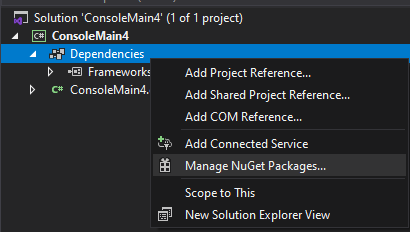
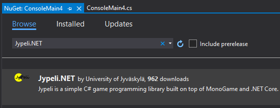
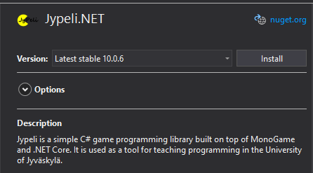
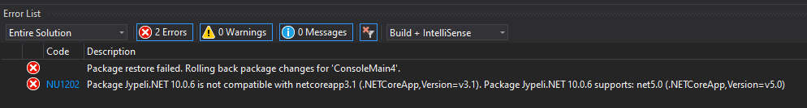
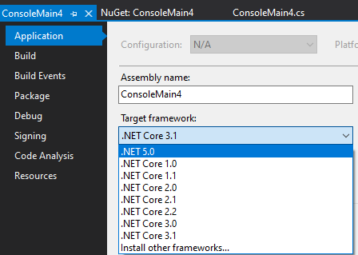

# Kirjaston liittäminen käsin

Jypeli-kirjaston tuomia funktioita voidaan (joillain rajoituksilla) käyttää myös tavallisessa konsoliprojektissa.

Klikkaa Riderin Explorer-näkymässä *Dependencies*-kansiota hiiren oikealla painikkeella (Macilla Ctrl+klikkaus) ja valitse `Manage Nuget packages`.



Aukeavasta näkymästä vaihda `Browse` näkymään ja kirjoita hakukenttään `Jypeli.NET` ja valitse sen niminen paketti.

**HUOM:** Tällä hetkellä tuloksista tulee myös useita hyvin vanhoja paketteja, älä käytä niitä.



Oikeaan reunaan aukevasta näkymästä kannattaa pitää versio asetus kohdassa `Latest stable...` ja klikkaa `Install`.

Rider saattaa kysyä lisävahvistusta, vastaa kyllä.

Jos saat virheviestin, ks. alempaa ohjeet.



Tämän jälkeen voit käyttää Jypelin funktioita konsolisovelluksessasi.

Eli esimerkiksi:

```csharp,ignore
double[] lukuja = Jypeli.RandomGen.NextDoubleArray(0, 20, 50);
```

## Package restore failed...

On mahdollista että lisäyksen jälkeen saat seuraavanlaisen virheviestin ja pakettia ei lisätty:



Tämä virhe johtuu siitä, että Jypelin paketti on käännetty uudemmalle .NET versiolle kuin mikä on sinun projektissa käytössä.

Tässä vaiheessa sinulla on kaksi vaihtoehtoa:

1.  Joko päivitä projektisi uudempaan versioon
    - Klikkaa projektiasi Explorer-näkymässä hiiren oikealla ja valitse `Properties`.
    - valitse kohdasta `Target FrameWork uudempi versio`, tässä tapauksessa .NET 5.0. Katso virheviestistä mistä versiosta sinun tapauksessa on kyse. 
    - Tämän jälkeen lisää Jypeli uudestaan projektiin aiemmalla tavalla
2.  Käytä vanhempaa Jypelin versiota.
    - Paketti nimeltä `Jypeli.NET` on ainoastaan `.NET 5` tai uudemmille projekteille.
    - `.NET Core` projekteille käytä pakettia nimeltä `Jypeli.Core`.
