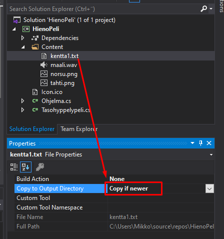

# Kuvat ja äänet mukaan projektiin

Jos haluat käyttää pelissä omia kuvia, ääniä tai tekstitiedostoja, ne täytyy ensin liittää mukaan projektiin, jotta ohjelmointiympäristö tietää, että mistä kuva- ja äänitiedostot löytyvät.

**Ohjeet on kirjoitettu Riderille. Muissa ohjelmointiympäristöissä vaiheet ovat samat, mutta valikoiden nimet voivat erota.**

## Tiedostojen tuominen

1.  Mikäli peliprojektissasi ei jo ole kansiota nimeltä `Content`, tee sellainen klikkaamalla projektia hiiren oikealla painikkeella (Macilla Ctrl+klikkaus) ja Add -\> Directory.

<video controls width="800" src="images/content.mp4"></video>

*Content-kansion luominen Riderissa*

1.  Tallenna haluamasi kuva / ääni / tekstitiedosto `Content`-kansioon Resurssienhallinnassa / Finderissa. Voit lisätä tiedoston myös Riderista käsin klikkaamalla Content-kansiota hiiren oikealla ja valitsemalla `Add -> Existing Item`.

2.  Lisäämäsi tiedosto tulee näkyviin Content-kansion sisälle. Klikkaa tiedostoa hiiren oikealla, valitse `Properties` ja muuta `Copy to Output Directory` olemaan `Copy if newer`.

3.  Nyt voit käyttää lisäämääsi tiedostoa koodissasi, esimerkiksi `norsu.Image = LoadImage("norsu");`. `LoadImage`-funktio hakee tiedostoja automaattisesti `Content`-kansion sisältä.

`LoadImage` ja `LoadSoundEffect` funktioille ei tarvitse antaa tiedostopäätettä, mutta se saa myös olla.

Eli äskeisessä esimerkissä olisi yhtä hyvin voitu kirjoittaa `LoadImage("norsu.png");`
