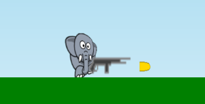
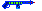
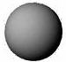

# Aseet



Jypeli sisältää valmiita aseita peleissä käytettäväksi.

Aseet toimivat fysiikkapeleissä ja tasohyppelypeleissä. Yleensä ase on jollakin pelihahmolla.

Aseen voi lisätä mille tahansa fysiikkaoliolle (PhysicsObject) tai pelioliolle (GameObject).

Tasohyppelyhahmolle (PlatformCharacter) lisätty ase kääntyy automaattisesti hahmon rintamasuunnan mukaisesti.

Asetta ei tietenkään ole pakko lisätä hahmolle, vaan sen voi lisätä peliin `Add`-kutsulla kuten minkä tahansa muunkin peliolion. Huomaa kuitenkin, että aseet eivät ole fysiikkaolioita. Ne eivät siis itsenään voi törmätä mihinkään!

## Aseen luominen ja lisääminen mille tahansa oliolle (esimerkiksi PhysicsObject-fysiikkaoliolle)

### Ase attribuutiksi

```csharp,ignore
public class Peli : PhysicsGame
{
    AssaultRifle pelaajan1Ase;

    public override void Begin()
    {
        //...
    }
```

### Aseen luominen

Aseen luominen kannattaa tehdä samassa paikassa, missä luodaan asetta kantava olio. Tässä esimerkissä `pelaaja1` voi olla vaikkapa **fysiikkaolio**.

```csharp,ignore
pelaajan1Ase = new AssaultRifle(30, 10);

// Jos et halua ammusten määrän rajoitusta, vaan loputtomat panokset,
// niin älä lisää seuraavaa riviä ollenkaan:
pelaajan1Ase.Ammo.Value = 1000; // Ammusten määrä aluksi

// Kuinka monta laukausta sekunnissa ase voi ampua
pelaajan1Ase.FireRate = 5;

// Mitä tapahtuu, kun ammus osuu johonkin?
pelaajan1Ase.ProjectileCollision = AmmusOsui;

// Laitetaan ase samaan sijaintiin kuin pelaaja, eli se on silloin pelaajan keskellä.
pelaajan1Ase.Position = pelaaja1.Position;

pelaaja1.Add(pelaajan1Ase);
```

Ase lisätään fysiikkaolio `pelaaja1`:n lapsiolioksi. Tämä tarkoittaa sitä, että ase liikkuu pelaajan mukana. Aseen sijaintia suhteessa pelaajaan voidaan muuttaa esimerkiksi asettamalla:

```csharp,ignore
pelaajan1Ase.Position = pelaaja1.Position + new Vector(pelaaja1.Width / 2, 0);
```

Tällöin ase sijaitsee pelaajan oikeassa reunassa.

Vaihtoehtoisesti sijainti voidaan asettaa myös `RelativePosition`in avulla:

```csharp,ignore
pelaajan1Ase.RelativePosition = new Vector(pelaaja1.Width / 2, 0);
```

Tämä voidaan tehdä vasta sen jälkeen, kun ase on lisätty pelaajalle! Tämä on yksi niitä harvoja tilanteita kappaleiden attribuuttien määrityksen suhteen, milloin rivien suoritusjärjestyksellä on merkitystä lopputulokseen.

### Ammuksen törmäyksen käsittelevä aliohjelma

```csharp,ignore
void AmmusOsui(PhysicsObject ammus, PhysicsObject kohde)
{
    //ammus.Destroy();
}
```

### Aseella ampuminen

Asetetaan näppäin, josta ase ampuu. Aseella voi ampua sen `Shoot`-metodia kutsumalla.

Ampumisesta kannattaa tehdä oma aliohjelma (`Shoot`-aliohjelman kutsua ei voi antaa suoraan näppäimen kuuntelijalle):

Sen aseen, jolla halutaan ampua, voi viedä parametrina `AmmuAseella`-aliohjelmalle.

```csharp,ignore
Keyboard.Listen(Key.Space, ButtonState.Down, AmmuAseella, "Ammu", pelaajan1Ase);
```

Jos halutaan päästä käsiksi aseesta lähtevään ammukseen, vaikkapa ammuksen koon, kuvan tai eliniän muuttamista varten, `Shoot`-metodi palauttaa aina viimeksi ammutun ammuksen.

`Shoot` palauttaa *null*, jos aseesta ei lähdekään ammusta, jos vaikka ammukset ovat loppuneet tai aseella yritetään ampua liian nopeasti edellisen ampumisen jälkeen. Tarkastetaan myös tämä:

```csharp,ignore
void AmmuAseella(AssaultRifle ase)
{
    PhysicsObject ammus = ase.Shoot();

    if (ammus != null)
    {
        //ammus.Size *= 3;
        //ammus.Image = ...
        //ammus.MaximumLifetime = TimeSpan.FromSeconds(2.0);
    }
}
```

## Aseen luominen ja lisääminen PlatformCharacter-tasohyppelyhahmolle

Aseen lisääminen tasohyppelyhahmolle menee muuten samalla tavalla, mutta aseen voi lisätä suoraan PlatformCharacterin Weapon-ominaisuuteen.

### Aseen luominen

Aseen luominen kannattaa tehdä samassa paikassa, missä luodaan asetta kantava tasohyppelyhahmo.

Uuden aseen voi sijoittaa suoraan **tasohyppelyhahmon** Weapon-ominaisuuden arvoksi. Tämän jälkeen aseeseen voi viitata Weapon-ominaisuuden avulla.

```csharp,ignore
// pelaaja1 on PlatformCharacter-tyyppinen
pelaaja1.Weapon = new AssaultRifle(30, 10);

// Ammusten määrä aluksi:
pelaaja1.Weapon.Ammo.Value = 1000;

// Mitä tapahtuu, kun ammus osuu johonkin?
pelaaja1.Weapon.ProjectileCollision = AmmusOsui;
```

### Ammuksen törmäyksen käsittelevä aliohjelma

```csharp,ignore
void AmmusOsui(PhysicsObject ammus, PhysicsObject kohde)
{
    //ammus.Destroy();
}
```

### Aseella ampuminen

Asetetaan näppäin, josta ase ampuu. Aseella voi ampua sen `Shoot`-metodia kutsumalla.

Ampumisesta kannattaa tehdä oma aliohjelma (`Shoot`-aliohjelman kutsua ei voi antaa suoraan näppäimen kuuntelijalle).

Sen tasohyppelyhahmon, jonka aseella halutaan ampua, voi viedä aliohjelmalle parametrina.

```csharp,ignore
Keyboard.Listen(Key.Space, ButtonState.Down, AmmuAseella, "Ammu", pelaaja1);
```

Jos halutaan päästä käsiksi aseesta lähtevään ammukseen, vaikkapa ammuksen koon, kuvan tai eliniän muuttamista varten, `Shoot`-metodi palauttaa aina viimeksi ammutun ammuksen.

`Shoot` palauttaa *null*, jos aseesta ei lähdekään ammusta, jos vaikka ammukset ovat loppuneet. Tarkastetaan myös tämä:

```csharp,ignore
void AmmuAseella(PlatformCharacter pelaaja)
{
    PhysicsObject ammus = pelaaja.Weapon.Shoot();

    if(ammus != null)
    {
        //ammus.Size *= 3;
        //ammus.Image = ...
        //ammus.MaximumLifetime = TimeSpan.FromSeconds(2.0);
    }
}
```

## Tähtääminen

Lyhyesti sanottuna asetta voi käännellä ja sillä voi tähdätä aseen kulmaa muuttamalla:

```csharp,ignore
pyssy.Angle += Angle.FromDegrees(1);
```

Tarkempia ohjeita tähtäämiseen löytyy kuitenkin [tähtäämissivulta](../ohjaimet/tahtays.md).

## Valmiit ampuma-aseet

Näillä voi rei'ittää viholliset tehokkaasti.

Jokainen ase sisältää mm. ammuslaskurin, oletuskuvan ja oletusäänen.

Jokaiselle aseelle voi määrittää ammusten törmäyksenkäsittelyn eli `ProjectileCollision`.

### AssaultRifle - rynnäkkökivääri

  Ampuu luoteja varsin tiheään.

```csharp,ignore
AssaultRifle pyssy = new AssaultRifle(20, 5);
//pyssy.ProjectileCollision = AmmusOsui;
```

### PlasmaCannon - plasmatykki

 

```csharp,ignore
PlasmaCannon plasmaTykki = new PlasmaCannon(20, 5);
//plasmaTykki.ProjectileCollision = AmmusOsui;
```

### LaserGun - laserase

 

Laserase on (toistaiseksi) samannäköinen kuin plasmatykki. Ammus ja ääni ovat erilaiset.

```csharp,ignore
LaserGun laserAse = new LaserGun(20, 5);
//laserAse.ProjectileCollision = AmmusOsui;
```

### Cannon - tykki

 

Tykki ampuu kuulia.

```csharp,ignore
Cannon tykki = new Cannon(50, 10);
//tykki.ProjectileCollision = AmmusOsui;
```

### Kaikille aseille yhteiset ominaisuudet

Kaikilla aseilla on paljon yhteisiä ominaisuuksia, joita muuttamalla voi aseista muokata erilaisia ja paremmin omaan peliin sopivia.

**Ammusten määrä:**

```csharp,ignore
ase.Ammo.Value = 500;

//loputtomat ammukset:
ase.InfiniteAmmo = true;
```

**Seuraavana piipussa olevan ammuksen nopeus:**

```csharp,ignore
ase.Power.Value = 2000;
```

**Kaikkien ammusten oletusnopeus:**

```csharp,ignore
ase.Power.DefaultValue = 2000;
```

**Tulinopeus** eli montako laukausta enintään sekunnissa:

```csharp,ignore
ase.FireRate = 5.0;
```

**Painovoiman vaikutus:**

```csharp,ignore
ase.AmmoIgnoresGravity = false;
```

**Räjähdysten vaikutus:**

```csharp,ignore
ase.AmmoIgnoresExplosions = true;
```

**Ammusten osuminen aseen omistajaan:**

```csharp,ignore
ase.CanHitOwner = false;
```

**Kuva:**

```csharp,ignore
ase.Image = aseenKuva;

//ei kuvaa:
ase.Image = null;
```

**Ääni:**

```csharp,ignore
ase.AttackSound = aseenAani;

//ei ääntä:
ase.AttackSound = null;
```

**Paikka:**

Kun ase on lisätty jollekin oliolle, sen paikka määräytyy suhteessa aseen omistajaan.

Esimerkiksi jos aseen X-koordinaatin arvoksi asetetaan 10, tämä tarkoittaa, että ase sijoittuu pelikentässä 10 yksikköä aseen omistajasta oikealle.

```csharp,ignore
ase.X = 10.0;
ase.Y = -5.0;
```

### Kranaatti ja muut heitettävät oliot {#heitettavat}

Kranaatit ovat heitettäviä panoksia, jotka räjähtävät tietyn ajan kuluttua. Oletuksena tämä aika on kolme sekuntia.

Kranaatti luodaan antamalla sille parametrina säde:

```csharp,ignore
Grenade kranaatti = new Grenade(4.0);
```

Kranaatti voidaan heittää valmiilla `Throw`-aliohjelmalla automaattisesti oikeaan suuntaan:

```csharp,ignore
void HeitaKranaatti(PlatformCharacter pelaaja)
{
   Grenade kranu = new Grenade(4.0);
   pelaaja.Throw(kranu, Angle.FromDegrees(30), 10000);
}
```

`Throw`-aliohjelmaa voi käyttää myös minkä tahansa muun olion heittämiseen poispäin toisesta oliosta. Se toimii kuten `Hit`, paitsi että se lisää olion kentälle ja hoitaa heittovektorin laskemisen puolestasi.

Mitä tapahtuu, kun räjähdys osuu johonkin? Se voidaan määrittää näin:

Suoritetaan aliohjelma `KranaattiOsui`, jos räjähdys yltää johonkin, mihin tahansa olioon:

```csharp,ignore
kranu.Explosion.ShockwaveReachesObject += KranaattiOsui;
```

Suoritetaan aliohjelma `KranaattiOsui`, jos räjähdys yltää sellaiseen olioon, jolla on `Tag`-ominaisuutena "vihollinen":

```csharp,ignore
kranu.Explosion.AddShockwaveHandler("vihollinen", KranaattiOsui);
```

Räjähdyksen osuman käsittelevä aliohjelma:

```csharp,ignore
void KranaattiOsui(IPhysicsObject rajahdyksenKohde, Vector v)
{
    rajahdyksenKohde.Destroy();
}
```

### Rypälekranaatti

Rypälekranaattia käytetään samaan tapaan kuin tavallista kranaattia. Erikoisuutena on se, että se hajoaa räjähtäessään useaksi pienemmäksi kranaatiksi. Nämä kranaatit voivat edelleen hajota useampaan osaan!

Rypälekranaatin luomisessa ensimmäinen parametri on säde ja toinen on luku, joka kertoo, kuinka monta kertaa kranaatti hajoaa osiin. Tähän ei yleensä kannata laittaa kolmosta isompaa lukua, sillä pommien määrä voi kasvaa järkyttävän suureksi hyvin nopeasti!

```csharp,ignore
ClusterGrenade kranaatti = new ClusterGrenade(4.0, 2);
Add(kranaatti);
```

Rypälekranaatille voi kertoa, kuinka moneen osaan se kerrallaan hajoaa seuraavasti:

```csharp,ignore
kranaatti.NumberOfClusters = 4;
```
