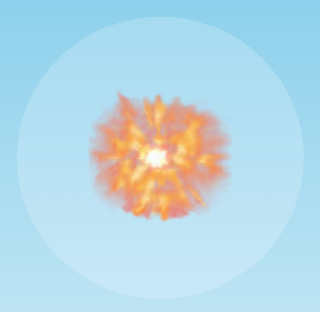

# Räjähdykset



Tällä sivulla opastetaan yksinkertaisen räjähdyksen tekemiseen. Tällä sivulla olevilla ohjeilla räjähdyksestä syntyy myös paineaalto, joka vaikuttaa pelissä oleviin fysiikkaolioihin.

Jos haluat tehdä vähän monimutkaisemman ja näyttävämmän räjähdyksen, josta ei synny paineaaltoa (eli on pelkkä visuaalinen efekti), katso [Efektit/räjähdys](efektit.md#rajahdys).

## Räjähdyksen luominen

Räjähdyksen voi luoda seuraavalla tavalla:

Esimerkki räjähdyksestä.

```csharp,feature-jypeli
//-using System;
//-using Jypeli;
//-using Jypeli.Assets;
//-using Jypeli.Controls;
//-
//-public class rajahdys : PhysicsGame
//-{
//-    public override void Begin()
//-    {
//-        PhysicsObject olio = new PhysicsObject(100, 100);
//-        Camera.Zoom(20);
        Explosion rajahdys = new Explosion(50);
        rajahdys.Position = olio.Position;
        Add(rajahdys);
//-
//-    }
//-}
```

Yllä olevassa esimerkissä:

1.  Rivi: luodaan räjähdys, jonka säde on 50.
2.  Rivi: määritetään räjähdyksen sijainti. Tässä räjähdyksen sijainti on asetettu samaksi kuin olion, joka esimerkiksi tuhoutuu.
3.  Rivi: räjähdys lisätään kenttään, jolloin se näkyy ja vaikuttaa muihin olioihin pelikentällä.

## Ominaisuudet ja ulkonäkö

Räjähdyksen nopeutta ja paineaallon voimakkuutta voi säädellä räjähdyksen ominaisuuksista.

```csharp,ignore
rajahdys.Speed = 500.0;
rajahdys.Force = 10000;
```

Räjähdyksellä on valmiina oletustekstuuri ja -ääni. Voit myös halutessasi vaihtaa ne toisiksi (ks. sivut [tekstuurin lisääminen](../oliot/ulkonako.md#tekstuuri) ja [äänet peliin](aanien-lisays.md)). Kuvan tai äänen saa pois räjähdykseltä asettamalla sen arvoksi `null`.

```csharp,ignore
rajahdys.Image = rajahdysKuva;
rajahdys.Sound = rajahdysAani;
```

Lisäksi räjähdyksen paineaallon väriä voi muuttaa. Jypelin valmiit värit eivät ole läpinäkyviä, joten ne peittävät räjähdykselle annetun kuvan.

Voimme kuitenkin itse määrittää uuden värin, jossa on mukana läpinäkyvyys.

```csharp,ignore
//Paineaallon väri peittää räjähdyksen kuvan:
rajahdys.ShockwaveColor = Color.Yellow;

//Läpinäkyvä väri päästää läpi räjähdyksen kuvan
//Kolme ensimmäistä parametria ovat värin punaisen, vihreän ja sinisen värin määrä
//Neljäs parametri on värin läpinäkyvyys
//Parametrien arvot ovat väliltä 0 - 255.
rajahdys.ShockwaveColor = new Color(255, 0, 150, 90);
```

Esimerkki räjähdyksen muokkaamisesta.

```csharp,feature-jypeli
//-using System;
//-using Jypeli;
//-using Jypeli.Assets;
//-using Jypeli.Controls;
//-
//-public class rajahdys : PhysicsGame
//-{
//-    public override void Begin()
//-    {
//-        PhysicsObject olio = new PhysicsObject(100, 100);
//-        Camera.Zoom(20);
        Explosion rajahdys = new Explosion(50);
        rajahdys.ShockwaveColor = new Color(255, 0, 150, 90);
        // tai rajahdys.ShockwaveColor = Color.Yellow;
        rajahdys.Position = olio.Position;
        Add(rajahdys);
//-
//-    }
//-}
```

## Paineaallon tapahtuma

Räjähdyksen saa myös kutsumaan omaa aliohjelmaa, kun paineaalto osuu johonkin olioon.

```csharp,ignore
rajahdys.ShockwaveReachesObject += PaineaaltoOsuu;
```

tai yhteen tiettyyn olioon

```csharp,ignore
rajahdys.AddShockwaveHandler(olio, PaineaaltoOsuu);
```

tai useaan tietyn tyyppiseen olioon, joilla on kaikilla sama `Tag`-ominaisuuden arvo (tässä "taso"):

```csharp,ignore
rajahdys.AddShockwaveHandler("taso", PaineaaltoOsuu);
```

Aliohjelman tulee näyttää parametreiltaan tältä:

```csharp,ignore
void PaineaaltoOsuu(IPhysicsObject olio, Vector shokki)
{
   // tehdään jotain
}
```

missä `olio` on olio, johon paineaalto on osunut, ja `shokki` vektori, jonka suuntaan räjähdys on oliota heittänyt.

## Paineaallon huomiotta jättäminen

Jos haluat, että paineaallot eivät vaikuta johonkin olioon, voit kirjoittaa:

```csharp,ignore
pelaaja1.IgnoresExplosions = true;
```
