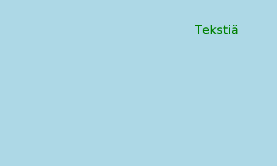
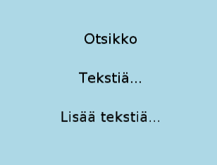
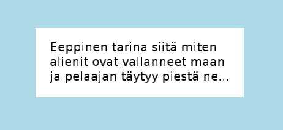
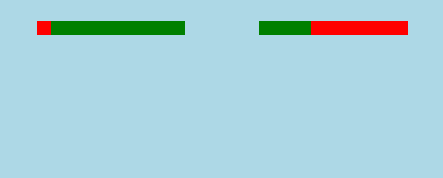
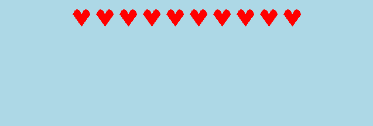
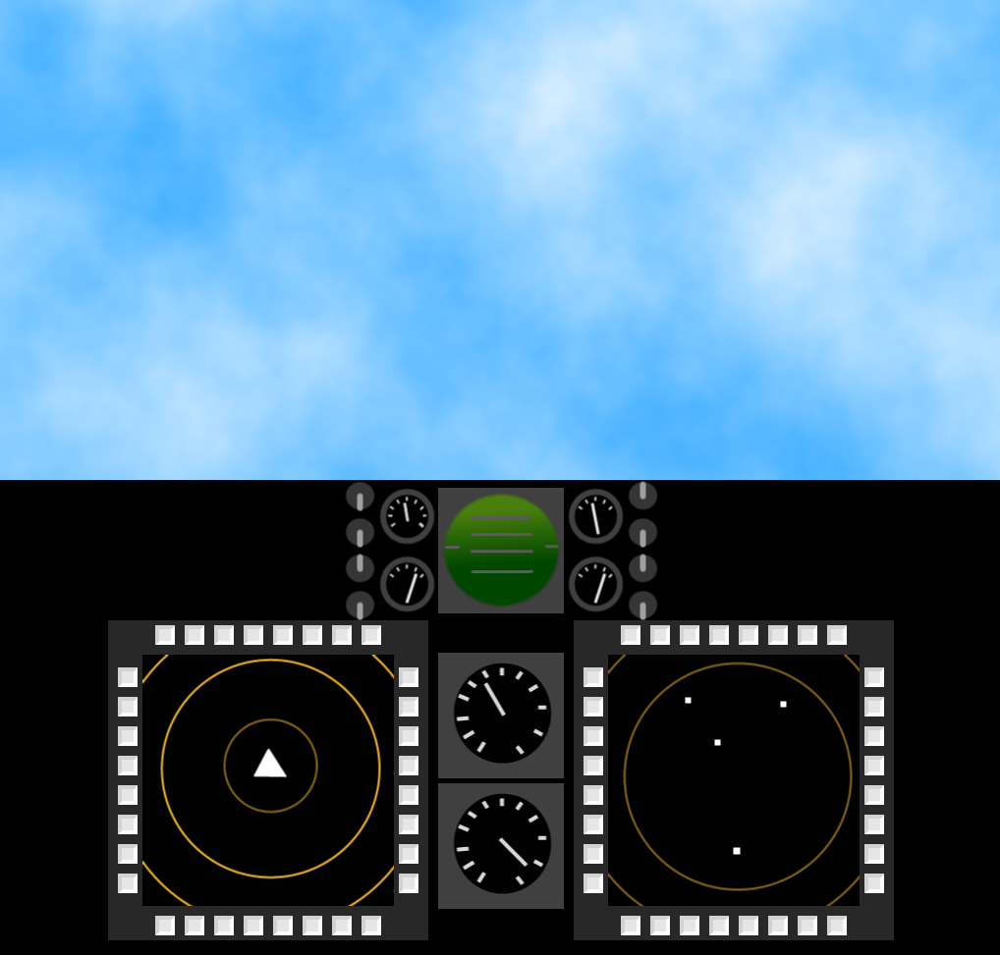

# Esimerkkejä käyttöliittymän tekemisestä

Esimerkkejä, järjestyksessä yksinkertaisesta monipuolisempaan.

## Tekstiä ruudun oikeaan ylänurkkaan

Tsekkaa myös [tekstikentän ohje](teksti.md).

```csharp,ignore
Label teksti = new Label("Tekstiä");
teksti.X = Screen.Right - 100;
teksti.Y = Screen.Top - 50;
teksti.TextColor = Color.Green;
Add(teksti);
```



## Monta tekstiä päällekäin

```csharp,ignore
VerticalLayout asettelu = new VerticalLayout();
asettelu.Spacing = 30;

Widget laatikko = new Widget(asettelu);
laatikko.Color = Color.Transparent;
Add(laatikko);

Label otsikko = new Label("Otsikko");
laatikko.Add(otsikko);

Label teksti1 = new Label("Tekstiä...");
laatikko.Add(teksti1);

Label teksti2 = new Label("Lisää tekstiä...");
laatikko.Add(teksti2);
```



## Ikkuna, jossa on tekstiä

```csharp,ignore
MessageWindow ikkuna = new MessageWindow("Eeppinen tarina siitä miten alienit ovat vallanneet
maan ja pelaajan täytyy piestä ne...");
Add(ikkuna);
```



## Mätkintäpelin HUD (eli ruudun yläreunassa näkyvät palkit)

Tässä esimerkissä oletetaan, että pelissä on mittarit pelaajien elämälle, jotka on määriteltynä luokan sisällä:

```csharp,ignore
DoubleMeter pelaaja1Elama;
DoubleMeter pelaaja2Elama;
```

Katso myös [laskurien ohje](https://trac.cc.jyu.fi/projects/npo/wiki/PistelaskurinTekeminen).

Sekä niiden alustukset, esimerkiksi `Begin()`-aliohjelmassa:

```csharp,ignore
pelaaja1Elama = new DoubleMeter(100);
pelaaja1Elama.MaxValue = 100;
pelaaja2Elama = new DoubleMeter(100);
pelaaja2Elama.MaxValue = 100;
```

[Palkkien luominen](https://trac.cc.jyu.fi/projects/npo/wiki/BarGauge) onnistuu sitten tähän tapaan:

```csharp,ignore
BarGauge pelaaja1Elamapalkki = new BarGauge(20, Screen.Width / 3);
pelaaja1Elamapalkki.X = Screen.Left + Screen.Width / 4;
pelaaja1Elamapalkki.Y = Screen.Top - 40;
pelaaja1Elamapalkki.Angle = Angle.FromDegrees(90);
pelaaja1Elamapalkki.BindTo(pelaaja1Elama);
pelaaja1Elamapalkki.Color = Color.Red;
pelaaja1Elamapalkki.BarColor = Color.Green;
Add(pelaaja1Elamapalkki);

BarGauge pelaaja2Elamapalkki = new BarGauge(20, Screen.Width / 3);
pelaaja2Elamapalkki.X = Screen.Right - Screen.Width / 4;
pelaaja2Elamapalkki.Y = Screen.Top - 40;
pelaaja2Elamapalkki.Angle = Angle.FromDegrees(-90);
pelaaja2Elamapalkki.BindTo(pelaaja2Elama);
pelaaja2Elamapalkki.Color = Color.Red;
pelaaja2Elamapalkki.BarColor = Color.Green;
Add(pelaaja2Elamapalkki);
```



## Inventory

Inventory, eli esinevalikko: 

Huomaa, että nykyisellään (versio 4.0.6) Jypeli tukee vain vaaka- sekä pystysuuntaisia sommitteluja. Näin ollen valikon, jossa esineet ovat monessa rivissä, tekeminen on hankalaa.

Kannattaa periä oma luokka valikkoa varten (kts. myös [perinnän ohje](https://trac.cc.jyu.fi/projects/npo/wiki/Perinta)):

```csharp,ignore
/// <summary>
/// Esinevalikko.
/// </summary>
class Inventory : Widget
{
    /// <summary>
    /// Tapahtuma, kun esine on valittu.
    /// </summary>
    public event Action<PhysicsObject> ItemSelected;

    /// <summary>
    /// Luo uuden esinevalikon.
    /// </summary>
    public Inventory()
        : base(new HorizontalLayout())
    {
    }

    /// <summary>
    /// Lisää esineen.
    /// </summary>
    /// <param name="item">Lisättävä esine.</param>
    /// <param name="kuva">Esineen ikoni, joka näkyy valikossa.</param>
    public void AddItem(PhysicsObject item, Image kuva)
    {
        PushButton icon = new PushButton(kuva);
        Add(icon);
        icon.Clicked += delegate() { SelectItem(item); };
    }

    void SelectItem(PhysicsObject item)
    {
        if (ItemSelected != null)
        {
            ItemSelected(item);
        }
    }
}
```

Inventoryn tekeminen tapahtuu kuten minkä tahansa muunkin widgetin:

```csharp,ignore
Inventory inventory = new Inventory();
Add(inventory);
```

Esineen lisääminen inventoryyn. tässä `miekka` on `PhysicsObject`-tyyppinen olio:

```csharp,ignore
inventory.AddItem(miekka, miekanKuva);
```

## Pelaajan elämät näkyvät sydäminä

```csharp,ignore
HorizontalLayout asettelu = new HorizontalLayout();
asettelu.Spacing = 10;

Widget sydamet = new Widget(asettelu);
sydamet.Color = Color.Transparent;
sydamet.X = Screen.Center.X;
sydamet.Y = Screen.Top - 30;
Add(sydamet);

for (int i = 0; i < 10; i++)
{
    Widget sydan = new Widget(30, 30, Shape.Heart);
    sydan.Color = Color.Red;
    sydamet.Add(sydan);
}
```



## Hävittäjälentokoneen ohjaamo

```csharp,ignore
class Tutkanaytto : Widget
{
    public Tutkanaytto(Image image)
        : base(new VerticalLayout() { Spacing = 10, LeftPadding = 5, RightPadding = 5, TopPadding = 5, BottomPadding = 5 } )
    {
        var vaakaAsettelu = new HorizontalLayout() { Spacing = 10 };
        Color = new Color(40, 40, 40);
        Add(TeeNapit(vaakaAsettelu));
        Add(TeeKeskiosa(image));
        Add(TeeNapit(vaakaAsettelu));
    }

    Widget TeeKeskiosa(Image image)
    {
        var pystyAsettelu = new VerticalLayout() { Spacing = 10, LeftPadding = 5, RightPadding = 5, TopPadding = 5, BottomPadding = 5 };
        Widget w = new Widget(new HorizontalLayout()) { Color = Color.Transparent };
        w.Add(TeeNapit(pystyAsettelu));
        w.Add(new Widget(image));
        w.Add(TeeNapit(pystyAsettelu));
        return w;
    }

    Widget TeeNapit(ILayout layout)
    {
        Widget napit = new Widget(layout) { Color = Color.Transparent };
        for (int i = 0; i < 8; i++)
            napit.Add(new PushButton(20, 20) { Color = new Color(230, 230, 230) } );
        return napit;
    }
}

void LuoHavittajalentokoneenOhjaamo()
{
    Widget ohjaamo = new Widget(Screen.Width, Screen.Height / 2) { Color = Color.Black, SizeByLayout = false };
    ohjaamo.Layout = new VerticalLayout();
    ohjaamo.Add(new HorizontalSpacer());
    ohjaamo.Add(TeeYlaosa());
    ohjaamo.Add(TeeKeskiosa());
    ohjaamo.Add(new HorizontalSpacer());
    Add(ohjaamo);

    ohjaamo.RefreshLayout();
    ohjaamo.X = 0;
    ohjaamo.Y = Screen.Bottom + ohjaamo.Height / 2;
}

Widget TeeYlaosa()
{
    Widget ylaOsa = new Widget(new HorizontalLayout()) { Color = Color.Transparent };

    Widget vivut = new Widget(new VerticalLayout() { Spacing = 5 }) { Color = Color.Transparent };
    vivut.Add(new Widget(vipuAlasKuva));
    vivut.Add(new Widget(vipuAlasKuva));
    vivut.Add(new Widget(vipuYlosKuva));
    vivut.Add(new Widget(vipuAlasKuva));
    ylaOsa.Add(vivut);

    Widget mittarit = new Widget(new VerticalLayout() { Spacing = 5 }) { Color = Color.Transparent };
    mittarit.Add(new Widget(pieniMittariKuva));
    mittarit.Add(new Widget(pieniMittari2Kuva));
    ylaOsa.Add(mittarit);

    ylaOsa.Add(new Widget(tasoMittariKuva));

    mittarit = new Widget(new VerticalLayout() { Spacing = 5 }) { Color = Color.Transparent };
    mittarit.Add(new Widget(pieniMittari3Kuva));
    mittarit.Add(new Widget(pieniMittari2Kuva));
    ylaOsa.Add(mittarit);

    vivut = new Widget(new VerticalLayout() { Spacing = 5 }) { Color = Color.Transparent };
    vivut.Add(new Widget(vipuYlosKuva));
    vivut.Add(new Widget(vipuAlasKuva));
    vivut.Add(new Widget(vipuYlosKuva));
    vivut.Add(new Widget(vipuAlasKuva));
    ylaOsa.Add(vivut);

    return ylaOsa;
}

Widget TeeKeskiosa()
{
    Widget keskiosa = new Widget(new HorizontalLayout() { Spacing = 10 }) { Color = Color.Black };

    keskiosa.Add(new Tutkanaytto(tutka1Kuva));

    Widget mittarit = new Widget(new VerticalLayout() { Spacing = 5 }) { Color = Color.Transparent };
    mittarit.Add(new Widget(mittari1Kuva));
    mittarit.Add(new Widget(mittari2Kuva));
    keskiosa.Add(mittarit);

    keskiosa.Add(new Tutkanaytto(tutka2Kuva));
    return keskiosa;
}
```


