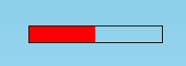
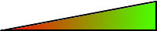

# Etenemispalkki



Joskus peleissä halutaan näyttää ruudulla asioita graafisesti eikä pelkästään numeroarvoilla mitattuna.

Esimerkiksi pelihahmon osumapisteitä voisi kuvata palkilla, joka vähenee, kun hahmoon osuu ammus, tai palloon kohdistettavaa voimaa voisi kuvata palkilla, joka kasvaa sen mukaan kun kohdistettava voima kasvaa.

Jypelissä palkkinäyttöjä voi tehdä `ProgressBar`-olion avulla. Se on tavallaan pelkästään näyttö, jonka voi sitoa jonkin laskurin arvoon. Palkki sitten kasvaa tai pienenee laskurin arvon mukaisesti.

## Vähenevän palkin tekeminen

Tässä esimerkissä luodaan peliin vähenevä elämämittari. Vähenevä mittari voi tietysti kuvata pelissä muutakin kuin elämien määrää.

### Elämäpalkin luominen

Uutta elämäpalkkia varten tarvitsemme laskurin, joka laskee jäljellä olevien elämien määrää, sekä palkin, joka osaa näyttää laskurin arvoa.

- Tehdään elämälaskurista ensin uusi attribuutti, että pääsemme siihen käsiksi kaikista aliohjelmista:

```csharp,ignore
public class Peli : PhysicsGame
{
    DoubleMeter elamalaskuri;

    public override void Begin()
    {
        //...
    }
```

- Luodaan uusi laskuri, jonka alkuarvo on 10. Laskurille pitää erikseen kertoa sen maksimiarvo, jotta palkki tietää, milloin laskuri on täynnä.

- Voimme lisätä laskurille tapahtuman, mitä tehdään (eli mikä aliohjelma suoritetaan) sitten kun laskurin arvo menee nollaan (`LowerLimit`).

- Tämän jälkeen luodaan uusi `ProgressBar`, sidotaan se näyttämään laskurin arvoa (`BindTo`). Palkin luonnissa sille kerrotaan palkin leveys ja korkeus. Lisätään palkki peliin.

```csharp,ignore
void LuoElamalaskuri()
{
    elamalaskuri = new DoubleMeter(10);
    elamalaskuri.MaxValue = 10;
    elamalaskuri.LowerLimit += ElamaLoppui;

    ProgressBar elamapalkki = new ProgressBar(150, 20);
    elamapalkki.X = Screen.Left + 150;
    elamapalkki.Y = Screen.Top - 20;
    elamapalkki.BindTo(elamalaskuri);
    Add(elamapalkki);
}

void ElamaLoppui()
{
    MessageDisplay.Add("Elämät loppuivat, voi voi.");
}
```

### Elämälaskurin arvon vähentäminen

Sopivassa paikassa koodissa voimme nyt vähentää elämälaskurin arvoa (esim. kun pelaaja osuu viholliseen):

```csharp,ignore
elamalaskuri.Value -= 1;
```

Kun elämät menevät nollaan, elämälaskurin `LowerLimit`-tapahtuma laukeaa ja suoritetaan aliohjelma `ElamaLoppui`.

### Palkin muut ominaisuudet

Palkki pystysuoraan:

```csharp,ignore
elamapalkki.Angle = Angle.RightAngle;
```

Värit:

```csharp,ignore
//Taustaväri:
elamapalkki.Color = Color.Transparent;

//Palkin väri:
elamapalkki.BarColor = Color.Red;

//Reunan väri:
elamapalkki.BorderColor = Color.Black;
```

## Kasvavan palkin tekeminen

Tehdään tässä esimerkissä kasvava voimamittari. Kasvavalla mittarilla voidaan näyttää esimerkiksi koripallopelissä heiton voimaa.

### Voimamittarin tekeminen

Kasvavaa palkkia varten tarvitsemme mittarin, joka laskee voimien määrää, ja palkin, joka näyttää mittarin arvoa.

Voimamittaristamme kannattaa tehdä attribuutti, jotta pääsemme siihen käsiksi kaikista aliohjelmista:

```csharp,ignore
public class Peli : PhysicsGame
{
    DoubleMeter voimamittari;

    public override void Begin()
    {
        //...
    }
```

Luodaan sitten jossain aliohjelmassa muuttujaan `voimamittari` uusi laskuri, asetetaan sille maksimiarvo ja sidotaan sen arvo palkkinäyttöön:

```csharp,ignore
voimamittari = new DoubleMeter(0);
voimamittari.MaxValue = 3000;

ProgressBar voimapalkki = new ProgressBar(150, 10);
voimapalkki.BindTo(voimamittari);
Add(voimapalkki);
```

Palkin luonnissa sille kerrotaan palkin leveys ja korkeus. Muistetaan sitoa laskuri palkkiin (`BindTo`). Lopuksi lisätään palkki ruudulle (`Add`).

Palkin sijainti ruudulla voidaan asettaa sen x- ja y-koordinaateista:

```csharp,ignore
voimapalkki.X = Screen.Left + 150;
voimapalkki.Y = Screen.Top - 20;
```

Palkin värin voi asettaa `BarColor`- ja reunojen värin `BorderColor`-ominaisuudella.

```csharp,ignore
voimapalkki.BarColor = Color.Red;
voimapalkki.BorderColor = Color.Aqua;
```

Palkki on oletuksena vaakasuorassa. Kulmaa muuttamalla sen saa kuitenkin esimerkiksi pystysuoraan:

```csharp,ignore
voimapalkki.Angle = Angle.RightAngle;
```

tai vaikkapa 30 asteen kulmaan:

```csharp,ignore
voimapalkki.Angle = Angle.FromDegrees(30);
```

### Voimamittarin arvon kasvattaminen

Sopivassa paikassa koodissa voimme nyt kasvattaa voimamittarin arvoa (esim. kun jokin näppäin on painettuna pohjaan):

```csharp,ignore
voimamittari.Value += 1;
```

Mittarin voi vastaavasti nollata (esim. kun jokin näppäin nostetaan pohjasta):

```csharp,ignore
voimamittari.Value = 0;
```

### Voimamittarin täyttyminen

Jos pelissämme halutaan tietää, milloin kasvava mittari on täynnä, se voidaan tehdä mittarin tapahtumalla `UpperLimit`.

```csharp,ignore
voimamittari.UpperLimit += VoimamittariTaynna;
```

Aliohjelmaa `VoimamittariTaynna` kutsutaan, kun voimamittari saavuttaa maksimiarvonsa:

```csharp,ignore
void VoimamittariTaynna()
{
    MessageDisplay.Add("Voimat täynnä!");
}
```

## Kuvan antaminen palkille

Palkille voi antaa myös edusta- ja taustakuvan.

Taustakuva on se, miltä palkki näyttää tyhjänä: 

ja edustakuva on se, miltä palkki näyttää täynnä: 

Jos edelliset kuvat ovat vaikkapa taysipalkki.png ja tyhjapalkki.png, kuvat voidaan asettaa

```csharp,ignore
palkki.Image = LoadImage("tyhjapalkki");
palkki.BarImage = LoadImage("taysipalkki");
```

Nyt kun palkki on esimerkiksi puoliksi täynnä, se näyttää tältä:


