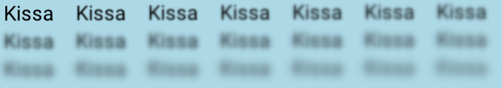
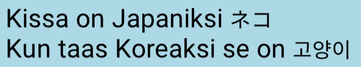

# Fontit

Fontti tarkoittaa kirjasinta, eli sitä miltä teksti näyttää. Jypeli sisältää valmiiksi [Roboto](https://fonts.google.com/specimen/Roboto)-fontin normaalilla kirjaisimella, sekä boldattuna.

Näihin pääsee käsiksi `Font.Default` tai `Font.DefaultBold` -kenttien kautta.

## TrueType ja OpenType -fonttien käyttäminen

TrueType (.ttf) ja OpenType (.otf) -fontit saa käyttöön lisäämällä fonttitiedoston projektin `Content`-kansioon ja lataamalla sen. esimerkiksi [Labelille](teksti.md):

```csharp,ignore
Label label = new Label("Tämä tulee eri fontilla.");
label.Font = LoadFont("fontti.ttf");
Add(label);
```

Hyvä paikka fonttitiedostojen etsintään on esimerkiksi [Google fonts](https://fonts.google.com/).

On kuitenkin suositeltavaa, että fonttia ei ladata jokaiselle `Label`ille erikseen, vaan että se ladataan ohjelman attribuuteissa, esimerkiksi:

```csharp,ignore
Font omaFontti = LoadFont("NotoSansKR-Regular.otf");

public override void Begin()
{
    // Muuta koodia...

    Label l = new Label("Kissa");
    l.Font = omaFontti;
    ...
```

## Fontin koon muuttaminen

Olemassaolevan fontin kokoa voi muuttaa `omaFontti.Size = 50;` Fonttien oletuskoko on 25.

**Huom!** jos muutat Jypelin valmiiden `Font.Default` tai `Font.DefaultBold` -fonttien kokoa, vaikuttaa se joka ikiseen käyttöliittymäkomponenttiin oletuksena.

Voit tehdä oletusfontista kopion:

```csharp,ignore
// Konstruktorin parametrit ovat koko, onkoBoldattu.
Font kopio = new Font(25); // tai
Font kopioBold = new Font(25, true);
```

## Fonttien tyylittely

Voit antaa fontille reunuksen sanomalla `omaFontti.StrokeAmount = 1;`, tai sumentaa fonttia `omaFontti.BlurAmount = 1;`.



Molempien sallitut arvot ovat väliltä `0-20`;

Fontilla ei voi olla samaan aikaan sekä reunus että sumennus.

## Kahden tai useamman fontin yhdistäminen

Voit lisätä fonttiin myös toisen fonttitiedoston tuoman merkistön, esimerkiksi usean eri merkistön käyttämiseksi samassa `Label`issa.

Mikäli fonttitiedostot sisältävät päällekkäin menevää merkistöä, ensimmäisenä lisätty pysyy käytössä.

```csharp,ignore
// Luodaan ensin oma fontti-olio
Font omaFontti = new Font(50);

// Sitten yhdistetään siihen Japanin ja Korean merkistöt
// Fonttitiedostot lisätty Content-kansioon.
omaFontti.AddFont("NotoSansJP-Regular.otf");
omaFontti.AddFont("NotoSansKR-Regular.otf");

Label l = new Label("Kissa on Japaniksi ネコ\nKun taas Koreaksi se on 고양이");
l.TextColor = Color.Black;
l.Font = omaFontti;
Add(l);
```



## Labelin tekstin yksittäisten merkkien värjääminen

Labelin tekstin merkit on mahdollista värjätä yksittäin.

```csharp,ignore
Label label = new Label("Kissa");
label.Font = new Font(50);
Color[] varit = new Color[] { Color.Red, Color.Green, Color.Blue, Color.Brown, Color.Red };
label.CharacterColors = varit;
Add(label);
```


Huomioita:

- Taulukossa tulee olla tekstin jokaiselle merkille väri, eli väritaulukon tulee olla vähintään yhtä pitkä kuin itse tekstin.
- Tämän kentän arvon asettaminen ylittää `label.TextColor`-kentän arvon.
