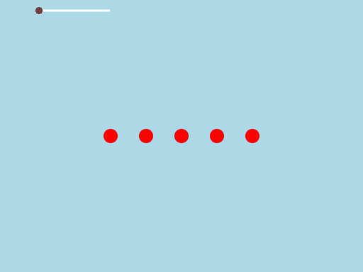

# Liukusäätimet

Esimerkki: liukusäädin kentän zoomausta varten.



Kun liukusäätimen nuppia vedetään vasemmalta oikealle, siihen sidotun mittarin
arvo kasvaa nollasta yhteen ja kamera zoomaa kenttää lähemmäs.

Luodaan liukusäätimelle ensin mittari, jonka lähtöarvo on 0, minimiarvo 0 ja maksimiarvo 1. Sidotaan mittari liukusäätimeen.
`Slider` on nimiavaruudessa `Jypeli.Widgets`, joten tiedoston alkuun tarvitaan rivi `using Jypeli.Widgets;`.

Esimerkki liukusäätimen käytöstä: [​http://www.youtube.com/watch?v=8_5lD57VIK0&feature=relmfu](http://www.youtube.com/watch?v=8_5lD57VIK0&feature=relmfu)

```csharp,ignore
void LuoSlider()
{
    DoubleMeter zoomauskerroin = new DoubleMeter(0, 0, 1);
    zoomauskerroin.Changed += ZoomaaKenttaa;

    Slider liukusaadin = new Slider(200, 20);
    liukusaadin.BindTo(zoomauskerroin);

    Add(liukusaadin);
}

void ZoomaaKenttaa(double vanhaArvo, double uusiArvo)
{
    Camera.ZoomFactor = 1 + uusiArvo;
}
```

Liukusäätimen paikan asettaminen ja värien muuttaminen:

```csharp,ignore
    liukusaadin.X = Screen.LeftSafe + 200;
    liukusaadin.Y = Screen.TopSafe - 40;

    liukusaadin.Color = Color.Pink;
    liukusaadin.Knob.Color = Color.Black;
    liukusaadin.Track.Color = Color.Blue;
    liukusaadin.BorderColor = Color.Red;
```
