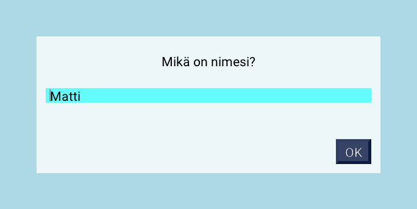

# Tekstin kysyminen pelaajalta

Jypeli sisältää valmiin luokan `InputWindow` tekstin kysymiseen pelaajalta. Luokkaa voidaan käyttää esimerkiksi pelaajan nimen tai oven salasanan syöttämiseen. Huomaa, että parhaiden pisteiden listaa varten on oma luokka: [HighScoreWindow](parhaiden-pisteiden-lista.md).



Kuvan ikkuna kysyy pelaajan nimeä. Koko ohjelma on sivun lopussa kohdassa
[Esimerkki: pelaajan nimen kysyminen](#esimerkki).

## Ikkunan luominen

Kysymysikkuna luodaan antamalla sille kysymys. Tapahtumalle `TextEntered` annetaan tapahtumankäsittelijä, joka suoritetaan, kun pelaaja on kirjoittanut vastauksen ja painanut Enteriä tai OK-nappia. Lopuksi ikkuna näytetään ruudulla lisäämällä se peliin.

```csharp,ignore
InputWindow kysymysikkuna = new InputWindow("Mikä on nimesi?");
kysymysikkuna.TextEntered += KasitteleSyote;
Add(kysymysikkuna);
```

Ikkunan värejä voi muuttaa seuraavasti:

```csharp,ignore
InputWindow kysymysikkuna = new InputWindow("Mikä on nimesi?");

// Ikkunan taustaväri
kysymysikkuna.ActiveColor = Color.DarkGray;

// Kysymyksen värit
kysymysikkuna.Message.Color = Color.DarkGray; // Tausta
kysymysikkuna.Message.TextColor = Color.White; // Teksti

// Kirjoituslaatikon värit
kysymysikkuna.InputBox.Color = Color.DarkGray; // Tausta
kysymysikkuna.InputBox.TextColor = Color.White; // Teksti

// Napin värit
kysymysikkuna.OKButton.Color = Color.DarkGray; // Tausta
kysymysikkuna.OKButton.TextColor = Color.White; // Teksti

Add(kysymysikkuna);
```

## Tapahtumankäsittelijä

Tapahtumankäsittelijäaliohjelma on seuraavaa muotoa. Pelaajan kirjoittama
teksti luetaan ikkunan kirjoituslaatikosta `InputBox`.

```csharp,ignore
void KasitteleSyote(InputWindow ikkuna)
{
    string vastaus = ikkuna.InputBox.Text;
    // tehdään jotain vastauksella
}
```

## Esimerkki: pelaajan nimen kysyminen {#esimerkki}

Peli kysyy käynnistyessään pelaajan nimen. Kun nimi on kirjoitettu ja
vahvistettu, ikkuna sulkeutuu ja ruudun vasempaan yläkulmaan tulee tervehdys, jossa
nimi on mukana. Tervehdys näytetään [MessageDisplay](teksti.md#messagedisplay)-tekstinä.

```csharp,feature-jypeli
using Jypeli;

public class Peli : PhysicsGame
{
    public override void Begin()
    {
        InputWindow kysymysikkuna = new InputWindow("Mikä on nimesi?");
        kysymysikkuna.TextEntered += KasitteleSyote;
        Add(kysymysikkuna);
    }

    void KasitteleSyote(InputWindow ikkuna)
    {
        string nimi = ikkuna.InputBox.Text;
        MessageDisplay.Add("Tervetuloa peliin, " + nimi + "!");
    }
}
```

Nimen voi myös tallettaa attribuuttiin ja käyttää sitä myöhemmin, esimerkiksi
[parhaiden pisteiden listassa](parhaiden-pisteiden-lista.md) tai pelin
lopputekstissä.
