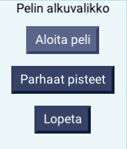
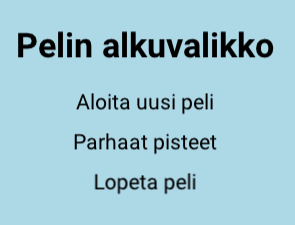

# Valikot

## MultiSelectWindow (monivalintaikkuna) {#multiselect}

### Monivalintaikkunan luonti

Monivalintaikkuna luodaan antamalla sille ikkunan yläosaan tuleva teksti ja vaihtoehdot, joista pelaaja voi valita.

Kaikki `String`-oliot ensimmäisen jälkeen sijoitetaan taulukkoon, josta niitä voi helposti kutsua tapahtumankäsittelijässä kyseisen `String`-olion indeksillä.

```csharp,ignore
MultiSelectWindow alkuvalikko = new MultiSelectWindow("Pelin alkuvalikko", "Aloita peli", "Parhaat pisteet", "Lopeta");
Add(alkuvalikko);
```

Voit myös antaa vaihtoehdot halutessasi taulukkona:

```csharp,ignore
string[] vaihtoehdot = { "Aloita peli", "Parhaat pisteet", "Lopeta" };
MultiSelectWindow alkuvalikko = new MultiSelectWindow("Pelin alkuvalikko", vaihtoehdot);
```

Alla oleva kuva selventää hieman, kuinka annetut merkkijonot sijoittuvat monivalintaikkunaan.



### Tapahtumankäsittelijä

Painikkeille voi asettaa tapahtumia `AddItemHandler`-metodilla. Parametriksi tulee napin indeksi (kuinka mones, alkaa nollasta) ja aliohjelma, joka suoritetaan, kun nappia painetaan.

```csharp,ignore
alkuvalikko.AddItemHandler(0, AloitaPeli);
alkuvalikko.AddItemHandler(1, ParhaatPisteet);
alkuvalikko.AddItemHandler(2, Exit);
```

Valikon eri vaihtoehtoja voi myös selata nuolinäppäimillä ja vahvistaa valinnan Enterillä.

Valikosta valitun vaihtoehdon väri on oletuksena hieman muita vaaleampi.

### Peruutusnäppäin

Ikkunasta pääsee oletuksena pois esc-näppäimellä, puhelimen takaisin-painikkeella ja peliohjaimen B-näppäimellä, jolloin valitaan automaattisesti ensimmäinen ("nollas") vaihtoehto. Vaihtoehdon voi vaihtaa `DefaultCancel`-ominaisuutta muuttamalla.

```csharp,ignore
alkuvalikko.DefaultCancel = 2;
```

Yllä oleva valitsee siis kolmannen (0 = ensimmäinen) vaihtoehdon peruutusnäppäimestä. Jos peruutusnäppäin halutaan pois käytöstä, `DefaultCancel`ille voidaan antaa arvo rajojen ulkopuolelta, esimerkiksi -1.

```csharp,ignore
alkuvalikko.DefaultCancel = -1;
```

### Muita ominaisuuksia

#### Taustan ja nappuloiden väri

```csharp,ignore
alkuvalikko.Color = Color.Red;
```

#### Nappuloiden väri

```csharp,ignore
alkuvalikko.SetButtonColor(Color.Orange);
```

#### Nappuloiden tekstin väri

```csharp,ignore
alkuvalikko.SetButtonTextColor(Color.Red);
```

#### Valikon liikuttamisen estäminen

```csharp,ignore
alkuvalikko.CapturesMouse = false;
```

#### Nappulat yksittäin

Valikon kaikki nappulat saa käsiteltäväksi:

```csharp,ignore
PushButton[] nappulat = alkuvalikko.Buttons;
```

Jolloin niitä voidaan yksittäin hallita, esimerkiksi:

```csharp,ignore
nappulat[0].Color = Color.Red;
nappulat[1].HoverColor = Color.Black;
nappulat[2].PressedColor = Color.Yellow;
```

## Labeleiden avulla

Tehdään alkuvalikko `Label`-olioiden avulla, joka sisältää samat valinnat kuin yllä `MultiSelectWindow`:lla tehty valikko.



### Valikon kohdat

Tässä valikon kohtia on vain kolme, mutta voisi toki olla paljon enemmänkin.

Valikon kohdat on näin ollen järkevintä säilyttää listassa.

```csharp,ignore
List<Label> valikonKohdat;
```

Tällä kertaa valikko on viisainta tehdä omassa aliohjelmassaan, jonka nimi on `Valikko()`.

Luodaan aliohjelmassa ensin yksi valikon kohta, lisätään se listaan ja peliin.

#### Ensimmäinen kohta

```csharp,ignore
void Valikko()
{
    Label otsikko = new Label("Pelin alkuvalikko"); // Luodaan otsikko
    otsikko.Y = 100; // Otsikko on hieman valikonkohtien yläpuolella
    otsikko.Font = new Font(40, true); // Otsikon teksti on suurempi ja boldattu
    Add(otsikko);

    valikonKohdat = new List<Label>(); // Alustetaan lista, johon valikon kohdat tulevat

    Label kohta1 = new Label("Aloita uusi peli");  // Luodaan uusi Label-olio, joka toimii uuden pelin aloituskohtana
    kohta1.Position = new Vector(0, 40);  // Asetetaan valikon ensimmäinen kohta hieman kentän keskikohdan yläpuolelle
    valikonKohdat.Add(kohta1);  // Lisätään luotu valikon kohta listaan jossa kohtia säilytetään

    // Lisätään kaikki luodut kohdat peliin foreach-silmukalla
    foreach (Label valikonKohta in valikonKohdat)
    {
        Add(valikonKohta);
    }
}
```

Katso myös [fonttien käsittely](fontti.md)

#### Loput kohdat

Loput kohdat valikkoon lisätään ensimmäisen kohdan tavoin. Lisää siis koodiisi seuraavat rivit.

Sijoita ne rivien `valikonKohdat.Add(kohta1)` ja `foreach (Label valikonKohta in valikonKohdat)` **väliin**.

```csharp,ignore
Label kohta2 = new Label("Parhaat pisteet");
kohta2.Position = new Vector(0, 0);
valikonKohdat.Add(kohta2);

Label kohta3 = new Label("Lopeta peli");
kohta3.Position = new Vector(0, -40);
valikonKohdat.Add(kohta3);
```

### Hiiren kuuntelijat

Tehdään seuraavaksi hiirelle kuuntelijat kuhunkin valikon kohtaan liittyen sekä yleinen kuuntelija, jotta valikon kohdat saadaan korostumaan. Lisää seuraavat rivit `foreach`-silmukan jälkeen:

#### Klikkauskuuntelijat

```csharp,ignore
Mouse.ListenOn(kohta1, MouseButton.Left, ButtonState.Pressed, AloitaPeli, null);
Mouse.ListenOn(kohta2, MouseButton.Left, ButtonState.Pressed, ParhaatPisteet, null);
Mouse.ListenOn(kohta3, MouseButton.Left, ButtonState.Pressed, Exit, null);
```

Näillä riveillä kuunnellaan hiiren vasenta nappia silloin, kun se on annetun kohdan päällä.

Esimerkiksi rivi

```csharp,ignore
Mouse.ListenOn(kohta1, MouseButton.Left, ButtonState.Pressed, AloitaPeli, null);
```

kuuntelee hiiren vasenta nappia silloin, kun se on `kohta1`:n päällä, eli tässä tapauksessa "Aloita uusi peli" -kohdan päällä.

Kun hiiren vasenta nappia klikkaa, suoritetaan annettu aliohjelma, tässä tapauksessa `AloitaPeli`.

#### Valikossa liikkuminen

Mikäli valikon kohta halutaan värjätä erilaiseksi, kun hiiri on sen päällä, se onnistuu seuraavanlaisella koodilla:

```csharp,ignore
Mouse.ListenOn(kohta1, HoverState.Enter, MouseButton.None, ButtonState.Irrelevant, ValikossaLiikkuminen, null, kohta1, true);
Mouse.ListenOn(kohta1, HoverState.Exit, MouseButton.None, ButtonState.Irrelevant, ValikossaLiikkuminen, null, kohta1, false);
```

Ja tähän tarvittava aliohjelma:

```csharp,ignore
void ValikossaLiikkuminen(Label kohta, bool paalla)
{
    if (paalla)
    {
        kohta.TextColor = Color.Red;
    }
    else
    {
        kohta.TextColor = Color.Black;
    }
}
```

Tässä lisättiin kuuntelija 1. valikon kohdalle, joka kutsuu `ValikossaLiikkuminen`-aliohjelmaa aina, kun hiiri tulee kohdan päälle tai poistuu sen päältä, ja antaa tälle aliohjelmalle kyseisen valikon kohdan sekä totuusarvon siitä, tuliko hiiri sen päälle vai poistuiko se.

Vastaavanlaiset kuuntelijat voidaan lisätä muillekin elementeille.

Toistaiseksi `ListenOn`-kuuntelijalle on pakko antaa jokin hiiren nappi, vaikka mitään nappulanpainallusta ei kuunneltaisikaan. Tällöin on hyvä antaa `MouseButton.None` sekä `ButtonState.Irrelevant`, jolloin hiiren minkään napin tilalla ei ole merkitystä.

### Kutsuttavat aliohjelmat

Hiiren klikkauksen kuuntelijoita tehtäessä määriteltiin muutamia aliohjelmia, jotka täytyy tehdä vielä. Luo siis seuraavat aliohjelmat peliisi ja lisää niihin haluamasi toteutus.

```csharp,ignore
void AloitaPeli()
{
}
```

```csharp,ignore
void ParhaatPisteet()
{
}
```

## Kehittyneemmät omat valikot

Katso [sommittelu](sommittelu.md) sekä [omien käyttöliittymäkomponenttien tekeminen](omat-kayttoliittymakomponentit.md).
