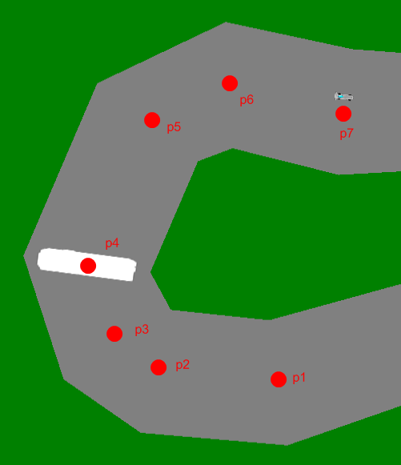

# Autorata

Radan luominen:

- Luettele reittipisteet taulukossa
- Luo uusi `RoadMap`-olio (tässä nimellä `tie`)
- Aseta radalle leveys (`tie.DefaultWidth = 50.0;`)
- Kutsu lopuksi `tie.Insert();`

Reittipisteistä muodostuu rata seuraavasti:



Esimerkkikoodi:

```csharp,feature-jypeli
//-using System;
//-using Jypeli;
//-using Jypeli.Controls;
//-
//-public class Autorata : PhysicsGame
//-{
//-    public override void Begin()
//-    {
//-        Camera.ZoomToLevel();
//-        LuoRata();
//-    }
    /// <summary>
    /// Esimerkkinä U:n muotoinen rata
    /// </summary>
    Vector[] reittipisteet = new Vector[]
    {
        new Vector(0, 0),
        new Vector(0, -200),
        new Vector(-200, -200),
        new Vector(-200, 0),
        // ...
    };

    /// <summary>
    /// Luodaan rata pisteiden perusteella
    /// </summary>
    void LuoRata()
    {
        RoadMap tie = new RoadMap(reittipisteet);
        tie.DefaultWidth = 50.0; //Radan leveys
        tie.Insert(); // Lisätään rata kentälle
    }
//-}
```

## Radan segmenttien luominen itse

`RoadMap`-luokalla tehty rata koostuu itse asiassa pienistä segmenteistä, jotka asetetaan toistensa perään. Joskus on kätevää, että segmenttioliot voi luoda itsekin. Esimerkiksi jos halutaankin tehdä kaide, johon voi törmätä, pitäisi luotavien olioiden olla fysiikkaolioita. Tällainen onnistuu määrittämällä oma aliohjelma, jolla segmentit luodaan:

```csharp,feature-jypeli
//-using System;
//-using System.Collections.Generic;
//-using Jypeli;
//-
//-public class Autorata : PhysicsGame
//-{
//-    public override void Begin()
//-    {
//-        LuoKaide();
//-    }
//-
//-    /// <summary>
//-    /// Esimerkkinä U:n muotoinen tie
//-    /// </summary>
//-    Vector[] reittipisteet = new Vector[]
//-    {
//-        new Vector(0, 0),
//-        new Vector(0, -200),
//-        new Vector(-200, -200),
//-        new Vector(-200, 0),
//-        // ...
//-    };
    /// <summary>
    /// Luodaan kaide pisteiden perusteella
    /// </summary>
    void LuoKaide()
    {
        RoadMap kaide = new RoadMap(reittipisteet);
        kaide.DefaultWidth = 30.0; // Kaiteen leveys
        kaide.CreateSegmentFunction = LuoKaiteenPatka; // Funktio joka luo osan kaiteesta
        kaide.Insert();
    }

    /// <summary>
    /// Luodaan kaiteen "pätkä"
    /// </summary>
    /// <param name="width">Leveys</param>
    /// <param name="height">Pituus</param>
    /// <param name="shape">Muoto</param>
    /// <returns>Kaiteen "pätkä"</returns>
    PhysicsObject LuoKaiteenPatka(double width, double height, Shape shape)
    {
        PhysicsObject patka = PhysicsObject.CreateStaticObject(width, height, shape);
        patka.Color = Color.Brown;
        Add(patka);
        return patka;
    }
//-
//-}
```
