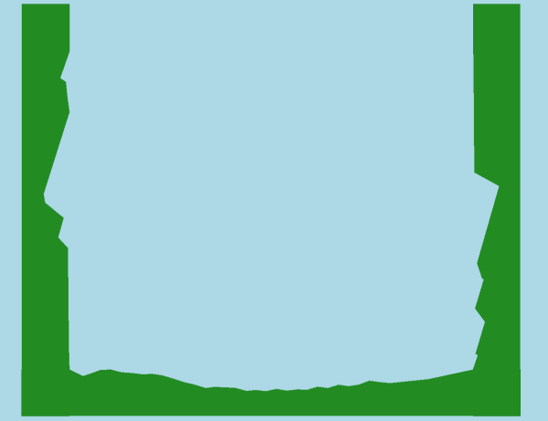
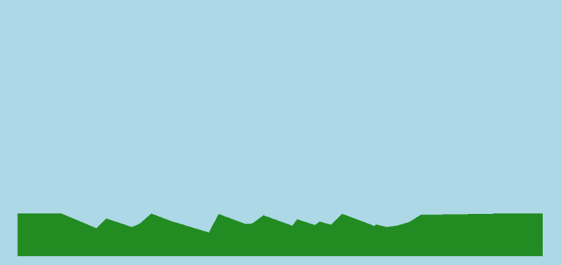
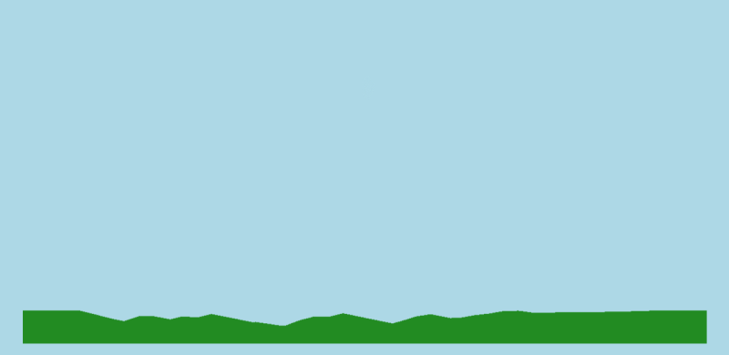
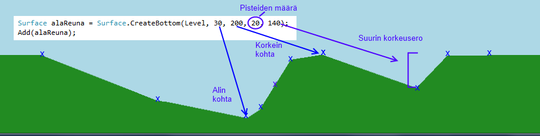

# Reunojen ja maaston tekeminen

Tässä ohjeessa kerrotaan, miten peliin lisätään tasainen tai epätasainen reuna kentän yhdelle tai useammalle laidalle pintoja käyttämällä. Pintoja voi käyttää myös muualla kentässä.



## Reunan luonti

### Tasainen reuna

Tasaisen reunan kentän alalaitaan saa luotua kun kirjoittaa

```csharp,ignore
Surface alareuna = Surface.CreateBottom(Level);
Add(alareuna);
```


### Epätasainen reuna

Epätasaisen reunan luonti onnistuu myös Surface-luokan avulla. Tällöin reunan luomisen yhteydessä pitää antaa enemmän parametreja kuin tasaista reunaa luodessa.

```csharp,ignore
Surface alareuna = Surface.CreateBottom(Level, 30, 100, 40);
Add(alareuna);
```

Yllä oleva koodi voisi antaa esimerkiksi seuraavanlaisen reunan



Jos ei haluta reunasta piikikästä, annettaan luomisen yhteydessä vielä yksi parametri, joka määrää kahden pisteen välisen suurimman etäisyyden.

```csharp,ignore
Surface alareuna = Surface.CreateBottom(Level, 30, 100, 40, 10);
Add(alareuna);
```



**Tärkeää''' Huomaa, että varsinkin monimutkaisten epätasaisten pintojen arpominen on sen verran hidasta, ettei niitä kannata ylikäyttää.**

### Reunan luomisen yhteydessä käytettävät parametrit

Alla olevassa kuvassa on luotu reuna kuvan mukaisella koodilla. Kuvan alla on selitetty mitä parametreja on annettu ja mitä ne tekevät.



| Parametrin nimi | Parametrin arvo | Selitys |
|:---|:---|:---|
| Kenttä | Level | Kenttä, johon reuna luodaan. Tämä on yleensä aina Level |
| min | 30 | Matalin kohta reunassa (merkitty sinisellä kuvaan) |
| max | 100 | Korkein kohta reunassa (merkitty sinisellä kuvaan) |
| points | 40 | Pisteiden määrä reunan luomiseen (merkitty punaisella kuvaan) |
| maxchange | 10 | Pisteiden väliin jäävän välin suurin korkeus (merkitty violetilla kuvaan) |

### Muiden reunojen luonti

Muiden reunojen luonti onnistuu muuttamalla **Surface.CreateBottom(Level)**-kohdan tilalle jonkin seuraavista

- **Surface.CreateLeft(Level)** : Luo kentän vasemman reunan
- **Surface.CreateRight(Level)** : Luo kentän oikean reunan
- **Surface.CreateTop(Level)** : Luo kentän yläreunan

## Irrallinen taso/maasto

Surfacella on mahdollista luoda myös aivan tavallisia fysiikkaolioita, jotka kuitenkin muotoillaan maaston muotoiseksi. Alla muutamia esimerkkejä minkälaisia maastoja/tasoja voidaan luoda.

### Tasainen taso

```csharp,ignore
Surface taso = new Surface(200, 30);
Add(taso);
```


### Epätasainen maasto

```csharp,ignore
Surface maasto = new Surface(200, 30, 50, 60);
Add(taso);
```


Voidaan myös antaa viides parametri, joka määrää pisteiden väliin jäävän suurimman korkeusmuutoksen

```csharp,ignore
Surface maasto = new Surface(200, 30, 50, 60, 10);
Add(maasto);
```


### Edistyneempi maasto

Jos haluat määrätä itse, miten maasto käyttäytyy, voit antaa parametrina desimaalilukutaulukon ja skaalausvakion jolla jokainen taulukon luku kerrotaan. Maaston kunkin pisteen korkeus luetaan annetusta taulukosta.

```csharp,ignore
double[] korkeudet = new double[] { 10, 12, 15, 20, 20, 17, 10 }
Surface maasto = new Surface(korkeudet, 1.0);
Add(maasto);
```

## Useiden reunojen luominen yhdellä rivillä

Koska kentän reunoja tarvitaan useissa peleissä, on kahdeksan riviä ohjelmakoodia niiden luomiseen ja kentälle lisäämiseen hiukan liikaa. Tätä varten kenttäluokassa (Level) on valmiita aliohjelmia useiden reunojen luomiseen kerralla. Nämä aliohjelmat myös lisäävät reunat automaattisesti peliin, jolloin Add-riviä ei tarvita.

|  |  |
|:---|:---|
| `CreateBorders(minkorkeus, maxkorkeus, pisteet, kimmoisuus, kuva)` | Luo tasaiset reunat kaikille sivuille. |
| `CreateBorders(false)` | Luo näkymättömät tasaiset reunat kaikille sivuille. |
| `CreateBorders(kimmoisuus, näkyvyys)` | Luo tasaiset reunat kaikille sivuille halutulla kimmoisuudella (0-1) ja näkyvyydellä (true/false). |
| `CreateBorders(kimmoisuus, näkyvyys, väri)` | Luo tasaiset reunat kaikille sivuille halutulla kimmoisuudella, näkyvyydellä ja värillä. |
| `CreateBorders(kimmoisuus, näkyvyys, kuva)` | Luo tasaiset reunat kaikille sivuille halutulla kimmoisuudella, näkyvyydellä ja tekstuurilla (kuvalla). |
| `CreateBorders(minkorkeus, maxkorkeus, pisteet)` | Luo epätasaiset reunat kaikille sivuille. |
| `CreateBorders(minkorkeus, maxkorkeus, pisteet, kimmoisuus)` | Luo epätasaiset reunat kaikille sivuille halutulla kimmoisuudella (0-1). |
| `CreateBorders(minkorkeus, maxkorkeus, pisteet, kimmoisuus, väri)` | Luo epätasaiset reunat kaikille sivuille halutulla kimmoisuudella ja värillä. |
| `CreateBorders(minkorkeus, maxkorkeus, pisteet, kimmoisuus, kuva)` | Luo epätasaiset reunat kaikille sivuille halutulla kimmoisuudella ja tekstuurilla (kuvalla). |

Kaikille näille aliohjelmille on olemassa myös vastaavat aliohjelmat `CreateHorizontalBorders` ja `CreateVerticalBorders` jotka luovat pelkästään vaaka- tai pystysuuntaiset reunat kentälle. Aliohjelmat palauttavat `Surfaces`-tyyppisen olion, jonka kautta reunojen ominaisuuksia voi muuttaa tai lisätä esimerkiksi törmäyskäsittelijöitä:

```csharp,ignore
Surfaces reunat = Level.CreateBorders();
reunat.Bottom.Color = Color.ForestGreen;
reunat.Top.Collided += TormattiinYlareunaan;
```

Reunoille voidaan käyttää myös `foreach`-lausetta. Seuraava esimerkki muuttaa kaikkien reunojen värin punaiseksi.

```csharp,ignore
Surfaces reunat = Level.CreateBorders();

foreach (var reuna in reunat)
{
    reuna.Color = Color.Red;
}
```

Jos haluaa muuttaa useamman kuin yhden reunan (mutta ei kaikkien) ominaisuuksia kerralla, se onnistuu käyttämällä `get`-aliohjelmaa `foreach`-lauseen yhteydessä.

```csharp,ignore
Surfaces reunat = Level.CreateBorders();

foreach (var reuna in reunat.get(Direction.Left, Direction.Right))
{
    reuna.Color = Color.Red;
}
```

Surface alareuna = Surface.CreateBottom(Level, 30, 100, 40, 10); Add(alareuna);
