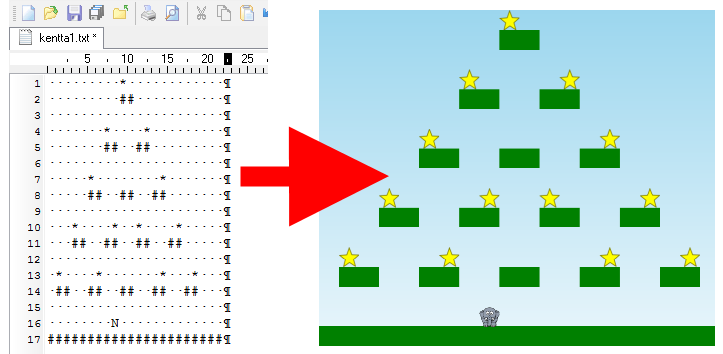
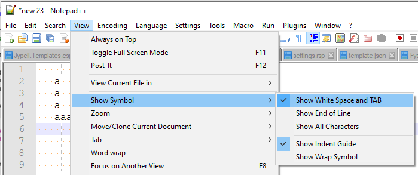
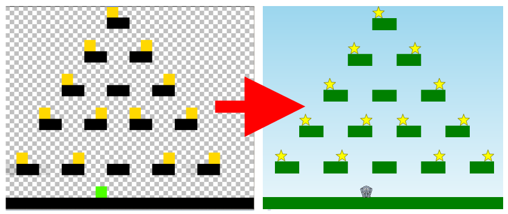
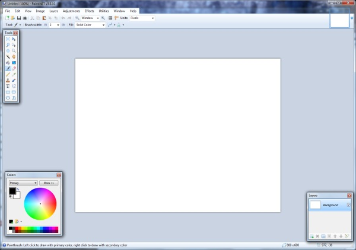
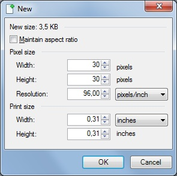
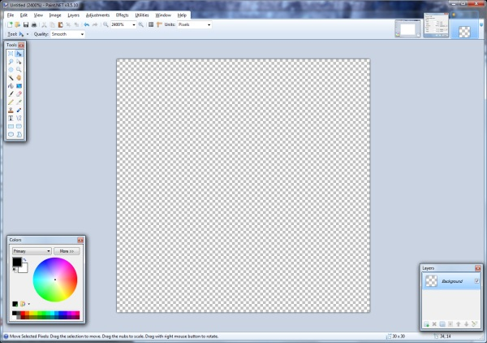
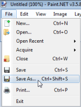
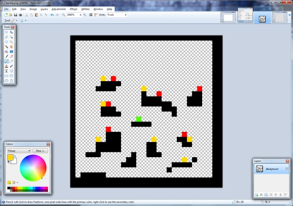

# Ruutukenttä

Jypelissä on mahdollista luoda kenttä merkkijonotaulukkoon, kuvatiedostoon tai tekstitiedostoon "piirretyn" mallin mukaisesti.

Tällöin puhutaan, että tehdään ns. *ruutukenttä*, sillä kuvatiedoston jokainen pikseli tai tekstitiedoston jokainen merkki asetetaan vastaamaan tietyn kokoista ruutua pelikentässä.

## Kentän luominen merkkijonotaulukosta {#stringlines}

Helpoin tapa luoda pelikenttä on tehdä se merkkijonotaulukosta.

```csharp,ignore
private static readonly String[] lines = {
              "                        ",
...
              "                        ",
              "        =======         ",
              "        Y  Y  Y         ",
              "        X* X  X         ",
              "   *    X  X  X     *   ",
              "        X  X  X         ",
              "        X *X *X         ",
              };
```

Taulukkoon kuvataan itse valituilla kirjaimilla, mihin kohti kenttää halutaan mitäkin elementtejä.

Sitten lasketaan, millaista leveyttä ja korkeutta kukin elementti edustaa.

Itse kentän kuvaus luodaan sitten tästä taulukosta:

```csharp,ignore
TileMap tiles = TileMap.FromStringArray(lines);
```

Sitten kerrotaan, mitä piirtometodia kutsutaan kunkin kirjaimen kohdalla. Metodille voidaan vielä lisäksi antaa haluttu määrä lisäparametreja. Esimerkissä kullekin elementille on viety sen väri.

```csharp,ignore
    tiles.SetTileMethod('X', LuoSeina, Color.Wheat);
    tiles.SetTileMethod('Y', LuoSeina, Color.Wheat);
    tiles.SetTileMethod('=', LuoKatto, Color.Red);
    tiles.SetTileMethod('/', LuoMaila, Color.Black);
    tiles.SetTileMethod('*', LuoVihollinen, Color.Pink);
```

Lopuksi pyydetään piirtämään kenttä kuvauksen perusteella:

```csharp,ignore
tiles.Execute(tileWidth, tileHeight);
```

Kun `Execute`-metodi löytää kentänkuvaustaulukosta jonkin kirjaimen, niin se kutsuu vastaavaa piirtometodia. Esimerkiksi

```csharp,ignore
private void LuoSeina(Vector paikka, double leveys, double korkeus, Color vari)
{
    PhysicsObject seina = new PhysicsObject(leveys-1, korkeus-2);
    seina.Position = paikka;
    seina.Color = vari;
    seina.Tag = "rakenne";
    Add(seina);
}
```

Piirtometodille tulee parametrina `tiles`-olion kirjaimelle laskema paikka ja kirjainta vastaavan ruudun (*tile*) koko, johon elementti pitää piirtää.

Fysiikkamoottorin (Farseer) takia elementit pitää luoda hieman pienemmiksi kuin yhden ruudun koko, muuten elementit (oliot) työntävät toisiaan pois.

Aja alla oleva ohjelma, niin näet tuloksen. Voit myös muutella kentän asettelua ja Alusta-linkistä palata alkuperäiseen.

```csharp,feature-jypeli
//-using Jypeli;
//-using Jypeli.Assets;
//-using Jypeli.Controls;
//-using Jypeli.Widgets;
//-using System;
//-using System.Collections.Generic;
//-
//-/// @author  Vesa Lappalainen
//-/// @version 18.10.2021
//-/// <summary>
//-/// Peli, jossa vihaisia Legoja tiputellaan toisten päälle
//-/// </summary>
public class AngryLego : PhysicsGame
{
    private static readonly String[] lines = {
                  "                        ",
                  "                        ",
                  "                        ",
                  "                        ",
                  "/                       ",
                  "                        ",
                  "                        ",
                  "                        ",
                  "                        ",
                  "                        ",
                  "                        ",
                  "                        ",
                  "                        ",
                  "                        ",
                  "                        ",
                  "                        ",
                  "                        ",
                  "        =======         ",
                  "        Y  Y  Y         ",
                  "        X* X  X         ",
                  "   *    X  X  X     *   ",
                  "        X  X  X         ",
                  "        X *X *X         ",
                  };

    private static readonly int tileWidth = 800 / lines[0].Length;
    private static readonly int tileHeight = 480 / lines.Length;

    public override void Begin()
    {
        Level.Background.CreateGradient(Color.Blue, Color.White);
        TileMap tiles = TileMap.FromStringArray(lines);

        tiles.SetTileMethod('X', LuoSeina, Color.Wheat);
        tiles.SetTileMethod('Y', LuoSeina, Color.Wheat);
        tiles.SetTileMethod('=', LuoKatto, Color.Red);
        tiles.SetTileMethod('/', LuoMaila, Color.Black);
        tiles.SetTileMethod('*', LuoVihollinen, Color.Pink);

        tiles.Execute(tileWidth, tileHeight);

        Level.CreateBorders();
        Camera.ZoomToLevel();

        PhoneBackButton.Listen(ConfirmExit, "Lopeta peli");
        Keyboard.Listen(Key.Escape, ButtonState.Pressed, ConfirmExit, "Lopeta peli");
    }

    /// <summary>
    /// Luodaan seinäelementti
    /// </summary>
    private void LuoSeina(Vector paikka, double leveys, double korkeus, Color vari)
    {
        PhysicsObject seina = new PhysicsObject(leveys-1, korkeus-2);
        seina.Position = paikka;
        seina.Color = vari;
        seina.Tag = "rakenne";
        Add(seina);
    }

    /// <summary>
    /// Luodaan kattoelementti.
    /// </summary>
    private void LuoKatto(Vector paikka, double leveys, double korkeus, Color vari)
    {
        PhysicsObject katto = new PhysicsObject(leveys-1, korkeus-1);
        katto.Position = paikka;
        katto.Color = vari;
        katto.Tag = "rakenne";
        Add(katto);
    }

    /// <summary>
    /// Luodaan maila, jolla palloja lyödään
    /// </summary>
    private void LuoMaila(Vector paikka, double leveys, double korkeus, Color vari)
    {
        PhysicsObject maila = PhysicsObject.CreateStaticObject(leveys * 6, korkeus);
        maila.Position = paikka;
        maila.Color = vari;
        Add(maila);
    }

    /// <summary>
    /// Luodaan vihollinen, joka hajoaa osuessaan rakenteeseen
    /// </summary>
    private void LuoVihollinen(Vector paikka, double leveys, double korkeus, Color vari)
    {
        PhysicsObject vihu = new PhysicsObject(leveys / 2, leveys / 2, Shape.Circle);
        vihu.Position = paikka;
        vihu.Color = vari;
        vihu.Tag = "vihu";
        Add(vihu);
    }
}
```

Enemmän elävyyttä saadaan tietysti, jos elementeille asetetaan kuvia tyyliin:

```csharp,ignore
seina.Image = LoadImage("tiili");
```

### Kuvia elementeille

```csharp,ignore
//-using Jypeli;
//-using Jypeli.Assets;
//-using Jypeli.Controls;
//-using Jypeli.Widgets;
//-using System;
//-using System.Collections.Generic;
//-
//-/// @author  Vesa Lappalainen
//-/// @version 18.10.2021
//-/// <summary>
//-/// Peli, jossa vihaisia Legoja tiputellaan toisten päälle
//-/// </summary>
public class AngryLego : PhysicsGame
{
    private static readonly String[] lines = {
                  "                        ",
                  "                        ",
                  "                        ",
                  "                        ",
                  "/                       ",
                  "                        ",
                  "                        ",
                  "                        ",
                  "                        ",
                  "                        ",
                  "                        ",
                  "                        ",
                  "                        ",
                  "                        ",
                  "                        ",
                  "                        ",
                  "                        ",
                  "        =======         ",
                  "        Y  Y  Y         ",
                  "        X* X  X         ",
                  "   *    X  X  X     *   ",
                  "        X  X  X         ",
                  "        X *X *X         ",
                  };

    private static readonly int tileWidth = 800 / lines[0].Length;
    private static readonly int tileHeight = 480 / lines.Length;

    public override void Begin()
    {
        Level.Background.CreateGradient(Color.Blue, Color.White);
        TileMap tiles = TileMap.FromStringArray(lines);

        tiles.SetTileMethod('X', LuoSeina, Color.Wheat);
        tiles.SetTileMethod('Y', LuoSeina, Color.Wheat);
        tiles.SetTileMethod('=', LuoKatto, Color.Red);
        tiles.SetTileMethod('/', LuoMaila, Color.Black);
        tiles.SetTileMethod('*', LuoVihollinen, Color.Pink);

        tiles.Execute(tileWidth, tileHeight);

        Level.CreateBorders();
        Camera.ZoomToLevel();

        PhoneBackButton.Listen(ConfirmExit, "Lopeta peli");
        Keyboard.Listen(Key.Escape, ButtonState.Pressed, ConfirmExit, "Lopeta peli");
    }

    /// <summary>
    /// Luodaan seinäelementti
    /// </summary>
    private void LuoSeina(Vector paikka, double leveys, double korkeus, Color vari)
    {
        PhysicsObject seina = new PhysicsObject(leveys-1, korkeus-2);
        seina.Position = paikka;
        seina.Color = vari;
        seina.Tag = "rakenne";
        seina.Image = LoadImage("tiili");
        Add(seina);
    }

    /// <summary>
    /// Luodaan kattoelementti.
    /// </summary>
    private void LuoKatto(Vector paikka, double leveys, double korkeus, Color vari)
    {
        PhysicsObject katto = new PhysicsObject(leveys-1, korkeus-1);
        katto.Position = paikka;
        katto.Color = vari;
        katto.Tag = "rakenne";
        Add(katto);
    }

    /// <summary>
    /// Luodaan maila, jolla palloja lyödään
    /// </summary>
    private void LuoMaila(Vector paikka, double leveys, double korkeus, Color vari)
    {
        PhysicsObject maila = PhysicsObject.CreateStaticObject(leveys * 6, korkeus);
        maila.Position = paikka;
        maila.Color = vari;
        maila.Image = LoadImage("maila3");
        Add(maila);
    }

    /// <summary>
    /// Luodaan vihollinen, joka hajoaa osuessaan rakenteeseen
    /// </summary>
    private void LuoVihollinen(Vector paikka, double leveys, double korkeus, Color vari)
    {
        PhysicsObject vihu = new PhysicsObject(leveys / 2, leveys / 2, Shape.Circle);
        vihu.Position = paikka;
        vihu.Color = vari;
        vihu.Tag = "vihu";
        vihu.Image = LoadImage("Baby");
        Add(vihu);
    }
}
```

Mikäli peliin lisätään painovoima, tulee tällä tavalla piirretyssä kentässä ongelmia, kun kappaleet eivät kannattele toisiaan.

```csharp,ignore
    Gravity = new Vector(0, -500);
```

### Painovoiman ongelmat

```csharp,ignore
//-using Jypeli;
//-using Jypeli.Assets;
//-using Jypeli.Controls;
//-using Jypeli.Widgets;
//-using System;
//-using System.Collections.Generic;
//-
//-/// @author  Vesa Lappalainen
//-/// @version 18.10.2021
//-/// <summary>
//-/// Peli, jossa vihaisia Legoja tiputellaan toisten päälle
//-/// </summary>
public class AngryLego : PhysicsGame
{
    private static readonly String[] lines = {
                  "                        ",
                  "                        ",
                  "                        ",
                  "                        ",
                  "/                       ",
                  "                        ",
                  "                        ",
                  "                        ",
                  "                        ",
                  "                        ",
                  "                        ",
                  "                        ",
                  "                        ",
                  "                        ",
                  "                        ",
                  "                        ",
                  "                        ",
                  "        =======         ",
                  "        Y  Y  Y         ",
                  "        X* X  X         ",
                  "   *    X  X  X     *   ",
                  "        X  X  X         ",
                  "        X *X *X         ",
                  };

    private static readonly int tileWidth = 800 / lines[0].Length;
    private static readonly int tileHeight = 480 / lines.Length;

    public override void Begin()
    {
        Gravity = new Vector(0, -500);

        Level.Background.CreateGradient(Color.Blue, Color.White);
        TileMap tiles = TileMap.FromStringArray(lines);

        tiles.SetTileMethod('X', LuoSeina, Color.Wheat);
        tiles.SetTileMethod('Y', LuoSeina, Color.Wheat);
        tiles.SetTileMethod('=', LuoKatto, Color.Red);
        tiles.SetTileMethod('/', LuoMaila, Color.Black);
        tiles.SetTileMethod('*', LuoVihollinen, Color.Pink);

        tiles.Execute(tileWidth, tileHeight);

        Level.CreateBorders();
        Camera.ZoomToLevel();

        PhoneBackButton.Listen(ConfirmExit, "Lopeta peli");
        Keyboard.Listen(Key.Escape, ButtonState.Pressed, ConfirmExit, "Lopeta peli");
    }

    /// <summary>
    /// Luodaan seinäelementti
    /// </summary>
    private void LuoSeina(Vector paikka, double leveys, double korkeus, Color vari)
    {
        PhysicsObject seina = new PhysicsObject(leveys-1, korkeus-2);
        seina.Position = paikka;
        seina.Color = vari;
        seina.Tag = "rakenne";
        seina.Image = LoadImage("tiili");
        Add(seina);
    }

    /// <summary>
    /// Luodaan kattoelementti.
    /// </summary>
    private void LuoKatto(Vector paikka, double leveys, double korkeus, Color vari)
    {
        PhysicsObject katto = new PhysicsObject(leveys-1, korkeus-1);
        katto.Position = paikka;
        katto.Color = vari;
        katto.Tag = "rakenne";
        Add(katto);
    }

    /// <summary>
    /// Luodaan maila, jolla palloja lyödään
    /// </summary>
    private void LuoMaila(Vector paikka, double leveys, double korkeus, Color vari)
    {
        PhysicsObject maila = PhysicsObject.CreateStaticObject(leveys * 6, korkeus);
        maila.Position = paikka;
        maila.Color = vari;
        maila.Image = LoadImage("maila3");
        Add(maila);
    }

    /// <summary>
    /// Luodaan vihollinen, joka hajoaa osuessaan rakenteeseen
    /// </summary>
    private void LuoVihollinen(Vector paikka, double leveys, double korkeus, Color vari)
    {
        PhysicsObject vihu = new PhysicsObject(leveys / 2, leveys / 2, Shape.Circle);
        vihu.Position = paikka;
        vihu.Color = vari;
        vihu.Tag = "vihu";
        vihu.Image = LoadImage("Baby");
        Add(vihu);
    }
}
```

Tähän auttaa hieman, kun tehdään rakennelmasta sellainen, että ylimmät seinäelementit ovat muita leveämpiä ja näin kannattelevat kattoelementtejä:

```csharp,ignore
private void LuoYlaSeina(Vector paikka, double leveys, double korkeus, Color vari)
{
    PhysicsObject seina = new PhysicsObject(leveys*1.8, korkeus-1);
    seina.Position = paikka;
    seina.Color = Color.Wheat;
    seina.Tag = "rakenne";
    seina.Image = LoadImage("tiili");
    Add(seina);
}
```

### Isommat yläseinät

```csharp,ignore
//-using Jypeli;
//-using Jypeli.Assets;
//-using Jypeli.Controls;
//-using Jypeli.Widgets;
//-using System;
//-using System.Collections.Generic;
//-
//-/// @author  Vesa Lappalainen
//-/// @version 18.10.2021
//-/// <summary>
//-/// Peli, jossa vihaisia Legoja tiputellaan toisten päälle
//-/// </summary>
public class AngryLego : PhysicsGame
{
    private static readonly String[] lines = {
                  "                        ",
                  "                        ",
                  "                        ",
                  "                        ",
                  "/                       ",
                  "                        ",
                  "                        ",
                  "                        ",
                  "                        ",
                  "                        ",
                  "                        ",
                  "                        ",
                  "                        ",
                  "                        ",
                  "                        ",
                  "                        ",
                  "                        ",
                  "        =======         ",
                  "        Y  Y  Y         ",
                  "        X* X  X         ",
                  "   *    X  X  X     *   ",
                  "        X  X  X         ",
                  "        X *X *X         ",
                  };

    private static readonly int tileWidth = 800 / lines[0].Length;
    private static readonly int tileHeight = 480 / lines.Length;

    public override void Begin()
    {
        Gravity = new Vector(0, -500);

        Level.Background.CreateGradient(Color.Blue, Color.White);
        TileMap tiles = TileMap.FromStringArray(lines);

        tiles.SetTileMethod('X', LuoSeina, Color.Wheat);
        tiles.SetTileMethod('Y', LuoYlaSeina, Color.Wheat);
        tiles.SetTileMethod('=', LuoKatto, Color.Red);
        tiles.SetTileMethod('/', LuoMaila, Color.Black);
        tiles.SetTileMethod('*', LuoVihollinen, Color.Pink);

        tiles.Execute(tileWidth, tileHeight);

        Level.CreateBorders();
        Camera.ZoomToLevel();

        PhoneBackButton.Listen(ConfirmExit, "Lopeta peli");
        Keyboard.Listen(Key.Escape, ButtonState.Pressed, ConfirmExit, "Lopeta peli");
    }

    /// <summary>
    /// Luodaan seinäelementti
    /// </summary>
    private void LuoSeina(Vector paikka, double leveys, double korkeus, Color vari)
    {
        PhysicsObject seina = new PhysicsObject(leveys-1, korkeus-2);
        seina.Position = paikka;
        seina.Color = vari;
        seina.Tag = "rakenne";
        seina.Image = LoadImage("tiili");
        Add(seina);
    }

    /// <summary>
    /// Luodaan isompi yläseinäelementti
    /// </summary>
    private void LuoYlaSeina(Vector paikka, double leveys, double korkeus, Color vari)
    {
        PhysicsObject seina = new PhysicsObject(leveys*1.8, korkeus-1);
        seina.Position = paikka;
        seina.Color = Color.Wheat;
        seina.Tag = "rakenne";
        seina.Image = LoadImage("tiili");
        Add(seina);
    }

    /// <summary>
    /// Luodaan kattoelementti.
    /// </summary>
    private void LuoKatto(Vector paikka, double leveys, double korkeus, Color vari)
    {
        PhysicsObject katto = new PhysicsObject(leveys-1, korkeus-1);
        katto.Position = paikka;
        katto.Color = vari;
        katto.Tag = "rakenne";
        Add(katto);
    }

    /// <summary>
    /// Luodaan maila, jolla palloja lyödään
    /// </summary>
    private void LuoMaila(Vector paikka, double leveys, double korkeus, Color vari)
    {
        PhysicsObject maila = PhysicsObject.CreateStaticObject(leveys * 6, korkeus);
        maila.Position = paikka;
        maila.Color = vari;
        maila.Image = LoadImage("maila3");
        Add(maila);
    }

    /// <summary>
    /// Luodaan vihollinen, joka hajoaa osuessaan rakenteeseen
    /// </summary>
    private void LuoVihollinen(Vector paikka, double leveys, double korkeus, Color vari)
    {
        PhysicsObject vihu = new PhysicsObject(leveys / 2, leveys / 2, Shape.Circle);
        vihu.Position = paikka;
        vihu.Color = vari;
        vihu.Tag = "vihu";
        vihu.Image = LoadImage("Baby");
        Add(vihu);
    }
}
```

## Kentän tekeminen tekstitiedostosta {#fromtextfile}



Aiempaa esimerkkiä mukaillen, kentän pohjana olevan tekstin voi myös halutessaan tallentaa erilliseen tekstitiedostoon, joka saadaan helposti ladattua pelin käynnistyessä.

### 1. Kenttätiedoston tekeminen ja muokkaaminen tekstieditorilla

Helpoin tapa on tehdä ruudukko erilliseen tekstitiedostoon, josta se sitten luetaan. Vaihtoehtoinen tapa on [määrittää ruudut suoraan koodissa](#stringlines).

Tekeminen ja muokkaaminen onnistuu helpoiten Notepad++-ohjelmalla, mutta mikä tahansa tekstieditori (eli EI Word!) käy.

Luo uusi tiedosto. Tekstitiedostoon voi nyt "piirtää" kirjoitusmerkeillä haluamansa kentän. Ruudukon leveydeksi tulee tiedoston pisimmän rivin pituus ja korkeudeksi tiedoston rivien määrä. Käytä tyhjien ruutujen merkitsemiseen välilyöntiä, **älä** käytä Tab-näppäintä.

**Vinkki:** Laita tyhjien merkkien näyttö päälle:

- View » Show Symbol » Show White Space and TAB



**Vinkki:** Kentän muokkaaminen voi olla helpompaa, kun painat `Insert`-näppäintä (tekstin korvaustila), jos näppäimistössäsi on sellainen. Paina `Insert`-näppäintä uudelleen päästäksesi takaisin normaaliin kirjoitustilaan.

**Vinkki:** Käytä merkkeinä pelkästään isoja ja pieniä kirjaimia sekä numeroita. Erikoismerkit (esim. £) eivät välttämättä toimi oikein.

Kun olet piirtänyt kentän, klikkaa tallennuskuvaketta tai mene File » Save (Ctrl+S) ja anna tiedostolle nimeksi esimerkiksi "kentta1.txt" (ilman lainausmerkkejä), jos teit ensimmäisen kentän.

Kun kenttä on valmis, palaa Rideriin.

### 2. Kenttätiedoston lisääminen projektiin

Kentän lataamiseksi lisätään kenttätiedosto `Content`-kansioon. Katso tarkemmat ohjeet: [Sisällön tuominen peliin](https://tim.jyu.fi/view/kurssit/tie/ohj1/tyokalut/sisallon-tuominen-peliin)

### 3. Ruutukartan luominen

Ruutukentän luomista varten tarvitsee koodissa luoda ruutukarttaolio (`TileMap`). Sopiva paikka ruutukartan luomiseksi on aliohjelma, joka luo kentän (esim. `LuoKentta()`).

Ruutukarttaolio luodaan seuraavasti (vaihda nimen `kentta1` tilalle tiedosto, jonka liitit projektiin):

```csharp,ignore
TileMap ruudut = TileMap.FromLevelAsset("kentta1");
```

### 4. Merkit / pikselit vastaamaan olioita

Tarkoitus on, että jokaista erilaista kirjoitusmerkkiä tai pikseliä vastaa joku tietynlainen olio. Jokainen käyttämäsi **merkki tai pikseli liitetään** sitä vastaavan **olion luovaan aliohjelmaan** seuraavalla tavalla:

Tekstitiedostolle:

```csharp,ignore
ruudut.SetTileMethod('=', LuoPalikka);
ruudut.SetTileMethod('*', LuoTahti);
```

`LuoPalikka` sekä `LuoTahti` ovat aliohjelmia, joita kutsutaan jokaisen annetun merkin kohdalla, joita kenttätiedostosta löytyy. Tällaisessa aliohjelmassa voidaan esimerkiksi luoda uusi olio.

Nyt täytyy vielä kirjoittaa oliot luovat aliohjelmat. Esimerkiksi `LuoPalikka` voisi olla seuraavanlainen:

```csharp,ignore
void LuoPalikka(Vector paikka, double leveys, double korkeus)
{
    PhysicsObject palikka = PhysicsObject.CreateStaticObject(leveys, korkeus);
    palikka.Position = paikka;
    palikka.Shape = Shape.Rectangle;
    palikka.Color = Color.Gray;
    Add(palikka);
}
```

Jos teet paljon samantyyppisiä elementtejä, jotka eroavat toisistaan vain vähän, esimerkiksi kuvan tai värin suhteen, voit antaa muuttuvat tiedot parametrina. Samoin voit toimia toki muidenkin ominaisuuksien kanssa. Alla esimerkki kahden erivärisen palikan tekemisestä samalla aliohjelmalla, sama toimii kuville, kun pistät parametriksi Imagen.

```csharp,ignore
public override void Begin()
{
    TileMap kentta = TileMap.FromLevelAsset("kentta1");
    kentta.SetTileMethod('$', LisaaTaso, Color.White);
    kentta.SetTileMethod('#', LisaaTaso, Color.Blue);
    kentta.Execute();
}

void LisaaTaso(Vector paikka, double leveys, double korkeus, Color vari)
{
    PhysicsObject taso = PhysicsObject.CreateStaticObject(leveys, korkeus);
    taso.Position = paikka;
    taso.Color = vari;
    Add(taso);
}
```

### 5. Kentän lisääminen peliin

Kun ruudut ovat taulukossa ja merkkien merkitys kerrottu, kentän voi vihdoin luoda peliin seuraavanlaisella komennolla:

```csharp,ignore
ruudut.Execute(20, 20);
```

Tässä yhden ruudun kooksi tulisi (20, 20).

**HUOM!** Tämä komento muuttaa kentän kokoa! Jos siis lisäät kenttään reunoja tai zoomaat kameran näyttämään koko kentän, tee se vasta tämän jälkeen.

Toinen vaihtoehto on antaa kirjaston laskea edellä mainitut attribuutit, jolloin kentän koko ei muutu. Tällöin käytä komentoa:

```csharp,ignore
ruudut.Execute();
```

### 6. Valmis esimerkki

Tässä eräs ratkaisu ruutukentän tekemiseen, kun kenttä on tehty erilliseen tekstitiedostoon nimeltä "kentta1.txt":

```csharp,ignore
public void LuoKentta()
{
    TileMap ruudut = TileMap.FromLevelAsset("kentta1");
    ruudut.SetTileMethod('P', LuoPelaaja);
    ruudut.SetTileMethod('#', LuoPalikka);
    ruudut.SetTileMethod('*', LuoTahti);
    ruudut.Execute(20, 20);
}

public void LuoPelaaja(Vector paikka, double leveys, double korkeus)
{
    pelaaja = new PlatformCharacter(10, 10);
    pelaaja.Position = paikka;
    AddCollisionHandler(pelaaja, "tahti", TormaaTahteen);
    Add(pelaaja);
}

public void LuoPalikka(Vector paikka, double leveys, double korkeus)
{
    PhysicsObject taso = PhysicsObject.CreateStaticObject(leveys, korkeus);
    taso.Position = paikka;
    taso.Image = tasonKuva;
    Add(taso);
}

public void LuoTahti(Vector paikka, double leveys, double korkeus)
{
    PhysicsObject tahti = new PhysicsObject(5, 5);
    tahti.IgnoresCollisionResponse = true;
    tahti.Position = paikka;
    tahti.Image = tahdenKuva;
    tahti.Tag = "tahti";
    Add(tahti, 1);
}
```

## Kentän tekeminen kuvatiedostosta {#frompixelfile}

Kentän voi luoda kuvasta niin, että yksi kuvapiste eli **pikseli** vastaa yksittäistä oliota pelikentällä.

Eriväriset pikselit vastaavat siten eri olioita, joten vaikkapa mustat pikselit voivat olla seiniä, vihreät pelaajia ja keltaiset kerättäviä tähtiä. Värien merkityksen voi itse päättää.



### 1. Kentän piirtäminen Paint.NETillä

Mikroluokissa piirtämiseen on käytössä Paint.NET-niminen ohjelma. Voit piirtää ruutukentän muullakin ohjelmalla, tärkeintä on, että kuvan yksittäisiä pisteitä eli pikseleitä pääsee muokkaamaan ja niiden väriarvot ovat helposti nähtävissä.

Avataan ensin Paint.NET Käynnistä-valikosta tai työpöydältä. Näkyville pitäisi tulla seuraavanlainen ikkuna:



Valitse **File**-valikosta **New...** luodaksesi uuden kuvan. Avautuvaan ikkunaan kirjoita kentälle haluttu koko *Width*- ja *Height*-kohtiin.

**HUOM.** Kentän koko on olioina, ei pikseleinä, joten vältä 80x80 suurempia kuvakokoja!



Kuvan zoomaustasoa voi säätää valikosta View » Zoom In / Zoom Out tai painamalla **Ctrl** pohjaan ja käyttämällä hiiren rullaa.

Poista vielä valkoinen tausta valitsemalla kaikki (Edit » Select All tai **Ctrl+A**) ja poistamalla valinta (Edit » Erase Selection tai **Delete**). Nyt kuvan pitäisi näyttää tältä:



Tallenna kuva pelin `Content`-kansioon.

Kuva pitää tallentaa png-muodossa, jotta läpinäkyvyys säilyy ja jotta kuvaan ei tule pakkausartifakteja. (Ks. myös [Miten teen kuvaan läpinäkyviä osia](../grafiikka/kuvan-lapinakyvyys.md).)



Nyt voit aloittaa kentän piirtämisen. Valmis kenttä voi näyttää vaikkapa tältä:



Voit itse päättää, mitä oliota mikäkin väri vastaa. Esimerkiksi mustat pikselit voivat olla seiniä, vihreät pelaajia, keltaiset kerättäviä tähtiä ja punaiset vihollisia.

### 2. Kenttätiedoston lisääminen projektiin

Kentän lataamiseksi kuvasta lisätään kenttätiedosto `Content`-kansioon. Katso tarkemmat ohjeet TIMistä: [https://tim.jyu.fi/view/kurssit/tie/ohj1/tyokalut/sisallon-tuominen-peliin](https://tim.jyu.fi/view/kurssit/tie/ohj1/tyokalut/sisallon-tuominen-peliin)

### 3. Kentän luominen projektiin lisätystä kuvatiedostosta

Kun kuva on liitetty `Content`-kansioon, voimme ottaa sen käyttöön koodissa.

Sopiva paikka kentän luomiseksi on aliohjelma, joka luo kentän (esim. `LuoKentta`).

Kentän luomisen vaiheet:

- Luodaan uusi `ColorTileMap` nimeltä ruudut, johon kuvatiedosto luetaan.

- Kerrotaan `ColorTileMap`ille, mitä aliohjelmaa kutsutaan, kun tietyn värinen pikseli tulee vastaan kuvatiedostossa. (Ja toteutetaan tarvittavat aliohjelmat.)

  - Aliohjelmassa luodaan olio, sijoitetaan se oikeaan paikkaan ja lisätään peliin
  - Aliohjelmille tulee parametrina vektori, joka kertoo olion paikan pelikentällä.
  - Lisäksi parametreina tulevat yhdelle pikselille varatun ruudun leveys ja korkeus pelikentällä.
  - Listan väreistä ja niiden nimistä Paint.NETissä näet alla olevasta kuvasta.

  

- Luodaan kenttä `Execute`-komennolla. Parametreina annetaan yhden pikselin leveys ja korkeus pelikentällä.

Esimerkki:

```csharp,ignore
void LuoKentta()
{
  //1. Luetaan kuva uuteen ColorTileMappiin.
  ColorTileMap ruudut = ColorTileMap.FromLevelAsset("kentta1");

  //2. Kerrotaan mitä aliohjelmaa kutsutaan, kun tietyn värinen pikseli tulee vastaan kuvatiedostossa.
  ruudut.SetTileMethod(Color.Green,  LuoPelaaja);
  ruudut.SetTileMethod(Color.Black,  LuoTaso);
  ruudut.SetTileMethod(Color.Yellow, LuoTahti);

  //3. Execute luo kentän
  //   Parametreina leveys ja korkeus
  ruudut.Execute(20, 20);
}

void LuoPelaaja(Vector paikka, double leveys, double korkeus)
{
  pelaaja = new PlatformCharacter(10, 10);
  pelaaja.Position = paikka;
  AddCollisionHandler(pelaaja, "tahti", TormaaTahteen);
  Add(pelaaja);
}

void LuoTaso(Vector paikka, double leveys, double korkeus)
{
  PhysicsObject taso = PhysicsObject.CreateStaticObject(leveys, korkeus);
  taso.Position = paikka;
  taso.Image = tasonKuva;
  taso.CollisionIgnoreGroup = 1;
  Add(taso);
}

void LuoTahti(Vector paikka, double leveys, double korkeus)
{
  PhysicsObject tahti = new PhysicsObject(5, 5);
  tahti.IgnoresCollisionResponse = true;
  tahti.Position = paikka;
  tahti.Image = tahdenKuva;
  tahti.Tag = "tahti";
  Add(tahti, 1);
}
```

**HUOM!** `Execute`-komento muuttaa kentän kokoa! Jos siis lisäät kenttään reunoja tai zoomaat kameran näyttämään koko kentän, tee se vasta tämän jälkeen.

**Vinkki:** Mikäli teet kentän, jossa on paljon samoja staattisia olioita (maasto, seinät jne.), lisää seuraava rivi olion luovaan aliohjelmaan:

```csharp,ignore
    palikka.CollisionIgnoreGroup = 1;
```

Tämän rivin vaikutus on se, että kaikki oliot, joilla on sama `CollisionIgnoreGroup`, eivät törmää keskenään. Pelissä vierekkäiset tasot törmäilevät muuten huomaamattamme keskenään, ja näiden törmäysten käsittely syö tietokoneen laskentatehoa.

## Tekstuurin lisääminen

Ruutukentän luomille olioille halutaan usein asettaa jokin kuva eli tekstuuri. Koska samaa kuvaa käytetään monta kertaa, se kannattaa ladata muuttujaan pelin alussa. Sitten samaa kuvaa voi helposti käyttää samanlaisia olioita luovassa aliohjelmassa.

Piirrä tekstuuri kuvankäsittelyohjelmalla ja katso sitten ohjeet [sisällön tuomisesta projektiin](https://tim.jyu.fi/view/kurssit/tie/ohj1/tyokalut/sisallon-tuominen-peliin).

Kun kuva on olemassa ja tuotu projektiin, sitä voidaan käyttää seuraavasti:

Ladataan kuva muuttujaan luokan alussa:

```csharp,ignore
using System;
using Jypeli;

public class Peli : PhysicsGame
{
    Image palikanKuva = LoadImage("palikka");

    public override void Begin()
    {
        //...
```

Asetetaan ladattu kuva olioille:

```csharp,ignore
void LuoPalikka(Vector paikka, double leveys, double korkeus)
{
    PhysicsObject palikka = PhysicsObject.CreateStaticObject(leveys, korkeus);
    palikka.Position = paikka;
    palikka.Image = palikanKuva;
    Add(palikka);
}
```

## Optimointi (jos peli on hidas)

Jos kenttä on iso ja siinä on paljon staattisia olioita kuten seiniä vierekkäin, sitä voidaan nopeuttaa antamalla Jypelin yhdistellä vierekkäisiä olioita. Tämä onnistuu kirjoittamalla ruutukentän luontiin ennen Execute-riviä

```csharp,ignore
kentta.Optimize(Color.Black);
```

tai tekstikentälle

```csharp,ignore
kentta.Optimize('x');
```

Huom. älä käytä esim. kerättäville esineille, pelaajille tai muille, joiden lukumäärällä on merkitystä.

On myös tärkeää huomioida, että tämä muuttaa kappaleiden kokoa yhdistämällä vierekkäin olevia samanlaisia kappaleita yhdeksi. Eli jos jonkin kappaleen fyysiset mitat ovat tärkeät, tämä voi tuottaa ongelmia (esimerkiksi tekstuurien venymisen suhteen).
