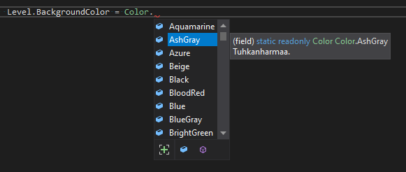
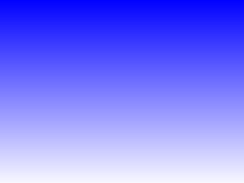
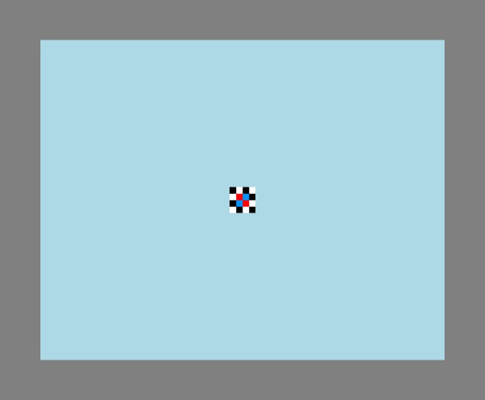
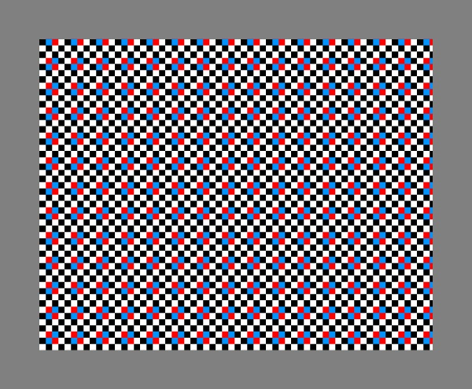
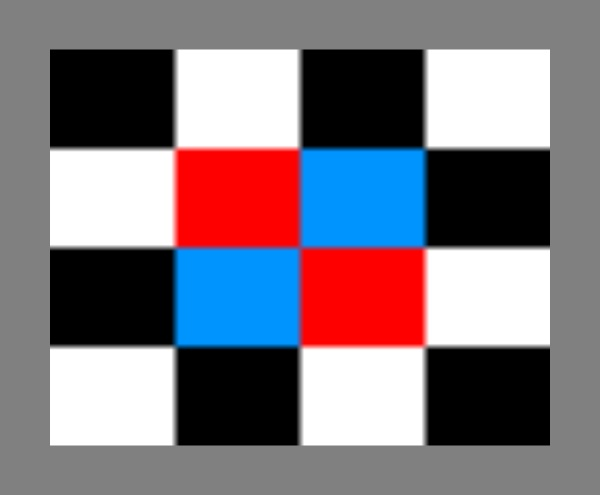

# Tausta

## Taustavärin asetus {#taustavari}

Kentän taustavärin voi asettaa seuraavalla tavalla:

```csharp,ignore
Level.Background.Color = Color.Green;
```

<details>
<summary>Katso lista Jypelin kaikista valmiista väreistä</summary>

| Väri | Nimi |
| --- | --- |
| <span style="display:inline-block;width:3em;height:1.2em;vertical-align:middle;background:#B2BEB5;border:1px solid #8888"></span> | `Color.AshGray` |
| <span style="display:inline-block;width:3em;height:1.2em;vertical-align:middle;background:#00FFFF;border:1px solid #8888"></span> | `Color.Aqua` |
| <span style="display:inline-block;width:3em;height:1.2em;vertical-align:middle;background:#7FFFD4;border:1px solid #8888"></span> | `Color.Aquamarine` |
| <span style="display:inline-block;width:3em;height:1.2em;vertical-align:middle;background:#0094FF;border:1px solid #8888"></span> | `Color.Azure` |
| <span style="display:inline-block;width:3em;height:1.2em;vertical-align:middle;background:#F5F5DC;border:1px solid #8888"></span> | `Color.Beige` |
| <span style="display:inline-block;width:3em;height:1.2em;vertical-align:middle;background:#000000;border:1px solid #8888"></span> | `Color.Black` |
| <span style="display:inline-block;width:3em;height:1.2em;vertical-align:middle;background:#7F0037;border:1px solid #8888"></span> | `Color.BloodRed` |
| <span style="display:inline-block;width:3em;height:1.2em;vertical-align:middle;background:#0000FF;border:1px solid #8888"></span> | `Color.Blue` |
| <span style="display:inline-block;width:3em;height:1.2em;vertical-align:middle;background:#6699CC;border:1px solid #8888"></span> | `Color.BlueGray` |
| <span style="display:inline-block;width:3em;height:1.2em;vertical-align:middle;background:#00FF21;border:1px solid #8888"></span> | `Color.BrightGreen` |
| <span style="display:inline-block;width:3em;height:1.2em;vertical-align:middle;background:#7F3300;border:1px solid #8888"></span> | `Color.Brown` |
| <span style="display:inline-block;width:3em;height:1.2em;vertical-align:middle;background:#5B7F00;border:1px solid #8888"></span> | `Color.BrownGreen` |
| <span style="display:inline-block;width:3em;height:1.2em;vertical-align:middle;background:#DC143C;border:1px solid #8888"></span> | `Color.Crimson` |
| <span style="display:inline-block;width:3em;height:1.2em;vertical-align:middle;background:#00FFFF;border:1px solid #8888"></span> | `Color.Cyan` |
| <span style="display:inline-block;width:3em;height:1.2em;vertical-align:middle;background:#36454F;border:1px solid #8888"></span> | `Color.Charcoal` |
| <span style="display:inline-block;width:3em;height:1.2em;vertical-align:middle;background:#004A7F;border:1px solid #8888"></span> | `Color.DarkAzure` |
| <span style="display:inline-block;width:3em;height:1.2em;vertical-align:middle;background:#5C4033;border:1px solid #8888"></span> | `Color.DarkBrown` |
| <span style="display:inline-block;width:3em;height:1.2em;vertical-align:middle;background:#00137F;border:1px solid #8888"></span> | `Color.DarkBlue` |
| <span style="display:inline-block;width:3em;height:1.2em;vertical-align:middle;background:#007F7F;border:1px solid #8888"></span> | `Color.DarkCyan` |
| <span style="display:inline-block;width:3em;height:1.2em;vertical-align:middle;background:#007F0E;border:1px solid #8888"></span> | `Color.DarkForestGreen` |
| <span style="display:inline-block;width:3em;height:1.2em;vertical-align:middle;background:#404040;border:1px solid #8888"></span> | `Color.DarkGray` |
| <span style="display:inline-block;width:3em;height:1.2em;vertical-align:middle;background:#006400;border:1px solid #8888"></span> | `Color.DarkGreen` |
| <span style="display:inline-block;width:3em;height:1.2em;vertical-align:middle;background:#007F46;border:1px solid #8888"></span> | `Color.DarkJungleGreen` |
| <span style="display:inline-block;width:3em;height:1.2em;vertical-align:middle;background:#7F3300;border:1px solid #8888"></span> | `Color.DarkOrange` |
| <span style="display:inline-block;width:3em;height:1.2em;vertical-align:middle;background:#7F0000;border:1px solid #8888"></span> | `Color.DarkRed` |
| <span style="display:inline-block;width:3em;height:1.2em;vertical-align:middle;background:#00CED1;border:1px solid #8888"></span> | `Color.DarkTurquoise` |
| <span style="display:inline-block;width:3em;height:1.2em;vertical-align:middle;background:#57007F;border:1px solid #8888"></span> | `Color.DarkViolet` |
| <span style="display:inline-block;width:3em;height:1.2em;vertical-align:middle;background:#000000;border:1px solid #8888"></span> | `Color.DarkYellow` |
| <span style="display:inline-block;width:3em;height:1.2em;vertical-align:middle;background:#5B7F00;border:1px solid #8888"></span> | `Color.DarkYellowGreen` |
| <span style="display:inline-block;width:3em;height:1.2em;vertical-align:middle;background:#50C878;border:1px solid #8888"></span> | `Color.Emerald` |
| <span style="display:inline-block;width:3em;height:1.2em;vertical-align:middle;background:#267F00;border:1px solid #8888"></span> | `Color.ForestGreen` |
| <span style="display:inline-block;width:3em;height:1.2em;vertical-align:middle;background:#FF00FF;border:1px solid #8888"></span> | `Color.Fuchsia` |
| <span style="display:inline-block;width:3em;height:1.2em;vertical-align:middle;background:#FFD800;border:1px solid #8888"></span> | `Color.Gold` |
| <span style="display:inline-block;width:3em;height:1.2em;vertical-align:middle;background:#808080;border:1px solid #8888"></span> | `Color.Gray` |
| <span style="display:inline-block;width:3em;height:1.2em;vertical-align:middle;background:#008000;border:1px solid #8888"></span> | `Color.Green` |
| <span style="display:inline-block;width:3em;height:1.2em;vertical-align:middle;background:#ADFF2F;border:1px solid #8888"></span> | `Color.GreenYellow` |
| <span style="display:inline-block;width:3em;height:1.2em;vertical-align:middle;background:#4800FF;border:1px solid #8888"></span> | `Color.HanPurple` |
| <span style="display:inline-block;width:3em;height:1.2em;vertical-align:middle;background:#4CFF00;border:1px solid #8888"></span> | `Color.Harlequin` |
| <span style="display:inline-block;width:3em;height:1.2em;vertical-align:middle;background:#FF69B4;border:1px solid #8888"></span> | `Color.HotPink` |
| <span style="display:inline-block;width:3em;height:1.2em;vertical-align:middle;background:#FFFFF0;border:1px solid #8888"></span> | `Color.Ivory` |
| <span style="display:inline-block;width:3em;height:1.2em;vertical-align:middle;background:#29AB87;border:1px solid #8888"></span> | `Color.JungleGreen` |
| <span style="display:inline-block;width:3em;height:1.2em;vertical-align:middle;background:#DCD0FF;border:1px solid #8888"></span> | `Color.Lavender` |
| <span style="display:inline-block;width:3em;height:1.2em;vertical-align:middle;background:#ADD8E6;border:1px solid #8888"></span> | `Color.LightBlue` |
| <span style="display:inline-block;width:3em;height:1.2em;vertical-align:middle;background:#E0FFFF;border:1px solid #8888"></span> | `Color.LightCyan` |
| <span style="display:inline-block;width:3em;height:1.2em;vertical-align:middle;background:#D3D3D3;border:1px solid #8888"></span> | `Color.LightGray` |
| <span style="display:inline-block;width:3em;height:1.2em;vertical-align:middle;background:#90EE90;border:1px solid #8888"></span> | `Color.LightGreen` |
| <span style="display:inline-block;width:3em;height:1.2em;vertical-align:middle;background:#FFB6C1;border:1px solid #8888"></span> | `Color.LightPink` |
| <span style="display:inline-block;width:3em;height:1.2em;vertical-align:middle;background:#FFFFE0;border:1px solid #8888"></span> | `Color.LightYellow` |
| <span style="display:inline-block;width:3em;height:1.2em;vertical-align:middle;background:#00FF00;border:1px solid #8888"></span> | `Color.Lime` |
| <span style="display:inline-block;width:3em;height:1.2em;vertical-align:middle;background:#32CD32;border:1px solid #8888"></span> | `Color.LimeGreen` |
| <span style="display:inline-block;width:3em;height:1.2em;vertical-align:middle;background:#FF00FF;border:1px solid #8888"></span> | `Color.Magenta` |
| <span style="display:inline-block;width:3em;height:1.2em;vertical-align:middle;background:#800000;border:1px solid #8888"></span> | `Color.Maroon` |
| <span style="display:inline-block;width:3em;height:1.2em;vertical-align:middle;background:#0000CD;border:1px solid #8888"></span> | `Color.MediumBlue` |
| <span style="display:inline-block;width:3em;height:1.2em;vertical-align:middle;background:#9370DB;border:1px solid #8888"></span> | `Color.MediumPurple` |
| <span style="display:inline-block;width:3em;height:1.2em;vertical-align:middle;background:#48D1CC;border:1px solid #8888"></span> | `Color.MediumTurquoise` |
| <span style="display:inline-block;width:3em;height:1.2em;vertical-align:middle;background:#C71585;border:1px solid #8888"></span> | `Color.MediumVioletRed` |
| <span style="display:inline-block;width:3em;height:1.2em;vertical-align:middle;background:#21007F;border:1px solid #8888"></span> | `Color.MidnightBlue` |
| <span style="display:inline-block;width:3em;height:1.2em;vertical-align:middle;background:#3EB489;border:1px solid #8888"></span> | `Color.Mint` |
| <span style="display:inline-block;width:3em;height:1.2em;vertical-align:middle;background:#000080;border:1px solid #8888"></span> | `Color.Navy` |
| <span style="display:inline-block;width:3em;height:1.2em;vertical-align:middle;background:#7F6A00;border:1px solid #8888"></span> | `Color.Olive` |
| <span style="display:inline-block;width:3em;height:1.2em;vertical-align:middle;background:#FF6A00;border:1px solid #8888"></span> | `Color.Orange` |
| <span style="display:inline-block;width:3em;height:1.2em;vertical-align:middle;background:#FF4500;border:1px solid #8888"></span> | `Color.OrangeRed` |
| <span style="display:inline-block;width:3em;height:1.2em;vertical-align:middle;background:#0026FF;border:1px solid #8888"></span> | `Color.PaintDotNetBlue` |
| <span style="display:inline-block;width:3em;height:1.2em;vertical-align:middle;background:#FF00DC;border:1px solid #8888"></span> | `Color.PaintDotNetMagenta` |
| <span style="display:inline-block;width:3em;height:1.2em;vertical-align:middle;background:#FFC0CB;border:1px solid #8888"></span> | `Color.Pink` |
| <span style="display:inline-block;width:3em;height:1.2em;vertical-align:middle;background:#7F006E;border:1px solid #8888"></span> | `Color.Purple` |
| <span style="display:inline-block;width:3em;height:1.2em;vertical-align:middle;background:#7F006E;border:1px solid #8888"></span> | `Color.DarkMagenta` |
| <span style="display:inline-block;width:3em;height:1.2em;vertical-align:middle;background:#FF0000;border:1px solid #8888"></span> | `Color.Red` |
| <span style="display:inline-block;width:3em;height:1.2em;vertical-align:middle;background:#FF006E;border:1px solid #8888"></span> | `Color.Rose` |
| <span style="display:inline-block;width:3em;height:1.2em;vertical-align:middle;background:#FBCCE7;border:1px solid #8888"></span> | `Color.RosePink` |
| <span style="display:inline-block;width:3em;height:1.2em;vertical-align:middle;background:#E0115F;border:1px solid #8888"></span> | `Color.Ruby` |
| <span style="display:inline-block;width:3em;height:1.2em;vertical-align:middle;background:#FA8072;border:1px solid #8888"></span> | `Color.Salmon` |
| <span style="display:inline-block;width:3em;height:1.2em;vertical-align:middle;background:#2E8B57;border:1px solid #8888"></span> | `Color.SeaGreen` |
| <span style="display:inline-block;width:3em;height:1.2em;vertical-align:middle;background:#C0C0C0;border:1px solid #8888"></span> | `Color.Silver` |
| <span style="display:inline-block;width:3em;height:1.2em;vertical-align:middle;background:#87CEEB;border:1px solid #8888"></span> | `Color.SkyBlue` |
| <span style="display:inline-block;width:3em;height:1.2em;vertical-align:middle;background:#6A5ACD;border:1px solid #8888"></span> | `Color.SlateBlue` |
| <span style="display:inline-block;width:3em;height:1.2em;vertical-align:middle;background:#708090;border:1px solid #8888"></span> | `Color.SlateGray` |
| <span style="display:inline-block;width:3em;height:1.2em;vertical-align:middle;background:#FFFAFA;border:1px solid #8888"></span> | `Color.Snow` |
| <span style="display:inline-block;width:3em;height:1.2em;vertical-align:middle;background:#00FF90;border:1px solid #8888"></span> | `Color.SpringGreen` |
| <span style="display:inline-block;width:3em;height:1.2em;vertical-align:middle;background:#008080;border:1px solid #8888"></span> | `Color.Teal` |
| <span style="display:inline-block;width:3em;height:1.2em;vertical-align:middle;background:#000000;border:1px solid #8888"></span> | `Color.Transparent` |
| <span style="display:inline-block;width:3em;height:1.2em;vertical-align:middle;background:#40E0D0;border:1px solid #8888"></span> | `Color.Turquoise` |
| <span style="display:inline-block;width:3em;height:1.2em;vertical-align:middle;background:#120A8F;border:1px solid #8888"></span> | `Color.Ultramarine` |
| <span style="display:inline-block;width:3em;height:1.2em;vertical-align:middle;background:#B200FF;border:1px solid #8888"></span> | `Color.Violet` |
| <span style="display:inline-block;width:3em;height:1.2em;vertical-align:middle;background:#F5DEB3;border:1px solid #8888"></span> | `Color.Wheat` |
| <span style="display:inline-block;width:3em;height:1.2em;vertical-align:middle;background:#FFFFFF;border:1px solid #8888"></span> | `Color.White` |
| <span style="display:inline-block;width:3em;height:1.2em;vertical-align:middle;background:#FFFF00;border:1px solid #8888"></span> | `Color.Yellow` |
| <span style="display:inline-block;width:3em;height:1.2em;vertical-align:middle;background:#B6FF00;border:1px solid #8888"></span> | `Color.YellowGreen` |

</details>

Näet eri värivaihtoehdot kirjoittamalla `Color` ja pisteen. Listasta voit valita useista valmiista väreistä haluamasi nuolinäppäimillä ja sitten enteriä painamalla.



Toinen tapa asettaa taustaväri on asettaa jokaisen värin arvo tarkalleen:

```csharp,ignore
Level.Background.Color = new Color(150, 150, 150);
```

- Nyt kentästä tuli harmaa. Väriarvot voivat vaihdella välillä 0–255.

Eri väriarvoja voit kokeilla esimerkiksi [Googlen ColorPickerillä](https://www.google.com/search?q=color+picker).

## 1. Kuvatiedostosta {#taustakuva}

Jos haluat asettaa kentälle oman taustakuvan, tehdään se seuraavasti.

- Piirrä taustakuva kuvankäsittelyohjelmalla. Taustakuvan koko on hyvä olla kentän kokoinen (esim. 1024x768). Tallenna taustakuva esimerkiksi png-muodossa. Lisää kuvatiedosto projektiin, katso ohjeet sisällön tuomisesta projektiin. Sen jälkeen kun kuva on lisätty projektiin, ladataan kuva ensin muuttujaan luokan alussa seuraavasti.

```csharp,ignore
public class Peli : PhysicsGame
{
    Image taustakuva = LoadImage("kuvanNimi");

    public override void Begin()
    {
         //...
    }
```

- Kohta kuvanNimi on projektiin lisätyn kuvan nimi. Esimerkiksi, jos kuva on vuoristo.png, niin kuvan nimi on silloin pelkkä "vuoristo". Huomaa, että png-tunnistetta ei tarvitse laittaa kuvan nimen perään.

- Kun kuva on ladattu muuttujaan, taustakuva saadaan näkymään peliin seuraavalla koodilla:

```csharp,ignore
Level.Background.Image = taustakuva;
```

## 2. Liukuväritausta



Jos halutaan luoda liukuväritausta, esimerkiksi niin, että alaosa on valkoinen ja yläosa sininen, luodaan taustakuva seuraavasti:

```csharp,ignore
Level.Background.CreateGradient(Color.White, Color.Blue);
```

Tai käyttämällä itse määritettyjä värejä:

```csharp,ignore
Level.Background.CreateGradient(new Color(0, 0, 0), new Color(150, 150, 150));
```

Värien määrityksessä ensimmäinen arvo kertoo punaisen värin määrän, toinen arvo vihreän värin määrän ja kolmas sinisen värin määrän. "Värimaailman" lyhenne RGB (Red Green Blue) tulee tästä. Lyhenteestä on helppo muistaa, missä järjestyksessä värit tulevat. Määrät ovat välillä 0–255.

## 3. Avaruustausta


Voit luoda myös satunnaisen avaruustaustakuvan, jossa on tähtiä:

```csharp,ignore
Level.Background.CreateStars();
```

Jos haluat valita tähtien lukumäärän, niin anna niiden määrä parametrina:

```csharp,ignore
Level.Background.CreateStars(10000);
```

## 4. Kuvien piirtäminen vierekkäin täyttämään koko kentän

Oletuksena taustakuva piirretään kentälle juuri sen kokoisena kuin se on tiedostossa.



Jos haluat, että taustakuvaa toistetaan pysty- ja vaakasuunnassa, voit lisätä taustakuvan asettamisen jälkeen rivin

```csharp,ignore
Level.Background.TileToLevel();
```

Nyt taustakuva näyttää tältä:



## 5. Kuvan skaalaaminen kentän kokoiseksi

Jos haluat, että taustakuva venytetään koko kentän kokoiseksi, voit lisätä taustakuvan asettamisen jälkeen rivin

```csharp,ignore
Level.Background.FitToLevel();
```

Nyt taustakuva näyttää tältä:



Muita skaalauksia taustakuvalla:

```csharp,ignore
ScaleToLevelByWidth()  - skaalaa kuvan niin että se täyttää kentän
                         vaakasuunnassa,
ScaleToLevelByHeight() - skaalaa vastaavasti pystysuunnassa ja
ScaleToLevel()         - skaalaa käyttäen jompaakumpaa niin että koko kuva näkyy
ScaleToLevelFull()     - skaalaa käyttäen jompaakumpaa niin että kentälle ei
                         jää tyhjää.
```

## 6. Liikkuva taustakuva {#liukuva}

### Liukuvan taustakuvan tekeminen (taustakuva liikkuu, kun kamera liikkuu)

Piirrä kuva, lisää se projektiin ja lataa kuva muuttujaan kuten kohdassa 1.

Nyt sen sijaan, että kuva annetaan taustakuvaksi, tehdään siitä peliolio, joka lisätään kentän taustalle.

1.  Tehdään uusi peliolio.
2.  Annetaan peliolion kuvaksi haluamamme kuva.
3.  Lisätään peliolio kentälle muiden siellä olevien olioiden takana olevalle [kerrokselle](../oliot/kerrokset.md) Add-komennolla.
4.  Annetaan kerrokselle vektori, joka kertoo, kuinka paljon tämän kerroksen olioiden paikka muuttuu kameran siirtyessä suhteessa muihin kerroksiin. Esimerkiksi arvo 0.5 aiheuttaa siirtymän, joka on puolet normaalista.

```csharp,ignore
GameObject taustapilvet = new GameObject(Screen.Width, Screen.Height);
taustapilvet.Image = pilvikuva;
Add(taustapilvet, -3);
Layers[-3].RelativeTransition = new Vector(0.5, 0.5);
```

Nyt kun kamera liikkuu, taustalla oleva kuva siirtyy puolet vähemmän suhteessa muihin kentän olioihin.

Vinkki: tekemällä liikkuvasta kuvasta läpinäkyvän, kentän oikea taustakuva tai taustaväri näkyy sen takaa läpi. Myös liikkuvia kerroksia voi tehdä useampia.

### Saman taustakuvan pyörittäminen

Alla karuselli, joka pyörii y-akselilla tasaisella nopeudella ajan mukana. Kuvia voi lisätä vapaasti `LisaaTaustakuva(...)`-rivejä lisäämällä. Idea on, että on (vähintään) kaksi kuvaoliota, joita sitten pyöritellään. Positiivisella skrollausnopeudella kuvat liikkuvat alhaalta ylös ja negatiivisella ylhäältä alas. Kokeile, testaa ja paranna.

```csharp,ignore
int scrollausnopeus = -5;
bool peliPaattynyt = false;

List<GameObject> taustakuvat;
Timer taustaAjastin = new Timer();
GameObject ekaTaustakuva;

public override void Begin()
{
   LuoTaustakuvat();
}

void LuoTaustakuvat()
{
   taustaAjastin = new Timer();
   taustaAjastin.Interval = 0.01;   // tällä voit myös säätää nopeutta
   taustaAjastin.Timeout += LiikutaTaustaa;
   taustaAjastin.Start();

   taustakuvat = new List<GameObject>();
   LisaaTaustakuva("kuva1", 300, 300);
   LisaaTaustakuva("kuva2", 300, 300);
   LisaaTaustakuva("kuva3", 300, 300);
   LisaaTaustakuva("kuva4", 300, 300);
}

void LisaaTaustakuva(string nimi, double leveys, double korkeus)
{
   GameObject olio = new GameObject(leveys, korkeus);
   olio.Image = LoadImage(nimi);
   olio.X = 0;
   Add( olio );

   if (taustakuvat.Count > 0)
   {
      olio.Top = taustakuvat[taustakuvat.Count - 1].Bottom;
      if (scrollausnopeus >= 0) ekaTaustakuva = olio;
   }
   else
   {
      olio.Top = Level.Top;
      if (scrollausnopeus < 0) ekaTaustakuva = olio;
   }

   taustakuvat.Add(olio);
}

void LiikutaTaustaa()
{
   foreach (GameObject taustakuva in taustakuvat)
   {
      taustakuva.Y += scrollausnopeus;

      if (scrollausnopeus < 0 && taustakuva.Top < Level.Bottom)
      {
         taustakuva.Bottom = ekaTaustakuva.Top;
         ekaTaustakuva = taustakuva;
      }
      else if (scrollausnopeus > 0 && taustakuva.Bottom > Level.Top)
      {
         taustakuva.Top = ekaTaustakuva.Bottom;
         ekaTaustakuva = taustakuva;
      }
   }
}
```
