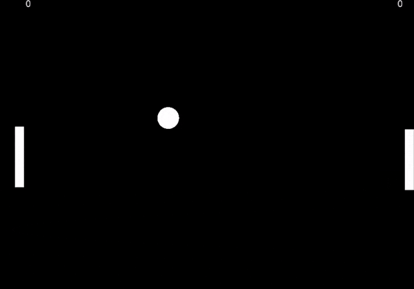

# Mallipelit

Tällä hetkellä on ohjeet kahden eri pelin tekoon, jotka opastavat Jypelin käyttöön sekä yleisesti ohjelmointiin.

## Yleiset ohjeet kaikkiin mallipeleihin

### Alkuvalmistelut ja ohjelmien asennus

Ihan ensiksi, [asenna koneellesi Rider ja Jypeli](https://tim.jyu.fi/view/kurssit/tie/ohj1/tyokalut/rider).

**Yliopiston koneilla** Rider on jo asennettu, mutta Jypeli pitää asentaa: Avaa Käynnistä-valikosta Command prompt -ohjelma, ja anna siihen tämä komento ja paina lopuksi Enter.

```bash
dotnet new install Jypeli.Templates
```

Voit sitten sulkea Command promptin.

### Käynnistä Rider

Käynnistä Rider tuplaklikkaamalla työpöydällä olevaa pikakuvaketta tai valitsemalla käynnistä-valikosta "JetBrains Rider 2022.3.1" (lopun numerot saattavat olla hieman erilaiset versiosta riippuen)

Tämän jälkeen Rider käynnistyy hetken kuluttua.

### Luo uusi projekti

Luo peliäsi varten uusi fysiikkapeli-projekti. Projekti on ohjelmointiympäristön tapa käsitellään koodia ja peliin liittyviä grafiikka- ja musiikkitiedostoja yhtenä kokonaisuutena.

Käynnistä Rider.

- Klikkaa "New Solution".
- Valitse vasemmalla olevasta listasta Fysiikkapeli (scrollaa alas). Jos Fysiikkapeliä ei näy, palaa asennusohjeiden kohtaan Jypeli.
- Laita Solution Name-kohtaan pelin nimi, esimerkiksi "Pong", tai oman pelisi nimi.
- Laita Solution directory-kohtaan kansio, johon haluat tehdä pelisi. Esimerkiksi: "C:\Users\Käyttäjänimi\Koodiprojektit". **Huom!** Yliopiston tietokoneilla kansioksi on annettava "C:\Mytemp\Omanimi". Laita Omanimi-sanan paikalle vaikkapa oma etunimesi.
- Vahvista uuden projektin luominen klikkaamalla Create.

Painamalla Ctrl-F5 peli käynnistyy. Mikäli aukeaa vaaleansininen ikkuna, on projekti luotu oikein.

### Huomioita

Oppaissa on käytetty seuraavanlaisia merkintöjä:

|  |  |  |
| --- | --- | --- |
|  |  |  |
| Kokeile ajaa peliäsi. Riderissa paina ctrl-F5-näppäinyhdistelmää. Yleensäkin peliä kannattaa koittaa ajaa usein, jotta näet miten tekemäsi muutokset vaikuttavat. | Pelisi ei toimi, eikä sen kuulukaan toimia vielä, jos olet seurannut ohjeita. Seuraa ohjetta eteenpäin, tilanne korjaantuu. Tärkeää: Mieti, miksi peli ei vielä toimi. | Tällaisen merkinnän kohdalla esitetään kysymys, jota voit miettiä ja mielellään myös koittaa tehdä kysymyksessä ehdotettu muutos koodiin. Voit kuitenkin halutessasi hypätä kysymyksen yli. |

## Pong

Tässä oppaassa luodaan vaiheittain monille tuttu Pong-peli, jossa kaksi pelaajaa voi lyödä palloa yksinkertaisilla mailoilla, yrittäen saada pallo menemään toisen pelaajan mailan ohi. Opas on jaettu pienempiin vaiheisiin.



### Aloita Pong-tutoriaalin teko

Kun olet luonut uuden projektin, voit aloittaa tekemään Pong-peliä vaihe kerrallaan. Jos teet tutoriaalia ensimmäistä kertaa, aloita vaiheesta 1.

**Lue kaikki ohjeet hyvin huolellisesti!**

- [Vaihe 1](pong/vaihe1.md) (jostakin se on aloitettava...)
- [Vaihe 2](pong/vaihe2.md) (pallo liikkeelle)
- [Vaihe 3](pong/vaihe3.md) (aliohjelma)
- [Vaihe 4](pong/vaihe4.md) (kaksi mailaa!)
- [Vaihe 5](pong/vaihe5.md) (mailoja voi liikuttaa!)
- [Vaihe 6](pong/vaihe6.md) (parantelua)
- [Vaihe 7](pong/vaihe7.md) (pistelasku)

## Läpsylintu

Tässä oppaassa luodaan vaiheittain Läpsylintu-peli, joka etäisesti muistuttaa monille tuttua Flappy Bird-peliä.

Pelissä on tavoitteena liikuttaa pelihahmoa kentässä osumatta pahoihin vihuihin! Keräämällä tähtiä saa pisteitä.

Opas on jaettu pienempiin vaiheisiin.

📺 [Katso video (YouTube)](https://www.youtube.com/watch?v=aC4OWtiO8Xs)

Tässä tutoriaalissa opit ohjelmoinnin alkeita, eikä aikaisempaa kokemusta ohjelmoinnista vaadita. Erityisesti opetellaan seuraavia tärkeitä ohjelmoinnin osa-alueita.

- Ensimmäisen tietokoneohjelman kirjoittaminen
- Muuttuja
- Aliohjelma
- Ehtolause
- Törmäyskäsittelijä
- Äänen ja kuvan lisääminen omaan peliin

Tämä on hieman Pongia haastavampi harjoitus, mutta soveltuu silti myös ensikertalaisille.

[Läpsylinnun tekoon](lapsylintu/vaihe1.md)
