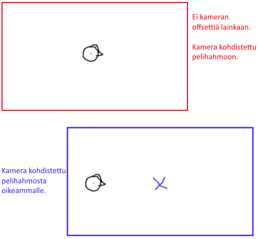

# Läpsylintu, vaihe 10: Yleiset parantelut

## Refaktorointia

Refaktoroidaan koodista ainakin yksi toistuva rivi pois tekemällä siitä aliohjelma. Koodissa on nyt kahdessa paikassa rivit, jotka molemmat poistavat pelaajan ylös-näppäimen pois käytöstä. Tehdään mieluummin yksi yhteinen aliohjelma, jota kutsutaan aina, kun kyseinen pelaamisnäppäin pitää poistaa:

```csharp,ignore
private void PoistaPelaamisnappaimet()
{
    Keyboard.Disable(Key.Up);
}
```

Etsi koodista muut kohdat, joissa aiemmin käytettiin `Keyboard.Disable(Key.Up);`-riviä, ja kirjoita niiden tilalle:

```csharp,ignore
PoistaPelaamisnappaimet();
```

Älä kuitenkaan korvaa tätä riviä `PoistaPelaamisnappaimet`-aliohjelman sisältä, sillä muuten saat aikaiseksi ikuisesti itseään kutsuvan aliohjelman `PoistaPelaamisnappaimet`.

## Kameran siirtäminen

Kamera seuraa tällä hetkellä pelaajaa siten, että pelihahmo on koko ajan ruudun keskellä. Pelissä on kuitenkin vaikea ennakoida oikealta esiin tulevia esteitä, joten kameran kohdistusta kannattaa siirtää hieman oikeammas pelaajan sijainnista.



Kohdistuksen voi tehdä `Begin`-aliohjelmassa määrittämällä kameralle ns. *follow offsettiä* seuraavasti:

```csharp,ignore
Camera.FollowOffset = new Vector(Screen.Width / 2.5 - RUUDUN_KOKO, 0.0);
```

Vektori kertoo kameran sijainnin seurattavan olion keskipisteeseen nähden. Piste annetaan muodossa (x, y) eli tässä kameran vaakasuuntainen koordinaatti x olisi pelihahmon koordinaattiin lisättynä `Screen.Width / 2.5 - RUUDUN_KOKO` eli näyttöruudun leveys jaettuna kahdella ja puolella (voisi olla myös esim. pelkästään jaettuna kahtia, mutta 2.5 sattuu olemaan visuaalisesti kauniimpi) ja siitä vielä vähennettynä hahmon leveyden verran, jotta hahmo jää varmasti näkyville. Y-suunnassa kameraa ei siirretä lainkaan, siksi arvo `0.0`.

> [!KOKEILE]

## Ohjeen päättyminen

**Varsinainen Läpsylintu-ohje päättyy tähän!** Seuraava vaihe on ylimääräinen, ja se sisältää ideoita, joiden avulla pelistä saa vielä monipuolisemman ja paremman. Voit keksiä itse lisää paranneltavaa ja muokata peliä haluamaasi suuntaan.
