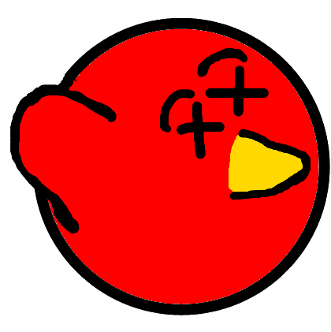

# Läpsylintu: Vaihe 6

## Ikkunan koon vaihtaminen

Jos haluat, voit vaihtaa peli-ikkunan kokoa, voit tehdä sen lisäämällä aivan Begin-aliohjelman alkuun rivin:

```csharp,ignore
SetWindowSize(1280, 720);
```

Jossa numerot kertovat ikkunan leveyden ja korkeuden pikseleinä. Monesti nykytietokoneissa näytön resoluutio on 1920x1080 (FullHD), mutta kannettavissa resoluutio voi olla pienempikin. Kokeile millä luvuilla ikkuna on hyvän kokoinen, ei kuitenkaan kannata laittaa ikkunaa suuremmaksi kuin mitä sinun näyttö on :)

Useimmiten kannettavissa on myös näytönskaalaus käytössä, jolloin ikkunan resoluutio ei täysin vastaa näytön todellista resoluutiota. Kokeile ja muokkaa arvoja. Oman näyttösi resoluution koneesi näyttöasetuksista.

## Kuolemiseen erilainen kuva

Jotta peliä pelaavalle tulee varmasti selväksi, että pelihahmo on kuollut seinään osumisen jälkeen, vaihdetaan kuolleelle hahmolle erilainen kuva.

Lataa oheinen kuva koneelle omalle tietokoneellesi kuten aiemmatkin kuvat. Älä käytä Agoran mikroluokissa Windowsin ehdottamaa Omat tiedostot -hakemistoa, sillä se täyttää käyttäjäprofiilin levytilan.



Tallenna kuva nimellä kuollut.png.

Muistatko vielä miten tiedosto lisättiin projektiin? Katso mallia [vaiheesta 3](vaihe3.md)

Koodissa on attribuutteina esitelty muun muassa seuraavat kuvat.

```csharp,ignore
private Image pelaajanKuva = LoadImage("lintu.png");
private Image[] pelaajanHyppykuvat = LoadImages("lapsy.png", "lintu.png");
```

Lisää näiden rivien perään `kuollut.png` seuraavasti:

```csharp,ignore
private Image pelaajanKuolemakuva = LoadImage("kuollut.png");
```

Jotta kuolemisen jälkeen tulisi käyttöön uusi kuva, se täytyy lisätä `TormaaTasoon`-aliohjelmassa.

Etsi `TormaaTasoon`-aliohjelma ja sen sisältämä `if (peliKaynnissa)`-lohko. Lisää tämän lohkon sisälle seuraavat rivit.

```csharp,ignore
// Asetetaan pelaajan normaali kuva kuolemiskuvaksi:
pelaaja1.Image = pelaajanKuolemakuva;

// Asetetaan pelaajan animaatiot kuolemisen animaatioksi (voi sisältää useammankin kuvan):
Animation kuolemisanimaatio = new Animation(pelaajanKuolemakuva);
pelaaja1.AnimFall = kuolemisanimaatio;
pelaaja1.AnimJump = kuolemisanimaatio;
```

Pelihahmon kuolemisanimaatio voisi olla myös useamman kuvan sisältävä, mutta tässä esimerkissä käytetään vain yksittäistä kuvaa, jossa linnun silmät ovat sarjakuvamaisesti ristissä.


