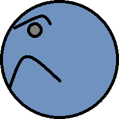

# Läpsylintu, vaihe 8: Viholliseen törmääminen

Viholliset ovat vielä valkoisia laatikoita, eikä niihin törmäämisestä tapahdu mitään.

## Viholliselle kuva



Tallenna kuva nimellä `vihollinen.png` ja lisää se projektiisi kuten aiemmatkin kuvatiedostot.

`Lapsylintu`-luokan alussa ladataan kuvatiedostoja. Lisää näiden rivien joukkoon:

```csharp,ignore
private Image vihollisenKuva = LoadImage("vihollinen.png");
```

Etsi seuraavaksi aliohjelma `LisaaVihollinen` ja lisää siihen:

```csharp,ignore
vihollinen.Image = vihollisenKuva;
```

Nyt kuvan pitäisi olla käytössä. Kokeile.

> [!KOKEILE]

## Viholliseen törmääminen

Korjataan viholliseen törmäämisestä aiheutumaan sama asia, kuin jos pelaaja törmäisi seinäpaloihin.

Jotta tämä onnistuisi, tarvitsemme jokaiselle viholliselle oman tägin. Tässä oppaassa käytetään tägiä "vihu" vihollisille.

Etsi `LisaaVihollinen`-aliohjelma ja lisää sinne rivi

```csharp,ignore
vihollinen.Tag = "vihu";
```

Etsi aliohjelma `LisaaPelaaja`, joka näyttää jotakuinkin seuraavalta:

```csharp,ignore
void LisaaPelaaja(Vector paikka, double leveys, double korkeus)
{
    pelaaja1 = new PlatformCharacter(leveys, korkeus);
    pelaaja1.Position = paikka;
    pelaaja1.Mass = 4.0;
    pelaaja1.Image = pelaajanKuva;
    pelaaja1.AnimJump = new Animation(pelaajanHyppykuvat);
    pelaaja1.AnimFall = new Animation(pelaajanKuva);
    AddCollisionHandler(pelaaja1, "tahti", TormaaTahteen);
    AddCollisionHandler(pelaaja1, "seina", TormaaTasoon);
    Add(pelaaja1);
}
```

Lisää siihen uusi AddCollisionHandler-rivi muiden vastaavien rivien jatkoksi:

```csharp,ignore
AddCollisionHandler(pelaaja1, "vihu", TormaaTasoon);
```

Nyt pelaajan törmätessä seinään tai viholliseen, pelaaja kuolee.

> [!KOKEILE]

## Refaktorointia

Koodissamme on nyt yksi huono puoli nimeämisessä. Nimittäin jos pelaaja törmää viholliseen, kutsutaan aliohjelmaa, jonka nimi on TormaaTasoon. Pelaajahan ei törmännyt tasoon vaan viholliseen.

Keksitään parempi nimi `TormaaTasoon`-aliohjelmalle, jotta sen kutsuminen molemmissa seuraavista tapauksista kuulostaa järkevältä:

- Pelaaja törmää tasoon (eli seinään)
- Pelaaja törmää viholliseen

Molemmat asiat ovat kuolettavia, joten nimeksi voisi käydä paremmin `TormaaKuolettavaan`.

Klikkaa aliohjelman `TormaaTasoon` nimeä hiiren toisella painikkeella ja valitse avautuvasta kontekstivalikosta Refactor ja sieltä Rename. Joissain ohjelmointiympäristössä toiminnon nimi voi olla pelkkä Rename. Anna uudeksi nimeksi `TormaaKuolettavaan` ja paina enteriä.

Siispä tämä tarkoittaa, että rivi:

```csharp,ignore
private void TormaaTasoon(PhysicsObject tormaaja, PhysicsObject kohde)
```

muuttuu muotoon:

```csharp,ignore
private void TormaaKuolettavaan(PhysicsObject tormaaja, PhysicsObject kohde)
```

ja rivit:

```csharp,ignore
AddCollisionHandler(pelaaja1, "seina", TormaaTasoon);
AddCollisionHandler(pelaaja1, "vihu", TormaaTasoon);
```

muuttuvat muotoihin:

```csharp,ignore
AddCollisionHandler(pelaaja1, "seina", TormaaKuolettavaan);
AddCollisionHandler(pelaaja1, "vihu", TormaaKuolettavaan);
```
