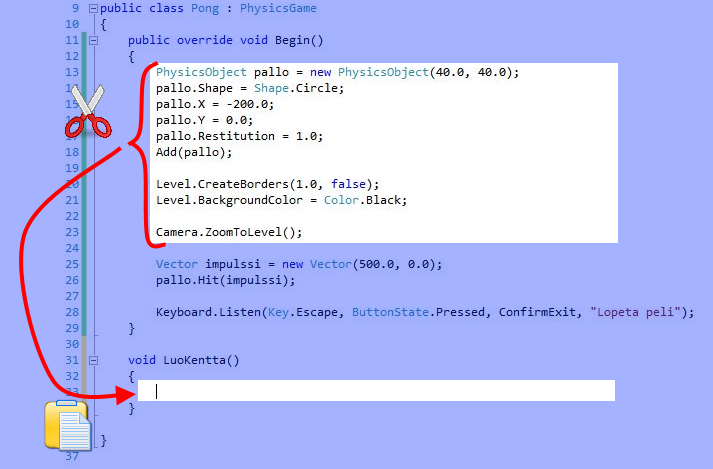
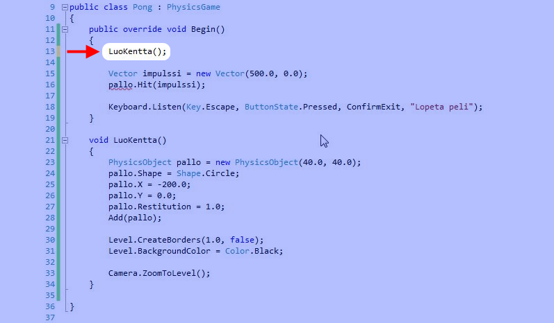

# Pong-peli, vaihe 3

Tämä on Pong-pelin tutoriaalin osa 3/7. Tämän vaiheen aikana

- Jaetaan ohjelma pienempiin palasiin (aliohjelmiin)
- Lisätään peliin maila (jota ei voi vielä liikuttaa)

Vaihe on melko pitkä, mutta sitäkin tärkeämpi, joten jaksathan lukea ohjeet huolellisesti loppuun saakka.


## 1. Aliohjelman tekeminen

Lisäämme pian pelikenttään lisää olioita, tällä kertaa mailan. Jotta koodi pysyisi hallittavan kokoisissa palasissa, teemme kentän luomisesta oman aliohjelman nimeltä `LuoKentta`.

<u>Aliohjelma on pienempi osa koodia, jota voidaan kutsua jostain muusta kohtaa koodia</u>. Aliohjelmasta näkee usein käytettävän myös nimityksiä funktio tai metodi. Ne tarkoittavat (melkein) samaa asiaa.

Kirjoita aliohjelma `LuoKentta`. Aliohjelman koodi on seuraavassa merkattu vihreällä värillä. Harmaalla oleva koodi pitäisi olla jo koodissasi, joten sitä ei pidä kirjoittaa.

**Kiinnitä erityisesti huomiota siihen, miten aaltosulut tulevat.** Rivin `void LuoKentta()` jälkeen tulee yksi aaltosulku auki `{` ja toinen kiinni `}`. Niiden väliin kirjoitetaan `LuoKentta`-aliohjelmaan kuuluvat koodirivit.

```csharp,feature-jypeli
//-using System;
//-using System.Collections.Generic;
//-using Jypeli;
//-using Jypeli.Assets;
//-using Jypeli.Controls;
//-using Jypeli.Effects;
//-using Jypeli.Widgets;
public class Pong : PhysicsGame
{
    public override void Begin()
    {
        PhysicsObject pallo = new PhysicsObject(40.0, 40.0);
        pallo.Shape = Shape.Circle;
        pallo.X = -200.0;
        pallo.Y = 0.0;
        pallo.Restitution = 1.0;
        Add(pallo);

        Level.CreateBorders(1.0, false);
        Level.Background.Color = Color.Black;

        Camera.ZoomToLevel();
// HIGHLIGHT_GREEN_BEGIN

        Vector impulssi = new Vector(500.0, 0.0);
        pallo.Hit(impulssi * pallo.Mass);
// HIGHLIGHT_GREEN_END

        Keyboard.Listen(Key.Escape, ButtonState.Pressed, ConfirmExit, "Lopeta peli");
    }

    void LuoKentta()
    {
    }
}
```

Aliohjelman alussa, ennen sen nimeä, kerrotaan minkä tyyppistä tietoa aliohjelma paluttaa. Koska tämä aliohjelma ei palauta mitään arvoa, tyypin kohdalle tulee vain sana `void`. Aliohjelman nimen jälkeen tulee sulut, joiden väliin tulee mahdolliset parametrit (joita tässä ei ole yhtään).

Nyt meillä on tyhjä aliohjelma, jonne haluaisimme siirtää kaikki kentän luomiseen liittyvät koodirivit.

## 2. Aliohjelman kutsuminen

Aliohjelma ei itsessään tee mitään ennen kuin sitä **kutsutaan** jostakin.

Aliohjelman kutsuminen tarkoittaa, että tietokonetta käsketään suorittamaan aliohjelmaan kuuluvat koodirivit.

Mistä voisimme kutsua tuota aliohjelmaa? Tietysti `Begin`-aliohjelmasta, jota olemme edellisissä vaiheissa tehneet. Tuo aliohjelmahan suoritetaan ensimmäisenä kun peli käynnistetään.

**Siirrä** kentän luontiin liittyvät rivit `Begin`:ista aliohjelmaan `LuoKentta` alla olevan kuvan osoittamalla tavalla. Ctrl+X leikkaa valitun tekstin ja Ctrl+V liitää sen kursorin kohdalle. Katso tarvittaessa tarkemmat [ohjeet tekstin editointiin](https://trac.cc.jyu.fi/projects/npo/wiki/Editori#Tekstinkopiointijasiirt%C3%A4minen) <span class="red">TODO: TIMIIN</span>.

**Huomaa, että omassa koodissasi rivit saattavat olla hieman eri järjestyksessä kuin kuvassa.**

Pallon liikuttamiseen liittyvät kaksi riviä (vektorin luominen ja pallon töytäisy) ja lopetusnapin tekevä rivi jäävät `Begin`-aliohjelmaan ja kaikki muut rivit siirretään uuteen `LuoKentta`-aliohjelmaan.



Kirjoitetaan sitten aliohjelmakutsu. **Aliohjelman kutsu on käsky tietokoneelle käydä suorittamassa aliohjelmalle kuuluvat koodirivit.**

Kutsu tapahtuu yksinkertaisesti kirjoittamalla <u>aliohjelman nimi</u>, jonka jälkeen tulee <u>sulut</u> ja sulkujen sisään mahdolliset <u>parametrit</u> (joita aliohjelmallamme ei ole yhtään) ja lopuksi puolipiste `;`.

**Kirjoita siirrettyjen rivien tilalle** aliohjelman `LuoKentta` kutsu kuten kuvassa:



Koska kirjoitimme aliohjelmakutsun ennen rivejä, joilla luodaan vektori nimeltä `impulssi` ja sysätään pallo liikkeelle, `LuoKentta`-aliohjelman rivit suoritetaan <u>ennen</u> `impulssin` luomista ja pallon liikuttamista. Pelimme toiminta ei siis muutu oikeastaan millään tavalla. Jäsentelemme vain koodia pienempiin osiin.

Pelissämme on vielä kuitenkin virhe.

%%eitoimi%%(Älä turhaan yritä ajaa peliä.)

## 3. Pallo attribuutiksi

Koska nyt pallo luodaan aliohjelmassa `LuoKentta`, niin `Begin`-aliohjelma ei enää tunne sen nimistä muuttujaa.

Tämä voidaan korjata siirtämällä pallo-muuttujan esittely aliohjelmien ulkopuolelle. Sitten kaikki aliohjelmat tunnistavat muuttujan.

Aliohjelmien ulkopuolella esiteltyjä ei-staattisia muuttujia kutsutaan ohjelmoinnissa **attribuuteiksi**. Attribuutteja tarvitaan esimerkiksi silloin, kun johonkin olioon tarvitsee päästä käsiksi koko pelin ajan eikä pelkästään oliota luotaessa.

**Lisää** koodiisi seuraavassa vihreällä merkitty osa:

```csharp,ignore
public class Pong : PhysicsGame
{
// HIGHLIGHT_GREEN_BEGIN
    PhysicsObject pallo;
// HIGHLIGHT_GREEN_END

    public override void Begin()
    {
        LuoKentta();
        Vector impulssi = new Vector(500.0, 0.0);
        pallo.Hit(impulssi * pallo.Mass);

        Keyboard.Listen(Key.Escape, ButtonState.Pressed, ConfirmExit, "Lopeta peli");
    }
```

Koska muuttuja `pallo` on jo esitelty attribuutissa, sitä ei pidä enää esitellä uudestaan aliohjelman `LuoKentta` sisällä.

**Pyyhi** pallon luovan rivin alusta pois sana `PhysicsObject`:

```csharp,ignore
void LuoKentta()
{
// HIGHLIGHT_RED_BEGIN
    PhysicsObject pallo = new PhysicsObject(40.0, 40.0);
// HIGHLIGHT_RED_END
    pallo.Shape = Shape.Circle;
    pallo.X = -200.0;
    pallo.Y = 0.0;
    pallo.Restitution = 1.0;
    Add(pallo);

    Level.CreateBorders(1.0, false);
    Level.Background.Color = Color.Black;

    Camera.ZoomToLevel();
}
```

Nyt uusi fysiikkaolio sijoitetaan siihen palloon, jonka äsken lisäsimme koodin alkuun.

Näillä toimenpiteillä pallo-olioon päästään käsiksi kaikista aliohjelmista.

%%kokeile%%

## 4. Mailan lisääminen kenttään

Lisätään kenttään maila. Haluaisimme, että maila on paikallaan pysyvä eli *staattinen* vaikka pallo törmäilee siihen.

Staattisen eli paikallaan pysyvän fysiikkaolion luominen tapahtuu aliohjelmakutsulla `PhysicsObject.CreateStaticObject`.

**Lisää** vihreällä merkityt rivit `LuoKentta`-aliohjelmaan:

```csharp,ignore
void LuoKentta()
{
    pallo = new PhysicsObject(40.0, 40.0);
    pallo.Shape = Shape.Circle;
    pallo.X = -200.0;
    pallo.Y = 0.0;
    pallo.Restitution = 1.0;
    Add(pallo);

// HIGHLIGHT_GREEN_BEGIN
    PhysicsObject maila = PhysicsObject.CreateStaticObject(20.0, 100.0);
    maila.Shape = Shape.Rectangle;
    maila.X = Level.Left + 20.0;
    maila.Y = 0.0;
    maila.Restitution = 1.0;
    Add(maila);
// HIGHLIGHT_GREEN_END

    Level.CreateBorders(1.0, false);
    Level.Background.Color = Color.Black;

    Camera.ZoomToLevel();
}
```

Pong-pelissä on maila sekä ruudun vasemmassa että oikeassa reunassa. Lisätään oikeanpuoleinen maila myöhemmin.

Y-koordinaatin asetamme nollaksi, jotta maila menee pystysuunnassa ruudun keskelle.

X-koordinaattia varten kysymme pelikentältä sen vasemman reunan x-koordinaatin (`Level.Left`) ja lisäämme siihen `20.0`, jotta maila pysyy kentän rajojen sisällä.

Olisimmeko voineet sijoittaa x-koordinaattiin yksinkertaisesti jonkun arvon, esimerkiksi `-300.0`? Olisimme toki. Äsken käyttämämme tapa on kuitenkin siitä parempi, että maila tulee aina kentän vasempaan reunaan vaikka päättäisimme myöhemmin muuttaa kentän kokoa. Näin peli on helpommin muokattavissa.

Laitamme myös mailalle `Restitution`-ominaisuuden arvoon `1.0`, koska törmäykseen vaikuttaa kummankin törmäävän kappaleen ominaisuudet.

%%kokeile%%

Kun nyt käynnistät pelin, siinä näkyy pallo sekä yksi maila.

## 5. Pelin aloittaminen

Kentän luomisen lisäksi pelissä on monia muita toimenpiteitä, jotka voisimme tehdä omina aliohjelminaan. Kun pelitilanne on muuten alustettu, voidaan aloittaa peli, joka tämän pelin tapauksessa tarkoittaa pallon laittamista liikkeelle. Tehdään aliohjelma, joka aloittaa pelin.

Aliohjelmien keskinäisellä järjestyksellä ei sinänsä ole merkitystä, kunhan ne ovat **toistensa ulkopuolella** (eli muiden aliohjelmien aaltosulkujen ulkopuolella) mutta **luokan** (eli äärimmäisten aaltosulkujen) **sisäpuolella**.

**Lisää** koodiisi uusi aliohjelma `AloitaPeli`:

```csharp,ignore
void AloitaPeli()
{
}
```

Siirretään koodirivejä aliohjelmasta toiseen samoin kuin kentän luomisen yhteydessä.

**Siirrä** pelin aloitukseen liittyvät rivit (`Vector impulssi` ja `pallo.Hit`) `Begin`-aliohjelmasta `AloitaPeliin`:

```csharp,ignore
void AloitaPeli()
{
    Vector impulssi = new Vector(500.0, 0.0);
    pallo.Hit(impulssi * pallo.Mass);
}
```

**Lisää** `Begin`-aliohjelmaan siirrettyjen rivien tilalle `AloitaPeli`-aliohjelmakutsu:

```csharp,ignore
public override void Begin()
{
    LuoKentta();
    AloitaPeli();

    Keyboard.Listen(Key.Escape, ButtonState.Pressed, ConfirmExit, "Lopeta peli");
}
```

%%kokeile%%

Huomaa, että koodin voi jakaa aliohjelmiin monin eri tavoin, tämä on vain yksi tapa.

## 6. Lopputulos

Näiden muutosten jälkeen luokka `Pong` eli Pong-pelimme on tämän näköinen.

Huomaa että pallo saattaa kimmota seinästä oudolla kulmalla tai hidastua osuessaan mailaan. Et ole tehnyt mitään väärin, vaan vika on Jypelin käyttämässä fysiikkamoottorissa jota ei ole tarkoitettu tämän tyylisille peleille.

|  |  |
| --- | --- |
|  | Montako aliohjelmaa koodissa on nyt? Näet vastauksen sivun lopusta, mutta mieti hetki ennen kuin katsot. Muista, että jokaisessa aliohjelmassa on aloittava aaltosulku { sekä lopettava aaltosulku }. |

```csharp,feature-jypeli
using System;
using System.Collections.Generic;
using System.Linq;
using System.Text;
using Jypeli;
using Jypeli.Assets;
using Jypeli.Controls;
using Jypeli.Effects;
using Jypeli.Widgets;

public class Pong : PhysicsGame
{
    PhysicsObject pallo;

    public override void Begin()
    {
        LuoKentta();
        AloitaPeli();

        Keyboard.Listen(Key.Escape, ButtonState.Pressed, ConfirmExit, "Lopeta peli");
    }

    void LuoKentta()
    {
        pallo = new PhysicsObject(40.0, 40.0);
        pallo.Shape = Shape.Circle;
        pallo.X = -200.0;
        pallo.Y = 0.0;
        pallo.Restitution = 1.0;
        Add(pallo);

        PhysicsObject maila = PhysicsObject.CreateStaticObject(20.0, 100.0);
        maila.Shape = Shape.Rectangle;
        maila.X = Level.Left + 20.0;
        maila.Y = 0.0;
        maila.Restitution = 1.0;
        Add(maila);

        Level.CreateBorders(1.0, false);
        Level.BackgroundColor = Color.Black;

        Camera.ZoomToLevel();
    }

    void AloitaPeli()
    {
        Vector impulssi = new Vector(500.0, 0.0);
        pallo.Hit(impulssi * pallo.Mass);
    }
}
```

<details>
<summary><strong>Vastaus kysymykseen</strong></summary>

Koodissa on kolme aliohjelmaa. Ne on merkitty seuraavassa keltaisella värillä. Tämän lisäksi attribuutti `pallo` on merkattu sinisellä värillä.

```csharp,feature-jypeli
//-using System;
//-using System.Collections.Generic;
// HIGHLIGHT_BLUE_BEGIN
//-using Jypeli;
// HIGHLIGHT_BLUE_END
//-using Jypeli.Assets;
// HIGHLIGHT_YELLOW_BEGIN
//-using Jypeli.Controls;
//-using Jypeli.Effects;
//-using Jypeli.Widgets;
public class Pong : PhysicsGame
{
    PhysicsObject pallo;

// HIGHLIGHT_YELLOW_END
    public override void Begin()
// HIGHLIGHT_YELLOW_BEGIN
    {
        LuoKentta();
        AloitaPeli();

        Keyboard.Listen(Key.Escape, ButtonState.Pressed, ConfirmExit, "Lopeta peli");
    }

    void LuoKentta()
    {
        pallo = new PhysicsObject(40.0, 40.0);
        pallo.Shape = Shape.Circle;
        pallo.X = -200.0;
        pallo.Y = 0.0;
        pallo.Restitution = 1.0;
        Add(pallo);

        PhysicsObject maila = PhysicsObject.CreateStaticObject(20.0, 100.0);
        maila.Shape = Shape.Rectangle;
        maila.X = Level.Left + 20.0;
        maila.Y = 0.0;
        maila.Restitution = 1.0;
// HIGHLIGHT_YELLOW_END
        Add(maila);
// HIGHLIGHT_YELLOW_BEGIN

        Level.CreateBorders(1.0, false);
        Level.Background.Color = Color.Black;

        Camera.ZoomToLevel();
// HIGHLIGHT_YELLOW_END
    }

    void AloitaPeli()
    {
        Vector impulssi = new Vector(500.0, 0.0);
        pallo.Hit(impulssi * pallo.Mass);
    }
}
```

</details>
