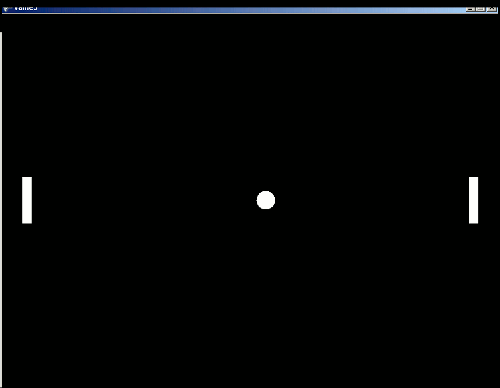
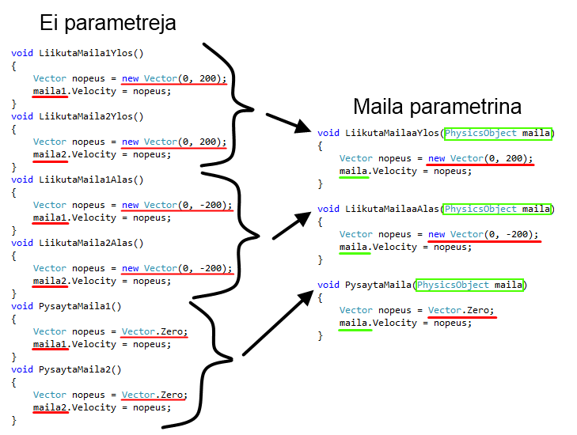
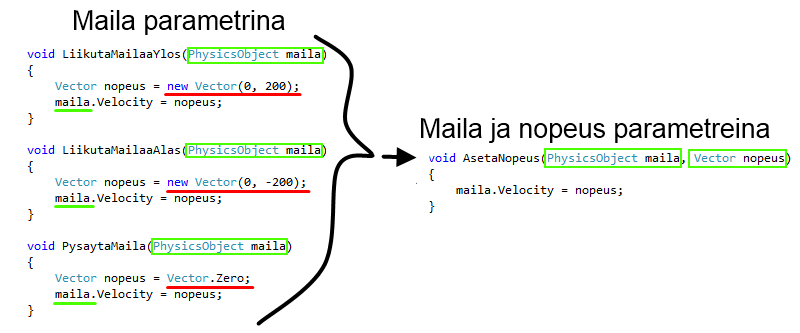

# Pong-peli, vaihe 5

Tämä on Pong-pelin tutoriaalin osa 5/7. Tämän vaiheen aikana

- Lisäämme peliin näppäimet
- Laitetaan mailat liikkumaan pelaajien ohjaamina

Näin ohjelmaamme voi jo kutsua peliksi :).



## 1. Taustatietoa näppäimistönkuuntelusta

*Jos ymmärrät jo, kuinka näppäimistönkuuntelu toimii, voit hypätä kohtaan 2.*

Pelissämme on ollut alusta saakka nappi, josta pelin saa lopetettua. Lopetusnappi on asetettu `Begin`-aliohjelmassa.

Pelin lopettamisen nappi on siis tehty siten, että näppäimistöltä kuunnellaan Esc-nappia, ja kun sitä painetaan, kutsutaan aliohjelmaa `ConfirmExit`:

(Tätä **ei** tarvitse kirjoittaa uudestaan.)

```csharp,ignore
public override void Begin()
{
   LuoKentta();
   AloitaPeli();

   Keyboard.Listen(Key.Escape, ButtonState.Pressed, ConfirmExit, "Lopeta peli");
}
```

Muita näppäimiä saa asetettua vastaavalla tavalla. Omien näppäinten asettamista varten tutkitaan hieman tarkemmin, miten lopetusnappi on tehty.

Aliohjelmaa `Keyboard.Listen` kutsumalla saadaan peli kuuntelemaan näppäimistön painalluksia. `Listen`-aliohjelmalle annetaan seuraavat parametrit:

**Ensimmäinen** parametri kertoo mitä näppäintä kuunnellaan. Lopetusnapissa se on `Key.Escape` eli Esc-näppäin.

**Toinen** parametri määrittää minkälaisia näppäinten tapahtumia halutaan kuunnella ja sillä on neljä mahdollista arvoa:

- ButtonState.Released: Näppäin on juuri vapautettu
- ButtonState.Pressed: Näppäin on juuri painettu alas
- ButtonState.Up: Näppäin on ylhäällä (vapautettuna)
- ButtonState.Down: Näppäin on alaspainettuna

**Kolmas** parametri on sen aliohjelman nimi, jota kutsutaan kun näppäin on siinä tilassa, mitä kuunnellaan. `ConfirmExit` on valmis aliohjelma, jota kutsumalla peli kysyy halutaanko se lopettaa. Kolmas parametri voi olla myös itse kirjoitettu aliohjelma.

**Neljäs** parametri on ohjeteksti, joka voidaan näyttää pelaajalle pelin alussa. Tässä tarvitsee vain kertoa mitä tapahtuu kun näppäintä painetaan. Ohjetekstin tyyppi on `string` eli merkkijono eli tekstiä. Teksti kirjoitetaan lainausmerkeissä `"`. Tämän parametrin arvo voi olla myös `null` eli tyhjä.

Lopuksi `Listen`-aliohjelmalle voi antaa lisääkin parametreja sen mukaan mitä pelissä tarvitaan. Nämä ylimääräiset parametrit välitetään näppäintä kuuntelevalle aliohjelmalle.

## 2. Ohjainten asettaminen

Koska näppäinten asettaminen on uusi selkeä kokonaisuus, tehdään siitä oma aliohjelma.

**Lisää** ohjelmakoodiin uusi aliohjelma nimeltä `AsetaOhjaimet` ja **siirrä** lopetusnapin tekevä rivi sinne:

```csharp,ignore
void AsetaOhjaimet()
{
   Keyboard.Listen(Key.Escape, ButtonState.Pressed, ConfirmExit, "Lopeta peli");
}
```

**Lisää** `AsetaOhjaimet`-aliohjelman kutsu `Begin`iin.

Ohjaimet on loogista asettaa ennen kuin peli aloitetaan, joten kirjoita `AsetaOhjaimet`-aliohjelman kutsu `LuoKentta` ja `AloitaPeli` -aliohjelmien kutsujen väliin.

`Begin` näyttää muutosten jälkeen tältä:

```csharp,ignore
public override void Begin()
{
   LuoKentta();
   AsetaOhjaimet();
   AloitaPeli();
}
```

Pong-pelissä mailan ohjaamisen ideana on, että mailaa liikkuu ylös, kun jokin näppäin on pohjassa. Kun näppäin päästetään pohjasta, maila pysähtyy.

Vaikka emme vielä tarkalleen tiedä miten saamme mailat liikkumaan, tehdään näppäimen kuuntelut toisen mailan liikuttamiseksi ylöspäin. **Toivomme** että toinen maila liikkuisi ylöspäin näppäimellä `A`.

**Kirjoita** kaksi `Listen`-aliohjelman kutsua lisää `AsetaOhjaimet`-aliohjelmaan mailan liikuttamista varten:

```csharp,ignore
void AsetaOhjaimet()
{
   Keyboard.Listen(Key.A, ButtonState.Down, LiikutaMaila1Ylos, "Pelaaja 1: Liikuta mailaa ylös");
   Keyboard.Listen(Key.A, ButtonState.Released, PysaytaMaila1, null);

   Keyboard.Listen(Key.Escape, ButtonState.Pressed, ConfirmExit, "Lopeta peli");
}
```

Kuunnellaan näppäintä `Key.A` eli A-näppäintä.

Ensimmäisessä kutsussa kerrotaan aliohjelma (`LiikutaMaila1Ylos`), johon tullaan kun näppäin on pohjassa (`ButtonState.Down`).

Toisessa kutsussa kerrotaan mitä tehdään (`PysaytaMaila1`), kun näppäin vapautetaan (`ButtonState.Released`).

**Emme ole vielä toteuttaneet tällaisia aliohjelmia**, mutta mietitään sitä vasta seuraavaksi.

%%eitoimi%%

## 3. Aliohjelma mailan liikuttamiseksi

Koska maila on fysiikkaolio, sen yhtenä ominaisuutena on nopeus (*engl. velocity*). Jos vain asetamme mailalle jonkin nopeuden, fysiikkapeli hoitaa mailan paikan muuttamisen.

Nopeus esitetään vektorina. Vektorin x-arvo kertoo mailan nopeuden vaakasuunnassa ja y-arvo pystysuunnassa. Millaisia vektoreita siis tarvitsemme mailan liikuttamiseen ylös ja alas? Entä miten voisimme ilmaista mailan pysäyttämisen?

%%eitoimi%%

Tarvitsemme kolme eri nopeusvektoria:

- Ylöspäin: nopeuden x-arvo nolla ja y-arvo positiivinen
- Alaspäin: nopeuden x-arvo nolla ja y-arvo negatiivinen
- Pysähtyminen: nopeuden x- ja y-arvot molemmat nolla eli nollavektori

Koska lisäksi mailoja on kaksi, voisimme toteuttaa mailojen liikuttamisen kuudella eri aliohjelmalla: `LiikutaMaila1Ylos`, `LiikutaMaila2Ylos`, `LiikutaMaila1Alas`, `LiikutaMaila2Alas`, `PysaytaMaila1` ja `PysaytaMaila2`.

Tarkemmin ajateltuna kaikki aliohjelmat tekevät kuitenkin samaa asiaa: asettavat mailalle nopeuden. Erilaista on vain maila jolle nopeus asetetaan ja nopeuden suunta.

Viemällä liikutettavan mailan parametrina selviämme mailojen liikuttamisesta vain kolmella aliohjelmalla: `LiikutaMailaaYlos`, `LiikutaMailaaAlas` ja `PysaytaMaila`.

*Älä kirjoita alla olevia aliohjelmia itse.*



Kun jälleen tarkastellaan kolmea aliohjelmaamme, huomataan että jokaisessa edelleen toistuu vektorin luominen ja sen asettaminen mailalle nopeudeksi. Erilaista on vain millainen vektori nopeudeksi asetetaan.

Jos myös nopeus vietäisiin parametrina, selviäisimme mailojen liikuttamisesta yhdellä ainoalla aliohjelmalla!



Mailojen liikuttamisen voimme siis hoitaa kuuden aliohjelman sijaan yhdellä aliohjelmalla `AsetaNopeus`, jolle annetaan parametrina maila jota liikutetaan, ja mailan nopeuden vektori.

**Kirjoita** siis aliohjelma `AsetaNopeus` ja sille alla oleva koodi:

```csharp,ignore
void AsetaNopeus(PhysicsObject maila, Vector nopeus)
{
   maila.Velocity = nopeus;
}
```

%%eitoimi%%

### Mailat ja vektorit attribuuteiksi

`Listen`-aliohjelmalle voi antaa mitä tahansa omia parametrejä pakollisten parametrien jälkeen. Nämä parametrit toimitetaan näppäintä kuuntelevalle aliohjelmalle.

Tehdään mailoille ja vektoreille muuttujat, jotka voimme antaa parametreina mailan liikuttamisesta vastaavalle aliohjelmalle.

Jotta muuttujat näkyisivät `AsetaOhjaimet`-aliohjelmalle, tehdään niistäkin **attribuutteja**.

**Esittele** luokan alussa uudet attribuutit, `maila1` ja `maila2` sekä **luo** uudet vektorit `nopeusYlos` ja `nopeusAlas`:

```csharp,ignore
public class Pong : PhysicsGame
{
// HIGHLIGHT_GREEN_BEGIN
    Vector nopeusYlos = new Vector(0, 200);
    Vector nopeusAlas = new Vector(0, -200);
// HIGHLIGHT_GREEN_END

    PhysicsObject pallo;

// HIGHLIGHT_GREEN_BEGIN
    PhysicsObject maila1;
    PhysicsObject maila2;
// HIGHLIGHT_GREEN_END

    public override void Begin()
    {
        LuoKentta();
        AsetaOhjaimet();
        AloitaPeli();
    }
```

%%eitoimi%%

### Mailojen sijoitus attribuutteihin

Jotta luomamme mailat menevät attribuutteihin `maila1` ja `maila2`, täytyy ne sijoittaa niihin.

**Muokkaa** tätä varten `LuoMaila`-aliohjelmaa niin, että se palauttaa siellä luodun mailan:

```csharp,ignore
// HIGHLIGHT_GREEN_BEGIN
PhysicsObject LuoMaila(double x, double y)
// HIGHLIGHT_GREEN_END
{
    PhysicsObject maila = PhysicsObject.CreateStaticObject(20.0, 100.0);
    maila.Shape = Shape.Rectangle;
    maila.X = x;
    maila.Y = y;
    maila.Restitution = 1.0;
    Add(maila);
// HIGHLIGHT_GREEN_BEGIN
    return maila;
// HIGHLIGHT_GREEN_END
}
```

Ennen muutosta aliohjelman nimen edessä oli sana `void` sen merkiksi, että aliohjelma ei palauta minkään tyyppistä tietoa. Koska nyt aliohjelma palauttaa mailan, joka on tyyppiä `PhysicsObject`, vaihdettiin se `void`:in tilalle. Aliohjelman loppuun lisättiin `return`-lause, joka palauttaa luodun mailan.

**Muokkaa** `LuoKentta`-aliohjelmaa niin, että luodut mailat sijoitetaan muuttujiin `maila1` ja `maila2`:

```csharp,ignore
void LuoKentta()
{
    pallo = new PhysicsObject(40.0, 40.0);
    pallo.Shape = Shape.Circle;
    pallo.X = -200.0;
    pallo.Y = 0.0;
    pallo.Restitution = 1.0;
    Add(pallo);

// HIGHLIGHT_GREEN_BEGIN
    maila1 = LuoMaila(Level.Left + 20.0, 0.0);
    maila2 = LuoMaila(Level.Right - 20.0, 0.0);
// HIGHLIGHT_GREEN_END

    Level.CreateBorders(1.0, false);
    Level.Background.Color = Color.Black;

    Camera.ZoomToLevel();
}
```

`LuoMaila`-aliohjelman tekemät mailat saadaan otettua talteen muuttujiin sen takia, että `LuoMaila` palauttaa tehdyn mailan. Ilman palauttamista maila kyllä tehtäisiin, mutta emme luomisen jälkeen pystyisi enää viittaamaan siihen millään tavalla.

Nyt meillä on olemassa mailat `maila1` ja `maila2`, jotka näkyvät kaikille aliohjelmille.

%%eitoimi%%

### 3.3. Maila liikkumaan ylöspäin

**Muuta** lopuksi `AsetaOhjaimet`-aliohjelman `Listen`-kutsuja niin, että suoritetaan `AsetaNopeus`-aliohjelmaa ja viedään sille parametrina se maila, johon halutaan vaikuttaa, ja se vektori, joka halutaan mailalle asettaa nopeudeksi:

```csharp,ignore
void AsetaOhjaimet()
{
// HIGHLIGHT_GREEN_BEGIN
    Keyboard.Listen(Key.A, ButtonState.Down, AsetaNopeus, "Pelaaja 1: Liikuta mailaa ylös", maila1, nopeusYlos);
    Keyboard.Listen(Key.A, ButtonState.Released, AsetaNopeus, null, maila1, Vector.Zero);
// HIGHLIGHT_GREEN_END

    Keyboard.Listen(Key.Escape, ButtonState.Pressed, ConfirmExit, "Lopeta peli");
}
```

%%kokeile%% (Ellei pelisi toimi, yritä selvittää mistä vika johtuu, tai pyydä ohjaajaa auttamaan.)

## 4. Molempien mailojen liikuttaminen

Molempien mailojen liikuttaminen voidaan nyt tehdä helposti vain lisäämällä `Keyboard.Listen`-kutsuja.

**Täydennä** `AsetaOhjaimet`-aliohjelmaasi vielä seuraavat **vihreällä merkityt** `Listen`-kutsut:

```csharp,ignore
void AsetaOhjaimet()
{
    Keyboard.Listen(Key.A,      ButtonState.Down,     AsetaNopeus,     "Pelaaja 1: Liikuta mailaa ylös", maila1, nopeusYlos);
    Keyboard.Listen(Key.A,      ButtonState.Released, AsetaNopeus,     null,                             maila1, Vector.Zero);
// HIGHLIGHT_GREEN_BEGIN
    Keyboard.Listen(Key.Z,      ButtonState.Down,     AsetaNopeus,     "Pelaaja 1: Liikuta mailaa alas", maila1, nopeusAlas);
    Keyboard.Listen(Key.Z,      ButtonState.Released, AsetaNopeus,     null,                             maila1, Vector.Zero);
// HIGHLIGHT_GREEN_END

// HIGHLIGHT_GREEN_BEGIN
    Keyboard.Listen(Key.Up,     ButtonState.Down,     AsetaNopeus,     "Pelaaja 2: Liikuta mailaa ylös", maila2, nopeusYlos);
    Keyboard.Listen(Key.Up,     ButtonState.Released, AsetaNopeus,     null,                             maila2, Vector.Zero);
    Keyboard.Listen(Key.Down,   ButtonState.Down,     AsetaNopeus,     "Pelaaja 2: Liikuta mailaa alas", maila2, nopeusAlas);
    Keyboard.Listen(Key.Down,   ButtonState.Released, AsetaNopeus,     null,                             maila2, Vector.Zero);
// HIGHLIGHT_GREEN_END

// HIGHLIGHT_GREEN_BEGIN
    Keyboard.Listen(Key.F1,     ButtonState.Pressed,  ShowControlHelp, "Näytä ohjeet");
// HIGHLIGHT_GREEN_END
    Keyboard.Listen(Key.Escape, ButtonState.Pressed,  ConfirmExit,     "Lopeta peli");
}
```

Kuten nyt nähdään, mailan ja nopeuden vieminen parametrina `Keyboard.Listen`-aliohjelmalle oli todella hyödyllistä, sillä voimme nyt helposti lisätä ohjauksen useammalle kuin yhdelle mailalle emmekä tarvitse ohjaamiseen kuin yhden aliohjelman.

Kokeile miten pelisi toimii!

%%kokeile%%

## 5. Lopputulos

Kun mailojen ohjaaminen on mukana, näyttää koodi seuraavalta:

```csharp,feature-jypeli
using System;
using System.Collections.Generic;
using System.Linq;
using System.Text;
using Jypeli;
using Jypeli.Assets;
using Jypeli.Controls;
using Jypeli.Effects;
using Jypeli.Widgets;

public class Pong : PhysicsGame
{
    Vector nopeusYlos = new Vector(0, 200);
    Vector nopeusAlas = new Vector(0, -200);

    PhysicsObject pallo;
    PhysicsObject maila1;
    PhysicsObject maila2;

    public override void Begin()
    {
        LuoKentta();
        AsetaOhjaimet();
        AloitaPeli();
    }

    void LuoKentta()
    {
        pallo = new PhysicsObject(40.0, 40.0);
        pallo.Shape = Shape.Circle;
        pallo.X = -200.0;
        pallo.Y = 0.0;
        pallo.Restitution = 1.0;
        Add(pallo);

        maila1 = LuoMaila(Level.Left + 20.0, 0.0);
        maila2 = LuoMaila(Level.Right - 20.0, 0.0);

        Level.CreateBorders(1.0, false);
        Level.BackgroundColor = Color.Black;

        Camera.ZoomToLevel();
    }

    PhysicsObject LuoMaila(double x, double y)
    {
        PhysicsObject maila = PhysicsObject.CreateStaticObject(20.0, 100.0);
        maila.Shape = Shape.Rectangle;
        maila.X = x;
        maila.Y = y;
        maila.Restitution = 1.0;
        Add(maila);
        return maila;
    }

    void AloitaPeli()
    {
        Vector impulssi = new Vector(500.0, 0.0);
        pallo.Hit(impulssi * pallo.Mass);
    }

    void AsetaOhjaimet()
    {
        Keyboard.Listen(Key.A, ButtonState.Down, AsetaNopeus, "Pelaaja 1: Liikuta mailaa ylös", maila1, nopeusYlos);
        Keyboard.Listen(Key.A, ButtonState.Released, AsetaNopeus, null, maila1, Vector.Zero);
        Keyboard.Listen(Key.Z, ButtonState.Down, AsetaNopeus, "Pelaaja 1: Liikuta mailaa alas", maila1, nopeusAlas);
        Keyboard.Listen(Key.Z, ButtonState.Released, AsetaNopeus, null, maila1, Vector.Zero);

        Keyboard.Listen(Key.Up, ButtonState.Down, AsetaNopeus, "Pelaaja 2: Liikuta mailaa ylös", maila2, nopeusYlos);
        Keyboard.Listen(Key.Up, ButtonState.Released, AsetaNopeus, null, maila2, Vector.Zero);
        Keyboard.Listen(Key.Down, ButtonState.Down, AsetaNopeus, "Pelaaja 2: Liikuta mailaa alas", maila2, nopeusAlas);
        Keyboard.Listen(Key.Down, ButtonState.Released, AsetaNopeus, null, maila2, Vector.Zero);

        Keyboard.Listen(Key.F1, ButtonState.Pressed, ShowControlHelp, "Näytä ohjeet");
        Keyboard.Listen(Key.Escape, ButtonState.Pressed, ConfirmExit, "Lopeta peli");
    }

    void AsetaNopeus(PhysicsObject maila, Vector nopeus)
    {
        maila.Velocity = nopeus;
    }
}
```
