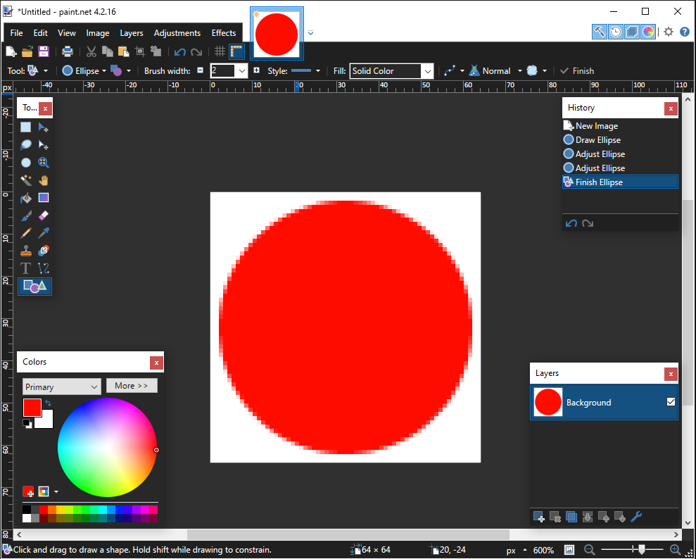
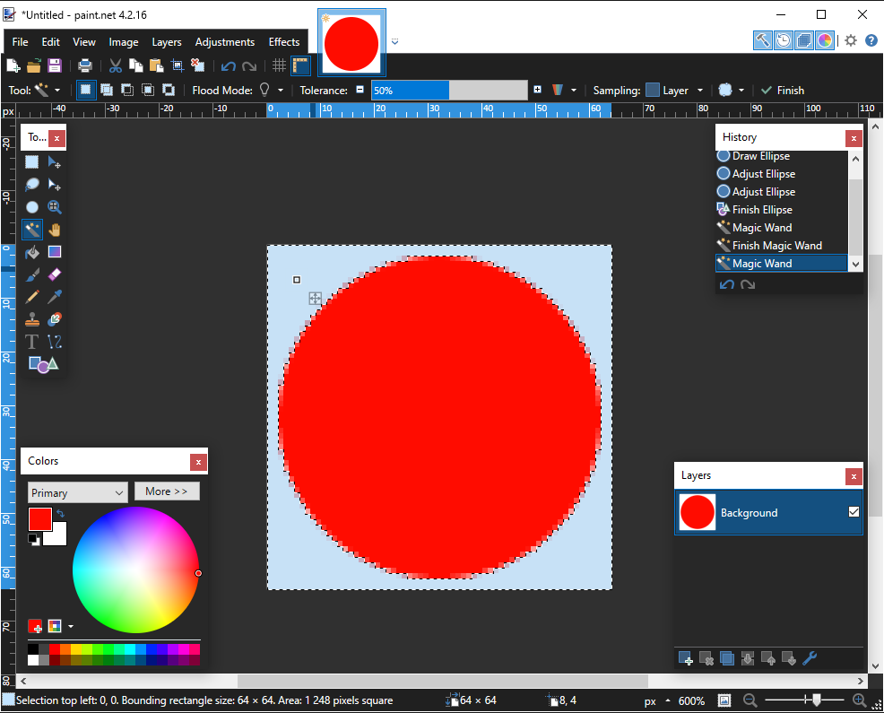
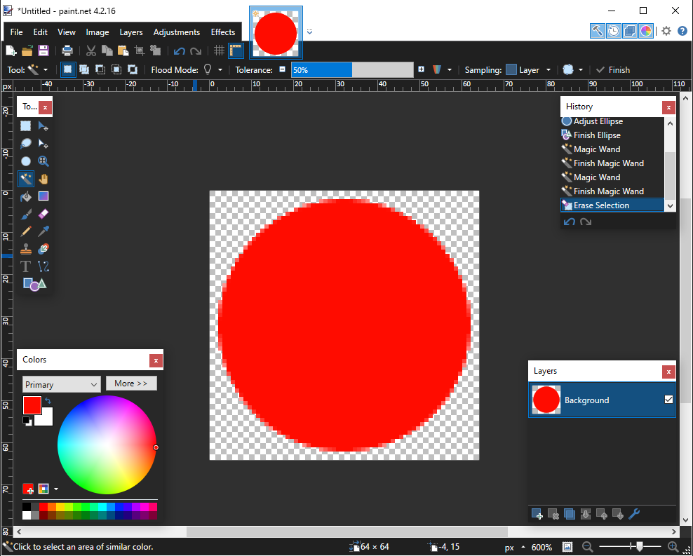
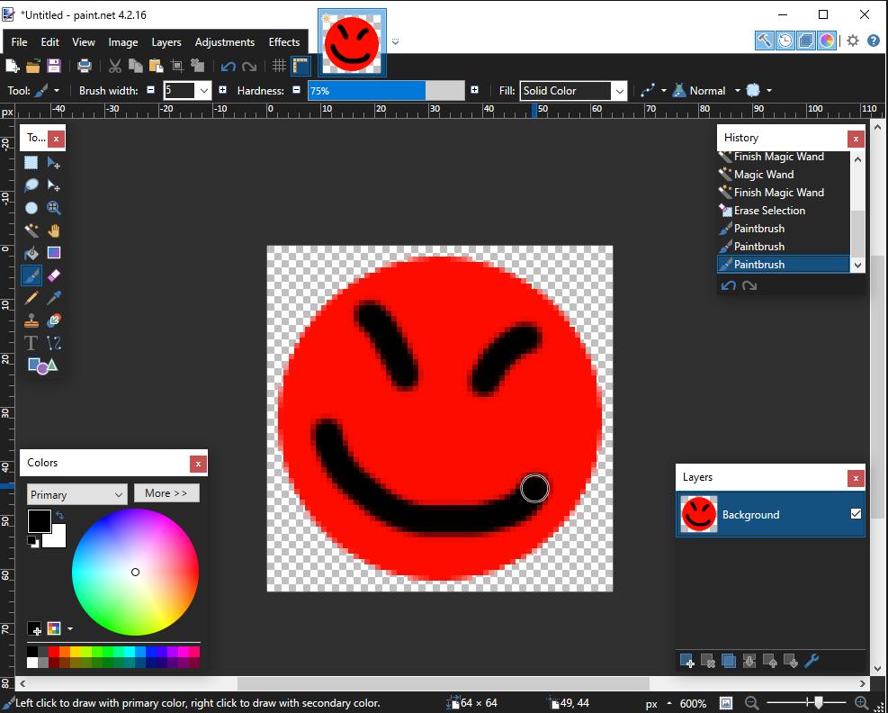
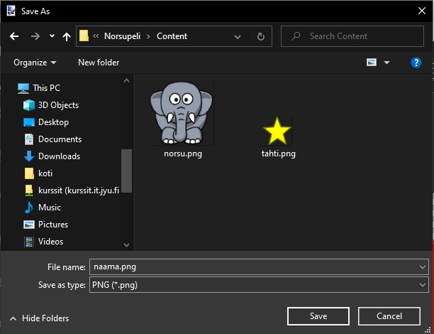
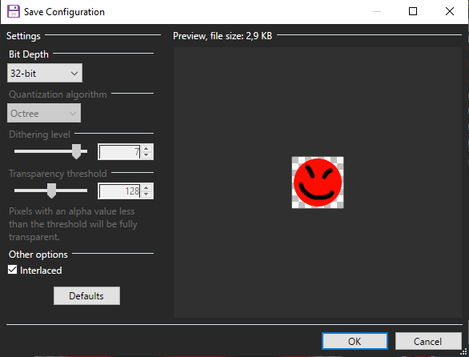

# Miten kuvaan saa tehtyä läpinäkyviä osia

Näin saat tehtyä [Paint.Net](https://www.getpaint.net/)-ohjelmalla kuvaasi läpinäkyviä osia ja tallennettua ne PNG-formaatissa.

Luo uusi kuva. Ota heti alussa huomioon kuvan koko, eli millaisella tarkkuudella haluat kuvan olevan lopullisessa pelissä. Tässä kuvan koko on 64x64 pikseliä mikä riittää pienelle pelihahmolle. Piirrä sitten haluamasi kuva.

Kun olet piirtänyt, aletaan poistamaan kuvasta niitä osia, jotka halutaan läpinäkyviksi. Valitse taikasauvatyökalu (Magic Wand, näppäinoikotie S) ja klikkaa (yhden kerran) sille alueelle, jonka haluat läpinäkyväksi (tasainen väri lähtee helpoiten).

Jos haluat valita useita alueita, pidä Shift-näppäin pohjassa ja tee monta valintaa.

Kun valinta on valmis, klikkaa Edit -\> Erase selection, tai paina Del-näppäintä.

Läpinäkyvä alue näkyy nyt "shakkiruudukkona".

Voit toki vielä jatkaa hahmon piirtämistä ruudulliselle alueellekin. Mutta edelleen - vain se alue joka on ruudullinen, on läpinäkyvää aluetta lopullisessa kuvassa.

Kun olet valmis, tallenna kuva, ja valitse tallennusmuodoksi PNG.

Bit Depthiin on yleensä parasta laittaa 32-bit.

Seuraavaksi katso kuinka [kuva tuodaan peliin ja lisätään oliolle](../grafiikka/kuvat.md#kuvan-lataaminen-tiedostosta-ja-asettaminen-oliolle).
