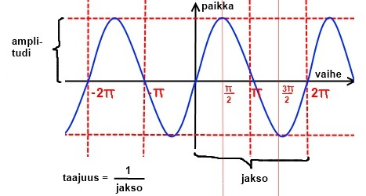

TODO: Sivun sisältö ei suurelta osin suoraan liity ohjaimiin.

# Miten fysiikkaolioita voi liikuttaa?

Fysiikkaolioiden liikuttamiseen on eri tapoja jotka käyvät eri tilanteisiin.

## Push

Push työntää oliota annetun voimavektorin mukaisesti.

```csharp,ignore
pelaaja1.Push(new Vector(1000, 0));
```

Tämä on yleensä suositeltava tapa, jos oliota pitää liikutella esim. nuolinäppäimillä. Tätä metodia käyttämällä olion vauhti kiihtyy.

Olion massa vaikuttaa siihen kuinka nopeasti se kiihtyy. Mitä suurempi massa on, sitä enemmän voimaa tarvitaan sen kiihdyttämiseen tai hidastamiseen.

Jos haluat, ettei vauhti kiihdy loputtomasti, aseta olion LinearDamping-ominaisuus pienemmäksi, esimerkiksi näin.

```csharp,ignore
pelaaja1.LinearDamping = 0.95;
```

LinearDamping-ominaisuuden arvoa pienentämällä olion liike hidastuu ja pysähtyy itsestään, jos sitä ei aktiivisesti työnnetä johonkin suuntaan. Sen avulla pelaajan liikuttamisesta pelikentällä saa sulavan näköistä.

Oliolle voi asettaa myös nopeusrajoituksen:

```csharp,ignore
pelaaja1.MaxVelocity = 200;
```

Seinistä kimpoilua voi hillitä muuttamalla olion kimmoisuutta:

```csharp,ignore
pelaaja1.Restitution = 0.0;
```

Lisätietoa fysiikkaolioiden ominaisuuksista [Fysiikan ilmiöt](../fysiikka/fysiikan-ilmiot.md) -sivulla.

Pushille voi antaa myös aikajakson, jolloin oliota työnnetään tietyn ajan tietyllä voimalla.

Pelaajaan kohdistuu annetun vektorin voima kahden sekunnin ajan:

```csharp,ignore
pelaaja1.Push(new Vector(0, 3000), TimeSpan.FromSeconds(2.0));
```

## Olion liikuttaminen siihen suuntaan, mihin se kulloinkin osoittaa

Usein ylhäältäpäin kuvatussa pelissä pelaajaa halutaan pyörittää ja sitten työntää eteenpäin siihen suuntaan mihin nokka osoittaa.

Olion suunnan saa selville sen `Angle`-ominaisuudesta. Olion suuntaisen vektorin voi luoda `Vector.FromLengthAndAngle`-metodilla, joka luo uuden vektorin kun sille annetaan vektorin pituus ja `Angle`-olio.

Esim:

```csharp,ignore
Vector pelaajanSuunta = Vector.FromLengthAndAngle(500.0, pelaaja1.Angle);
pelaaja.Push(pelaajanSuunta);
```

Muista myös ominaisuudet `LinearDamping`, `MaxVelocity` ja `Restitution` (kts. [kohta Push](#push)).

## ApplyTorque

`ApplyTorque` on kuten `Push`, mutta se vaikuttaa olion paikan sijasta sen kulmaan. Vektorin sijasta parametriksi annetaan vääntövoima lukuna. Positiivinen vääntövoima vääntää oliota vastapäivään ja negatiivinen myötäpäivään.

```csharp,ignore
pelaaja1.ApplyTorque(1000);
```

Olion massa vaikuttaa myös sen vääntövoiman vaikutukseen, mutta sitäkin suorempaan siihen vaikuttaa olion *hitausmomentti*. Hitausmomentti voidaan asettaa olion `MomentOfInertia`-ominaisuudella.

```csharp,ignore
pelaaja1.MomentOfInertia = 600;
```

Jos haluat, että pyöriminen loppuu joskus itsestään, aseta olion AngularDamping-ominaisuus pienemmäksi, esimerkiksi näin.

```csharp,ignore
pelaaja1.AngularDamping = 0.95;
```

Pyörimiselle voi asettaa myös nopeusrajoituksen:

```csharp,ignore
pelaaja1.MaxAngularVelocity = 200;
```

## Hit

Hit kohdistaa olioon impulssin (hetkellinen voima), jolla olion saa nopeasti liikkeeseen.

```csharp,ignore
pelaaja1.Hit(new Vector(1000, 0));
```

Olion massa vaikuttaa siihen kuinka paljon impulssi vaikuttaa siihen. Mitä suurempi massa, sitä suurempi impulssi tarvitaan sen liikuttamiseen.

## Walk ja Jump (vain PlatformCharacter-oliolla)

`PlatformCharacter`-olioilla on erityiset kävelemiseen ja hyppämiseen tarkoitetut aliohjelmat. Lue niistä lisää [täältä](https://trac.cc.jyu.fi/projects/npo/wiki/OliotJaSelitykset#a3.PlatformCharacter).

## Move

Move siirtää oliota sille annetun vektorin mukaisesti. Se toimii kaikkien olioiden kanssa ja ottaa fysiikan huomioon. Move on tarkoitettu ensisijaisesti aivojen kanssa käytettäväksi, esimerkiksi PlatformCharactereiden kanssa siitä ei ole juurikaan hyötyä yksittäisinä kutsuina.

```csharp,ignore
pelaaja1.Move(new Vector(1000, 0));
```

## MoveTo

`MoveTo` yrittää siirtää olion annettuun paikkaan annetulla nopeudella. Toimii peli-, fysiikka- ja tasohyppelyolioille.

Paikka ilmaistaan vektorina ja nopeus desimaalilukuna.

```csharp,ignore
pelaaja1.MoveTo(new Vector(500, 200), 400);
```

Jos halutaan tehdä jotain kun olio on päässyt perille, voidaan `MoveTo`:lle antaa kolmantena parametrina suoritettavan aliohjelman nimi.

```csharp,ignore
pelaaja1.MoveTo(new Vector(500, 200), 400, PelaajaSaapuiKohteeseen);
```

Tapahtuman käsittelevä aliohjelma voi olla esimerkiksi seuraavanlainen:

```csharp,ignore
void PelaajaSaapuiKohteeseen()
{
    MessageDisplay.Add("Pelaaja saapui kohteeseen!");
}
```

## Nopeuden asettaminen

Fysiikkaolioilla on olemassa ominaisuus nimeltä nopeus eli `Velocity`, joka kertoo vektorina olion nopeuden. Halutessamme voimme asettaa olioille suoraan haluamamme nopeuden:

```csharp,ignore
maila.Velocity = new Vector(0, 200);
```

Alla pidempi esimerkki, jossa pelaajaa voi ohjata kaikkiin neljään suuntaan tasaisella nopeudella. Tämä voi olla hyvä tapa liikutella pelaajaa, jos teet esimerkiksi ylhäältäpäin kuvattua labyrinttipeliä.

```csharp,feature-jypeli
using System;
using System.Collections.Generic;
using Jypeli;
using Jypeli.Assets;
using Jypeli.Controls;
using Jypeli.Effects;
using Jypeli.Widgets;

public class FysiikkaPeli1 : PhysicsGame
{
    private double liikkumisnopeus = 300;

    public override void Begin()
    {
        PhysicsObject pelaaja = new PhysicsObject(100, 100, Shape.Circle);
        Add(pelaaja);

        Keyboard.Listen(Key.Left, ButtonState.Down, Liikuta, null, pelaaja, new Vector(-liikkumisnopeus, 0));
        Keyboard.Listen(Key.Left, ButtonState.Released, Liikuta, null, pelaaja, Vector.Zero);
        Keyboard.Listen(Key.Right, ButtonState.Down, Liikuta, null, pelaaja, new Vector(liikkumisnopeus, 0));
        Keyboard.Listen(Key.Right, ButtonState.Released, Liikuta, null, pelaaja, Vector.Zero);
        Keyboard.Listen(Key.Down, ButtonState.Down, Liikuta, null, pelaaja, new Vector(0, -liikkumisnopeus));
        Keyboard.Listen(Key.Down, ButtonState.Released, Liikuta, null, pelaaja, Vector.Zero);
        Keyboard.Listen(Key.Up, ButtonState.Down, Liikuta, null, pelaaja, new Vector(0, liikkumisnopeus));
        Keyboard.Listen(Key.Up, ButtonState.Released, Liikuta, null, pelaaja, Vector.Zero);

        PhoneBackButton.Listen(ConfirmExit, "Lopeta peli");
        Keyboard.Listen(Key.Escape, ButtonState.Pressed, ConfirmExit, "Lopeta peli");
    }

    void Liikuta(PhysicsObject pelaaja, Vector suunta)
    {
        pelaaja.Velocity = suunta;
    }
}
```

## Sijainnin asettaminen

Oliolle voi myös yksinkertaisesti asettaa uuden sijainnin. Silloin se siirtyy annettuihin X:n ja Y:n pisteisiin. Jos käsittelet fysiikkaolioita tällä metodilla, huomaa, että tämä ei ota huomioon fysiikan vaikutusta olioon.

```csharp,ignore
pelaaja1.X = pelaaja1.X + 10;
pelaaja1.Y = pelaaja1.Y - 10;
```

- Pelaaja1 liikkuu x-akselin suhteen edellisestä sijainnista 10 yksikköä oikealle ja 10 yksikköä alaspäin.

## Pyörittäminen

Fysiikkaolion saa pyörimään antamalla sille kulmanopeuden. Kulmanopeuden voi asettaa fysiikkaolion `AngularVelocity`-ominaisuuteen seuraavalla tavalla:

```csharp,ignore
pelaaja1.AngularVelocity = 10.0;
```

Pyörimisen suunta vaihtuu kun antaa negatiivisia arvoja.

Pyörimisliike hidastuu ja pysähtyy itsestään, kun `AngularDamping`-ominaisuuden arvoksi asettaa ykköstä pienempiä lukuja:

```csharp,ignore
pelaaja1.AngularDamping = 0.5;
```

## Olion liikuttaminen edestakaisin (värähtely)

Olion saa värähtelemään edestakaisin `Oscillate`-nimisellä metodilla. Metodi ottaa parametrikseen akselin jonka suunnassa värähtely tapahtuu sekä värähtelyn amplitudin (maksimietäisyys keskikohdasta) ja taajuuden (kuinka monta kertaa sekunnissa liikutaan koko matka). Värähtelyn yksikkö on hertsi (Hz).

Seuraava esimerkki liikuttaa `vihu`-nimistä oliota vaakasuunnassa sadan yksikön matkalla 2 Hz taajuudella:

```csharp,ignore
vihu.Oscillate(Vector.UnitX, 100, 2);
```

`Oscillate` hyväksyy myös kaksi lisäparametria, joista ensimmäinen on vaihe ja toinen vaimennus. Kummankin oletusarvo on nolla, jos parametrit jätetään pois.

**Vaihe**

Vaiheella voidaan säätää, mistä kohtaa värähtely alkaa. Seuraava esimerkkikoodi aloittaa värähtelyn ylhäältä:

```csharp,ignore
vihu.Oscillate(Vector.UnitX, 100, 2, 0.5 * Math.PI);
```

Mistä `0.5 * Math.PI` sitten on saatu? Seuraava kuva havainnollistaa värähtelyliikettä ja sen muuttujia:



**Vaimeneva värähtely**

Oletuksena värähtely jatkuu loputtomiin, mutta vaimennuksella se saadaan pysähtymään itsestään jonkin ajan kuluttua. Mitä suurempi vaimennus annetaan, sitä jyrkemmin ja nopeammin värähtely hidastuu.

```csharp,ignore
vihu.Oscillate(Vector.UnitX, 100, 2, 0, 1);
```

## Olion kulman liikuttaminen edestakaisin (kulmavärähtely)

Myös olion kulman voi laittaa värähtelemään. Tätä varten on metodi `OscillateAngle`.

```csharp,ignore
vihu.OscillateAngle(1, Angle.FromDegrees(20), 2, 1);
```

Parametrit ovat järjestyksessä:

- suunta: -1 myötäpäivään, 1 vastapäivään
- amplitudi: kuinka monta astetta värähdellään kumpaankin suuntaan
- taajuus: kuinka monta jaksoa sekunnissa värähdellään (nopeus)
- vaimennus (ei pakollinen): mitä suurempi, sitä nopeammin värähtely lakkaa. Jos 0, jatkuu loputtomiin.

Kulmavärähtelylle voi asettaa aaltomuotoja samaan tapaan kuin tavallisellekin värähtelylle, esim.

```csharp,ignore
vihu.OscillateAngle<Waveform.Triangle>(1, Angle.FromDegrees(20), 2, 1);
```
