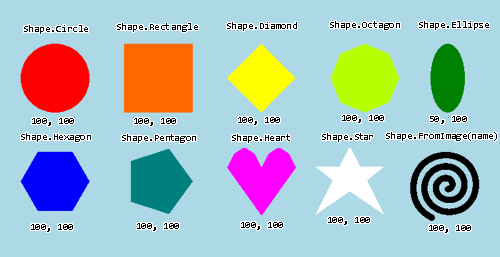

# Miten lisään olion?

Jos sinulla on käytössä Fysiikkapeli-projektimalli ja haluat kappaleen johon vaikuttaa fysiikka, tee `PhysicsObject`. Jos kappaleelle ei haluta mitään fysiikkaan liittyviä ominaisuuksia, kuten törmäyksiä, tällöin `GameObject` on parempi valinta.

Yksinkertainen esimerkki kappaleen luonnista.

```csharp,feature-jypeli
//-using System;
//-using Jypeli;
//-using Jypeli.Controls;
//-
//-public class Kissa : PhysicsGame
//-{
//-    public override void Begin()
//-    {
PhysicsObject kissa = new PhysicsObject(40, 20);
Add(kissa);
//-    }
//-}
```

- Ensimmäisellä rivillä luodaan muuttuja jolle annetaan nimeksi kissa, joka siis tyypiltään fysiikkaolio.
  - Fysiikkaoliota luodessa täytyy antaa tieto olion leveydestä ja korkeudesta. Tässä olion leveydeksi laitetaan 40 ja korkeudeksi 20. Kokeile muokata näitä arvoja.
- `Add`-funktiolla lisätään olio kenttään.

Olion luonnin jälkeen sille voi asettaa muitakin ominaisuuksia, kuten muodon tai värin.

```csharp,ignore
PhysicsObject kissa = new PhysicsObject(40, 20);
kissa.Shape = Shape.Circle;
kissa.Color = Color.Red;
Add(kissa);
```

Ominaisuuksia voi muuttaa vielä senkin jälkeen, kun olio on lisätty kenttään `Add`:illä.

Muut oliot tehdään vastaavalla tavalla, `PhysicsObjectin` tilalla vaan on halutun olion tyyppi. Eri oliot voivat kuitenkin haluta enemmän (tai vähemmän) tietoja jo luotaessa.

## Millaisia olioiden muotoja on olemassa?



Oliolle voidaan asettaa muoto. Jypelissä olevia muotoja ovat ympyrä, suorakulmio, kolmio, sydän, tähti, jana sekä erilaiset monikulmiot. Lisäksi muodon voi tehdä kuvaan perustuvasti.

Tehdään nyt uusi fysiikkaolio, jonka leveys on 100 ja korkeus on 50.

PhysicsObject olio = new PhysicsObject( 100, 50 );

Muista myös tarvittaessa lisätä olio kentälle: Add(olio);

Voit muuttaa olion sijaintia käyttämällä `olio.X = 0` ja `olio.Y = 0` komentojen avulla Kokeillaan nyt asettaa olio-muuttujalle erilaisia muotoja.

Kokeile erilaisia muotoja!

```csharp,feature-jypeli
//-using System;
//-using Jypeli;
//-using Jypeli.Controls;
//-
//-public class Cat : PhysicsGame
//-{
//-    public override void Begin()
//-    {
PhysicsObject sydan = new PhysicsObject(100, 100);
sydan.Shape = Shape.Heart;
Add(sydan);
//-    }
//-}
```

## Olion lisääminen toisen lapsiolioksi

Olio voidaan kiinnittää toiseen olioon lisäämällä se lapsiolioksi. Kiinnittämisen jälkeen lapsiolio liikkuu vanhempansa mukana. Lapsiolio säilyttää suhteellisen sijaintinsa vanhempaan nähden, ellei lapsioliota erikseen liikuteta.

```csharp,ignore
PhysicsObject pallo = new PhysicsObject(100, 100);
pallo.Shape = Shape.Circle;
pallo.Color = Color.White;
pallo.X = 100;
Add(pallo); // Pallo lisätään normaalisti peliin

PhysicsObject hattu = new PhysicsObject(60, 30);
hattu.Shape = Shape.Rectangle;
hattu.Color = Color.Green;
hattu.Position = pallo.Position; // Sijoitetaan hattu aluksi samaan kohtaan pallon kanssa
hattu.X += 0;                    // Siirretään hattua x-akselin suunnassa alkuperäisestä sijainnista
hattu.Y += 50;                   // Siirretään hattua y-akselin suunnassa  alkuperäisestä sijainnista
pallo.Add(hattu);                // Huom! Hattu lisätään pallon lapsiolioksi
```
