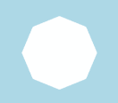
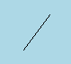
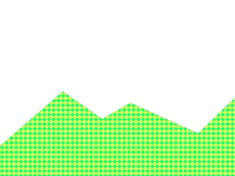
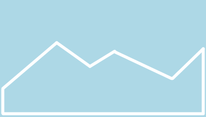
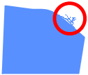
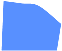

# Millaisia olioiden muotoja on olemassa?

Oliolle voidaan asettaa muoto. Jypelissä olevia muotoja ovat **ympyrä**, **suorakulmio**, **kolmio**, **sydän**, **tähti**, **jana** sekä erilaiset **monikulmiot**. Lisäksi muodon voi tehdä **kuvaan perustuvasti**.

Tehdään nyt uusi fysiikkaolio, jonka leveys on 100 ja korkeus on 50.

```csharp,ignore
PhysicsObject olio = new PhysicsObject(100, 50);
```

Muista myös tarvittaessa lisätä olio kentälle:

```csharp,ignore
Add(olio);
```

Kokeillaan nyt asettaa `olio`-muuttujalle erilaisia muotoja.

Tässä voit kokeilla erilaisia muotoa. Vaihda esimerkin <code>Shape.Circle</code> tilalle muita muotoja.

```csharp,feature-jypeli
//-using Jypeli;
//-
//-public class Peli : PhysicsGame
//-{
//-    public override void Begin()
//-    {
        Level.Background.Color = Color.Black;
        PhysicsObject olio = new PhysicsObject(100,50);
        olio.Shape = Shape.Circle;
        olio.Color = Color.Red;
        Add(olio);
//-        Camera.Zoom(2.0);
//-    }
//-}
```

## 1. Ympyrä

Ympyrä on pyöreä muoto, jolla on säde ja halkaisija. Ympyrän halkaisija (leveys ja korkeus) on 2 \* säteen pituus.

```csharp,ignore
olio.Shape = Shape.Circle;
```

Tässä tapauksessa oliostamme tulee ympyrä, jonka halkaisija on 100 (eli menee leveyden mukaan). Olio ei kuitenkaan näytä ympyrältä, vaikka se oikeasti onkin sen muotoinen, koska sen leveys on suurempi kuin korkeus.


**Jos oliosta haluaa myös ympyrän näköisen, leveys ja korkeus tulee asettaa yhtä suuriksi!**

## 2. Suorakulmio

Suorakulmiolla on leveys ja korkeus. Oliosta tulee suorakulmion muotoinen. Sen leveys ja korkeus ovat ne, mitkä olion luonnissa sille määriteltiin.

```csharp,ignore
olio.Shape = Shape.Rectangle;
```


Oletuksena oliot ovat juuri suorakulmion muotoisia, eli tätä muotoa ei erikseen tarvitse asettaa.

## 3. Kolmio

Kolmio tekee oliostamme tasasivuisen kolmion. Kolmion kanta on asettamamme leveyden pituinen. Kolmion kärki on laskettu kannan keskikohdasta asettamamme korkeuden päähän. Tasasivuisuus tarkoittaa sitä, että kantaa lukuunottamatta kolmion kaksi muuta sivua ovat yhtä pitkät.

```csharp,ignore
olio.Shape = Shape.Triangle;
```


## 4. Sydän

```csharp,ignore
olio.Shape = Shape.Heart;
```


## 5. Tähti

```csharp,ignore
olio.Shape = Shape.Star;
```


## 6. Monikulmiot

Jypelin muodoissa on olemassa valmiiksi joitain tavallisimpia monikulmioita:

```csharp,ignore
olio.Shape = Shape.Octagon; // kahdeksankulmio
olio.Shape = Shape.Hexagon; // kuusikulmio
olio.Shape = Shape.Pentagon; // viisikulmio
```

  

Erilaisia säännöllisiä monikulmioita voi tehdä myös itse antamalla halutun määrän kulmia CreateRegularPolygon-aliohjelmalle:

```csharp,ignore
olio.Shape = Shape.CreateRegularPolygon(10); // kymmenkulmio
```


## 7. Jana (eli "säde")

Janat tehdään Jypelissä muista muodoista hieman poikkeavasti. Jana tehdään RaySegment-oliolla. RaySegment on viiva, jolla on alkupiste, suunta ja pituus.

RaySegment-muodon käytös poikkeaa hieman muista muodoista. Se ei mm. voi pyöriä.

```csharp,ignore
RaySegment r = new RaySegment(new Vector(0, 0), new Vector(30, 40), 1);
PhysicsObject p = new PhysicsObject(r);
p.Color = Color.Black;
```



## 8. Muodon luominen kuvasta

Muoto voidaan luoda kuvan perusteella:

```csharp,ignore
Shape maastonMuoto = Shape.FromImage(maastonKuva);
```



Esimerkki kuvasta, josta muoto luetaan.



Kuvasta luettu muoto (sininen tausta on pelin "vakiotausta", eikä sinänsä liity varsinaiseen kuvaan).

## 9. Huomioita muodon luomiseen kuvasta

### 9.1. Tee kuvasta mahdollisimman pieni

Mitä enemmän kuvassa on pikseleitä, sitä enemmän olion luominen ja käsittely rasittaa tietokonetta. Jos kuvaan perustuvia olioita luodaan pelin aikana paljon, on suositeltavaa, että **kuvan leveys on enintään 128 pikseliä ja korkeus 128 pikseliä** - mielellään vähemmän.

Mitä tapahtuu, kun kuvassa on "liikaa" pikseleitä? Katso video:

📺 [Katso video (YouTube)](https://www.youtube.com/watch?v=UgYazosoVgQ)

### 9.2. Viimeistele (eli optimoi) koodi

Muodon lukeminen kuvasta on melko hidas operaatio. Kannattaa luoda muoto pelin alussa ja laittaa kuvio talteen muuttujaan, kuten seuraavassa esimerkissä on tehty:

```csharp,ignore
using System;
using Jypeli;

public class Peli : PhysicsGame
{
    Image maastonKuva = LoadImage( "maasto" );
    Shape maastonMuoto;

    protected override void Begin()
    {
        maastonMuoto = Shape.FromImage( maastonKuva );

        LuoKentta();
    }

    void LuoKentta()
    {
        PhysicsObject maasto = PhysicsObject.CreateStaticObject( 400, 300, maastonMuoto );
        maasto.Image = maastonKuva;
        Add( maasto );
    }
}
```

### 9.3. Tee reunat tasaisiksi

Katsothan, että kuvan reunat ovat mahdollisimman tasaisia. Jos kuvion reunalla näkyy ylimääräistä "röpelöä", pyyhi se pois.

 EI HYVÄ.

 HYVÄ.
