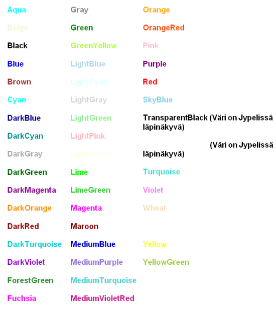
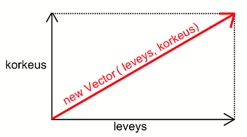
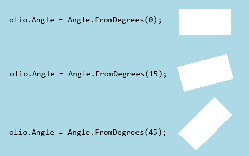

# Miten olion ulkonäköä voi muuttaa?

Luodaan ensin olio, jonka ulkonäköä esimerkeissä muutetaan:

```csharp,ignore
PhysicsObject olio = new PhysicsObject(100, 50);
```

Luomisen yhteydessä oliolle sanotaan vain sen leveys ja korkeus. Ryhdytään nyt muokkaamaan olion ominaisuuksia haluamiksemme. Kaikkia olion ominaisuuksia, myös leveyttä ja korkeutta, voi muuttaa olion luomisen jälkeenkin.

## Tekstuuri

Tekstuurikuvat kannattaa tallentaa png-muodossa, jolloin kuvaan voi tallentaa myös läpinäkyviä osia. Kuva täytyy liittää mukaan projektiin, jotta siihen voidaan viitata pelin koodissa. Katso ohjeet [sisällön tuomisesta projektiin](https://tim.jyu.fi/view/kurssit/tie/ohj1/tyokalut/sisallon-tuominen-peliin).

Sen jälkeen kun kuva on lisätty projektiin, ladataan kuva ensin muuttujaan luokan alussa seuraavasti.

```csharp,ignore
public class Peli : PhysicsGame
{
  Image olionKuva = LoadImage("kuvanNimi");

  public override void Begin()
  {
     //...
  }
}
```

Huomaa, että png-tunnistetta ei tarvitse laittaa kuvan nimen perään.

- Kohta `kuvanNimi` on Content-kansioon siirretyn kuvan nimi.
  - Esimerkiksi, jos kuva on `kissa.png`, niin kuvan nimenä voi olla pelkkä `kissa`, tai `kissa.png`.
- Miten kuvaan tehdään läpinäkyviä osia? [Lue ohje tästä](../muut/kuvan-lapinakyvyys.md).

Tämän jälkeen kuvan voi asettaa oliolle seuraavalla tavalla:

```csharp,ignore
olio.Image = olionKuva;
```

Samaa kuvaa voi nyt käyttää helposti halutessaan monelle eri oliolle.

## Muoto

Joskus olion muodon voi antaa jo oliota luotaessa. Muotoa voi kuitenkin myös jälkikäteen muuttaa. Esimerkiksi:

```csharp,ignore
olio.Shape = Shape.Circle;
```

Katso tarkemmat ohjeet muodon määrittämiseen: [Millaisia olioiden muotoja on olemassa](muodot.md)

## Väri {#vari}

Värin voi vaihtaa seuraavalla tavalla:

```csharp,ignore
olio.Color = Color.Gray;
```

Esimerkissä siis oliosta tehtiin harmaa. Värejä on valmiina paljon ja niistä voi valita haluamansa. Lista Jypelin sisäänrakennetuista väreistä:



Omia värejä voi myös tehdä seuraavasti:

```csharp,ignore
olio.Color = new Color(0, 0, 0);
```

Oliosta tuli musta. Ensimmäinen arvo kertoo punaisen värin määrän, toinen arvo vihreän värin määrän ja kolmas sinisen värin määrän. "Värimaailman" lyhenne RGB (Red Green Blue) tulee tästä. Lyhenteestä on helppo muistaa missä järjestyksessä värit tulevat. Määrät ovat välillä 0-255.

Värille voi antaa myös läpinäkyvyyden (ns. alfa-arvo) neljäntenä parametrina:

```csharp,ignore
olio.Color = new Color(255, 0, 0, 100);
```

Ylläoleva esimerkki tekee oliosta punaisen ja puoliksi läpinäkyvän. Nolla on täysin läpinäkyvä ja 255 täysin näkyvä. Vastaavan voi tehdä myös

```csharp,ignore
olio.Color = new Color(Color.Red, 100);
```

Muitakin tapoja värien asettamiseen on olemassa, mutta näillä pärjää jo hyvin.

Värejä voi helposti etsiä esimerkiksi [Googlen Color picker](https://www.google.com/search?q=color+picker)-työkalulla.

Käytä tämän antamia RGB-arvoja.

## Koko

Kokoa voi vaihtaa seuraavasti:

```csharp,ignore
olio.Width = leveys;
olio.Height = korkeus;
```

Saman asian voi tehdä myös vektorin avulla yhdellä rivillä:

```csharp,ignore
olio.Size = new Vector(leveys, korkeus);
```



## Kulma

Oliota voi pyörittää asettamalla olion `Angle` ominaisuuteen jokin kulma:

```csharp,ignore
olio.Angle = Angle.FromDegrees(kulma);
```

missä `kulma` tilalla on muuttuja tai luku, joka kuvaa montako astetta oliota käännetään. Oletuksena olion kulma on nolla astetta.



Kulman kasvaessa olio kääntyy vastapäivään päin:

Kulman voi antaa myös radiaaneina, esimerkiksi jos oliota halutaan pyörittää 90 astetta, eli 0.5 \* PI radiaania, niin se onnistuu näin:

```csharp,ignore
olio.Angle = Angle.FromRadians(0.5 * Math.PI);
```

## Loppuhuomautus

Kaikissa esimerkeissä on käytetty olion nimeä `olio`, esim. `olio.Color`. Huomaan, että olion tilalla voi olla mikä vaan muu nimi. Jos on luotu `PhysicsObject kissa`, niin tällöin kutsutaankin esim. `kissa.Color`.
