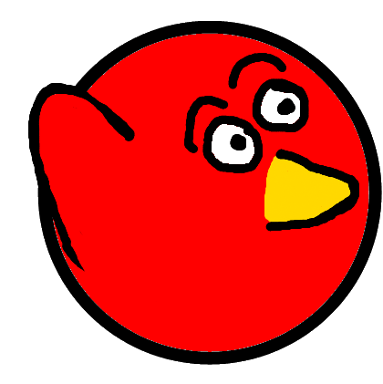
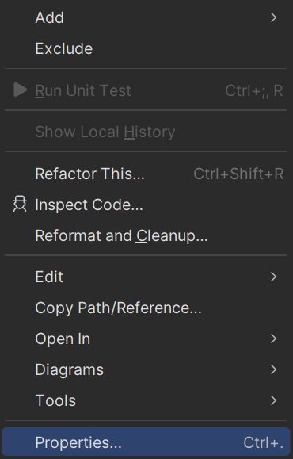
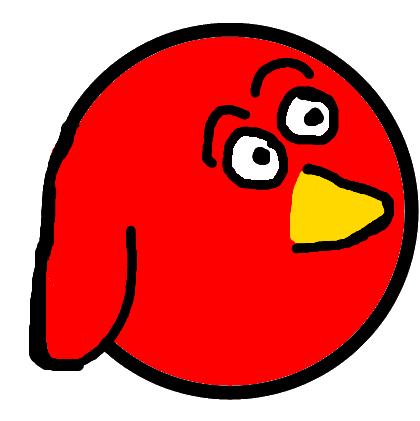

# Läpsylintu, vaihe 3: Norsusta linnuksi

## Norsusta linnuksi

Koska lentävä norsu ei näytä hyvältä pelissämme, vaihdetaan kuva lintuun. Lataa seuraava kuva tietokoneellesi:



Tallenna kuva nimellä `lintu.png`.

Ota esille projektisi kansio ja sieltä projektisi niminen kansio, jonka sisältä löytyy `Content`-kansio. Raahaa `PNG`-kuvatiedosto `Content`-kansion päälle. Varmista, että osut nimenomaan `Content`-kansion kohdalle, että kuva menee sen sisälle! Tämän jälkeen valitse tämä `lintu.png` Riderin Explorer-näkymästä, klikkaa sitä hiiren oikealla painikkeella (Macilla Ctrl+klikkaus) ja valitse avautuvasta valikosta **`Properties`**.



Etsi kohta, jossa lukee **`Copy to Output Directory`**, ja vaihda sen arvoksi `Copy if newer`.

Seuraavaksi etsi koodista rivi:

```csharp,ignore
Image pelaajanKuva = LoadImage("norsu.png");
```

Ja korvaa siitä "norsu" uuden kuvasi nimellä:

```csharp,ignore
Image pelaajanKuva = LoadImage("lintu.png");
```

Voit poistaa Explorer-näkymästä koko kuvatiedoston `norsu.png`, koska sitä ei enää käytetä.

Kokeile, että pelisi toimii uudella kuvalla!

> [!KOKEILE]

## Läpsyanimaation lisääminen

Haluamme, että lintu läpsyttää siipiään aina, kun pelaaja "hyppää" ylemmäksi.

Lataa linnusta läpsy-versio omaan hakemistoosi. Älä käytä tiedoston nimessä ääkkösiä tai muita erikoismerkkejä!



Tallenna kuva nimellä `lapsy.png`.

Lisää `lapsy.png` Explorer-näkymässä `Content`-kansioon (samoin kuin teit aiemmankin lintukuvan kanssa).

Etsi koodista kohta, jossa ladattiin pelaajan kuva:

```csharp,ignore
Image pelaajanKuva = LoadImage("lintu.png");
```

Lisää sen alapuolelle rivi, joka lisää hyppykuvaksi animaation, jossa on läpsäytys ja tavallinen lintukuva:

```csharp,ignore
Image[] pelaajanHyppykuvat = LoadImages("lapsy.png", "lintu.png");
```

`LisaaPelaaja`-aliohjelmassa on asetettu pelaajan normaali kuva rivillä:

```csharp,ignore
pelaaja1.Image = pelaajanKuva;
```

Lisää tämän rivin alapuolelle seuraavat rivit:

```csharp,ignore
pelaaja1.AnimJump = new Animation(pelaajanHyppykuvat);
pelaaja1.AnimFall = new Animation(pelaajanKuva);
```

Ensimmäinen näistä riveistä lisää hypylle läpsyanimaation ja toinen rivi määrittelee, miltä pelaaja näyttää pudotessaan alas. Tässä esimerkissä käytämme alas putoamisessa normaalia lintukuvaa, mutta sitä varten voisi halutessaan piirtää erillisenkin kuvan tai kuvasarjan. Animaatiot menevät automaattisesti päälle, eli niitä ei tarvitse erikseen koodata toimimaan, kun AnimJump- ja AnimFall-ominaisuudet on asetettu.

## Kenttätiedoston merkki `N` merkiksi `L`

Kenttätiedostossa käytetään yhä merkkiä `N` kuvaamaan norsun aloitussijaintia, vaikka muutimme pelaajamme linnuksi. Vaihdetaan siis merkiksi hieman kuvaavampi `L`.

Avaa Explorer-näkymässä tiedosto `kentta1.txt`. Se näyttää suunnilleen tältä:

```text
##################################################
..................................................
..............*.........................*.........
N...........................*.....................
.....*............................................
...................*..............................
..........................*................*......
..................................................
................................*.......*.........
..................................................
..................................................
##################################################
```

Muuta merkki `N` muotoon `L`. Muutoksen jälkeen tiedoston sisällön pitäisi olla:

```text
##################################################
..................................................
..............*.........................*.........
L...........................*.....................
.....*............................................
...................*..............................
..........................*................*......
..................................................
................................*.......*.........
..................................................
..................................................
##################################################
```

Jotta peli tietää käyttää uutta merkkiä, vaihda myös `Lapsylintu.cs`-tiedoston koodistasi aliohjelmasta `LuoKentta` rivi:

```csharp,ignore
kentta.SetTileMethod('N', LisaaPelaaja);
```

muotoon:

```csharp,ignore
kentta.SetTileMethod('L', LisaaPelaaja);
```

Ilman tätä muutosta pelikentässäsi ei ole pelaajaa lainkaan.

> [!KOKEILE]
