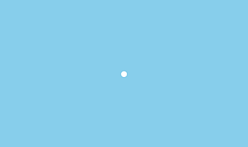
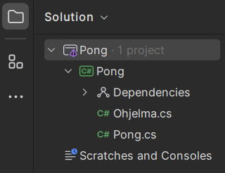

# Pong, vaihe 1: Pallo kentälle

Tämän vaiheen lopuksi peli näyttää suunnilleen tältä:



## 1. Ohjelmoinnin aloittaminen

Uudessa projektissa on paljon tiedostoja. Projektin tiedostot näkyvät listattuna Riderin vasemman reunan Explorer-näkymässä. Tässä vaiheessa meitä kiinnostaa ainoastaan tiedosto nimeltä **Pong.cs**, johon tulee C#-ohjelmointikielellä kirjoitettavaa koodia. Tuplaklikkaa tuota tiedostoa, jolloin se aukeaa editoriin muokattavaksi, mikäli se ei ole valmiiksi auki.



## 2. Ohjelmakoodi

Kooditiedosto sisältää pelin koodin eli kuvauksen siitä, mitä peli tekee. Tätä koodia lähdemme nyt muokkaamaan.

Koodia on useita rivejä, mutta nyt keskitymme vain aliohjelmaan nimeltä `Begin` (suom. aloita), joka näyttää tältä:

```csharp,ignore
public override void Begin()
{
    // TODO: Kirjoita ohjelmakoodisi tähän

    PhoneBackButton.Listen(ConfirmExit, "Lopeta peli");
    Keyboard.Listen(Key.Escape, ButtonState.Pressed, ConfirmExit, "Lopeta peli");
}
```

**Begin-aliohjelma suoritetaan ensimmäisenä, kun peli käynnistetään**. Se on siten sopiva paikka tehdä pelin alustukset, kuten pelihahmojen luominen ja sijoittaminen oikeille paikoilleen.

Etsi `Begin` koodista. **Aliohjelman nimi** `Begin` on kerrottu ensimmäisen rivin lopussa ja nimen jälkeen on **kaarisulut** `(` ja `)`.

Nimen ja kaarisulkujen jälkeen tulee **aaltosulut** `{` ja `}`.

**Aaltosulkujen väliin kirjoitetaan aliohjelmalle kuuluvat koodirivit.**

`//`-alkuinen vihreällä näkyvä rivi on kommentti. Se ei tee pelin kannalta mitään, vaan on ainoastaan muistuttamassa pelin ohjelmoijaa eli sinua, että pelin alustus tehdään tässä. Voit halutessasi poistaa tuon rivin.

Kommenttirivin jälkeen on kaksi riviä, jotka tekevät peliin lopetuspainikkeen. Koska emme nyt tee peliä puhelimelle, **voit pyyhkiä rivin**, joka alkaa sanalla `PhoneBackButton`.

## 3. Olion luominen

Ensimmäisenä haluamme lisätä peliimme pallon. Palloa varten luodaan olio, joka on tyyppiä `PhysicsObject` eli fysiikkaolio. Koska teemme fysiikkapeliä, käytämme fysiikkaolioita, jotka käyttäytyvät fysiikan lakien mukaan eli pomppivat, törmäävät jne. Fysiikkaolio pitää sisällään kappaleille kuuluvia ominaisuuksia, kuten esimerkiksi kuva tai massa.

**Kirjoita** `Begin`-aliohjelmaan aaltosulkujen väliin uuden fysiikkaolion luominen:

```csharp,ignore
PhysicsObject pallo = new PhysicsObject(40.0, 40.0);
```

Uusi `PhysicsObject`-tyyppinen olio luodaan ja sijoitetaan `PhysicsObject`-tyyppiseen muuttujaan nimeltä `pallo`.

- Ensin kerrotaan, että käytössämme on `PhysicsObject`-tyyppinen muuttuja, jonka nimi on `pallo`.

- Muuttujan `pallo` arvoksi asetetaan uusi `PhysicsObject`-olio, jonka tekee meille samanniminen aliohjelma.

- Aliohjelman nimen jälkeen annetaan suluissa parametreja, jotka kertovat, minkä kokoisen fysiikkaolion haluamme. Parametrien järjestyksellä on väliä.

Fysiikkaolion parametrit ovat desimaalilukuja ja ne annetaan järjestyksessä ensin leveys, sitten korkeus. Tässä pallon leveydeksi ja korkeudeksi asetettiin `40.0` (huomaa, että desimaaleja erottamaan käytetään **pistettä**). Mittayksikkö voi olla mitä tahansa, voit vaikka kuvitella sen olevan senttimetrejä.

Jotta pallo tulisi osaksi peliä, täytyy se lisätä pelikentän olioiden joukkoon.

**Kirjoita** tämä rivi pallon luomisen jälkeen:

```csharp,ignore
Add(pallo);
```

Komento `Add` lisää sille annetun olion pelikentälle.

Nyt `Begin`-aliohjelmasi pitäisi näyttää tältä:

```csharp,ignore
public override void Begin()
{
    PhysicsObject pallo = new PhysicsObject(40.0, 40.0);
    Add(pallo);

    Keyboard.Listen(Key.Escape, ButtonState.Pressed, ConfirmExit, "Lopeta peli");
}
```

**Rider tallentaa työsi automaattisesti**. Jos käytät jotakin muuta ohjelmaa koodin kirjoittamiseen, muista tallentaa koodisi muutaman minuutin välein.

Kokeile, toimiiko peli!

> [!KOKEILE]

## 4. Olio palloksi

Pallomme ei vielä näytä pallolta. Fysiikkaoliolla on kuitenkin olemassa sellainen ominaisuus kuin `Shape` eli muoto. Haluamme muuttaa pallo-nimisen fysiikkaoliomme muoto-ominaisuuden ympyräksi. Olion luonnin jälkeen sen muotoa voidaan muuttaa seuraavalla tavalla:

```csharp,ignore
pallo.Shape = Shape.Circle;
```

Pallon edessä ei enää tarvitse kirjoittaa `PhysicsObject`, kun se on kerran esitelty sen tyyppisenä muuttujana. Muodon muuttaminen täytyy tehdä vasta *olion luonnin jälkeen*. Jos se tehtäisiin sitä ennen, eihän edes olisi vielä olemassa mitään fysiikkaobjektia nimeltä pallo.

Pallon halkaisijaksi tulee nyt 40.0, eli sen koko määräytyy olion luonnissa annetuista leveydestä ja korkeudesta.

Lisää tämä rivi pallon luonnin ja kenttään lisäämisen väliin. Nyt `Begin`-aliohjelman pitäisi näyttää suunnilleen tältä:

```csharp,ignore
public override void Begin()
{
    PhysicsObject pallo = new PhysicsObject(40.0, 40.0);
    pallo.Shape = Shape.Circle;
    Add(pallo);

    Keyboard.Listen(Key.Escape, ButtonState.Pressed, ConfirmExit, "Lopeta peli");
}
```

Huomaa, että vaikka meillä oli muuttuja nimeltä pallo, se olikin aluksi pelissä neliön muotoinen. *Tietokone ei siis ymmärrä, mitä muuttujien nimet tarkoittavat.* Se ei yleensä välitä niistä niin kauan kuin nimiä vain käyttää sen mielestä oikein. Nimet ovat kuitenkin tärkeitä ihmisille, jotka yrittävät ymmärtää ohjelmakoodia. Hyvin ja kuvaavasti nimetyt muuttujat ja aliohjelmat helpottavat huomattavasti koodin lukemista niin koodin kirjoittajan kuin lukijankin kannalta! Eihän olisi ymmärrettävää antaa pallolle nimeksi esimerkiksi "kolmio", "olio1" tai "sdaydfs".

Nyt kun ajat ohjelman (Riderissa vihreä **Run**-kolmio), pitäisi keskellä ruutua näkyä pallo, kuten tämän sivun alussa olevassa kuvassa.

> [!KOKEILE]

## 5. Lopputulos

Valmiin ensimmäisen vaiheen koodi meidän peliimme on tällainen:

```csharp,feature-jypeli
using System;
using System.Collections.Generic;
using System.Linq;
using System.Text;
using Jypeli;
using Jypeli.Assets;
using Jypeli.Controls;
using Jypeli.Effects;
using Jypeli.Widgets;

public class Pong : PhysicsGame
{
    public override void Begin()
    {
        PhysicsObject pallo = new PhysicsObject(40.0, 40.0);
        pallo.Shape = Shape.Circle;
        Add(pallo);

        Keyboard.Listen(Key.Escape, ButtonState.Pressed, ConfirmExit, "Lopeta peli");
    }
}
```
