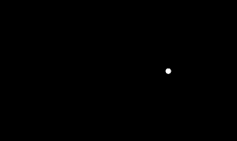
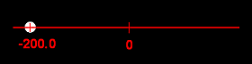
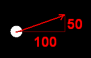

# Pong, vaihe 2: Pallo liikkeelle

Tämä on Pong-pelin tutoriaalin osa 2/7. Tämän vaiheen aikana

- Laitetaan pallo liikkeelle
- Tehdään kentälle reunat
- Vaihdetaan kentän taustaväri
- Zoomataan kamera näyttämään koko kenttä kerralla



## 1. Koordinaatistosta

Pelikentällä kulkee koordinaatisto, jonka avulla olioita voi sijoitella eri puolille kenttää. Koordinaatiston keskipiste on pelikentän keskipisteessä.

Edellisessä vaiheessa emme asettaneet pallolle koordinaatteja, joten sen paikaksi tuli oletuksena kentän keskipiste (origo eli piste, jonka sekä `x`- että `y`-koordinaatti on nolla).

Seuraava kuva esittää pallon `x`-koordinaatin idean. Kun `x`-koordinaatti on nolla, pallo on leveyssuunnassa keskellä pelikenttää. Jos taas `x`:n arvo on -200, pallon sijainti on leveyssuunnassa vasemmalle päin origosta. `y`-koordinaatin idea on sama, se vain kertoo paikan korkeussuunnassa.



Peliolioiden `x`- ja `y`-koordinaatit voi asettaa muuttamalla fysiikkaobjektin `X`- ja `Y`-ominaisuuksia:

```csharp,ignore
        pallo.X = -100.0;
        pallo.Y = 50.0;
```

Lisää edelliset rivit koodiin pallon luonnin jälkeen. Kokeile erilaisilla `X`:n ja `Y`:n arvoilla, mihin pallo sijoittuu ruudulla.

> [!KOKEILE]

## 2. Vektoreista

Pelin tekemisessä tarvitaan vektoreita. Vektori on otus, joka sisältää sekä `x`- että `y`-koordinaatin. Voisimme kuvata vektoria vaikkapa merkinnällä (10, 20). Ensimmäinen luku on `x`-koordinaatti ja jälkimmäinen `y`-koordinaatti. Vektorilla voidaan kuvata esimerkiksi olion paikkaa koordinaatistossa tai kappaleen paikan muutosta suhteessa johonkin aikaisempaan paikkaan. Esimerkiksi vektori (100, 50) kuvaisi `x`-koordinaatin muutosta 100 yksikköä oikealle ja `y`-koordinaatin muutosta 50 yksikköä ylöspäin.

Seuraavassa kuvassa on havainnollistettu edellä kuvattua vektoria. Vektoreita kuvataan yleensä nuolella. Koska vektorin `x`-arvo on 100, kuvassa nuolen pituus vaakasuunnassa on 100 yksikköä. Vastaavasti nuolen korkeus pystysuunnassa on 50 yksikköä. Jos palloa siirretään vektorin mukaisesti, se liikkuu nuolen osoittamaan suuntaan.



## 3. Pallon laittaminen liikkeelle

Laitetaan seuraavaksi pallo liikkumaan. Koska käytössämme on fysiikkamoottori, se käy helposti. Fysiikkaobjektin voi tökätä liikkeelle kutsumalla sen `Hit`-aliohjelmaa. Sille annetaan parametrina vektori, joka kertoo, *mihin suuntaan ja kuinka kovaa pallo lähtee*.

Lisää seuraavat rivit koodiin **sen jälkeen**, kun pallo on lisätty peliin (eli `Add`-kutsun jälkeen):

```csharp,ignore
Vector impulssi = new Vector(500.0, 0.0);
pallo.Hit(impulssi * pallo.Mass);
```

Mitä isompia arvoja annat vektorille, sitä kovempaa pallo lähtee. Kokeile tehdä vektori erilaisilla `x`- ja `y`-arvoilla ja katso, mihin suuntaan pallo lähtee.

> [!KOKEILE]

> [!KYSYMYS]
> Miten laittaisit pallon liikkumaan yläviistoon?

Tässä on vielä tärkeä huomata, että `Hit`-aliohjelmalle annettiin nyt vektori kerrottuna pallon massalla. Pallon massa on tässä yhteydessä vain jokin desimaaliluku, joka kertolaskun myötä kasvattaa vektorin pituutta, eli tässä yhteydessä annettua voimaa.

Jos meillä olisi esimerkiksi:

```csharp,ignore
Vector impulssi = new Vector(100.0, 0.0);
pallo.Hit(impulssi * 5 * pallo.Mass);
```

Olisi se tismalleen sama kuin meillä olisi pelkästään

```csharp,ignore
Vector impulssi = new Vector(500.0, 0.0);
pallo.Hit(impulssi * pallo.Mass);
```

Vektorin kertominen jollain luvulla siis vain kertoo sen `x`- ja `y`-komponentit.

Nyt meidän täytyy kasvattaa annettavaa voimaa pallon massan suhteen. Mitä suurempi massa, sitä suurempi voima tarvitaan. Meidän ei kuitenkaan tarvitse itse suoraan tietää, mitä pallon massa on, vaan voimme suoraan ottaa sen pallon `Mass`-kentästä ja ottaa sen käyttöön. Jos pallon massaa muutettaisiin jossain vaiheessa, toimisi tämä kohta koodia silti tismalleen samalla tavalla.

## 4. Reunan lisääminen

Kun pallo on saatu liikkeelle, karkaa se ennen pitkää ruudusta ulos. Lisätään pelialueeseen reunat nähdäksemme, miten pallo pomppii. Lisää seuraava aliohjelmakutsu (aliohjelmista kerrotaan tarkemmin seuraavassa vaiheessa) koodiin sen jälkeen, kun pallo on luotu ja lisätty peliin.

```csharp,ignore
Level.CreateBorders();
```

Kun nyt ajat peliä, pelikentässä pitäisi olla reunat, joihin pallo myös törmää.

> [!KOKEILE]

Miksi pallo törmää, vaikka emme ole törmäystä mitenkään ohjelmoineet? Siksi, että projektia luodessamme teimme fysiikkapelin. Fysiikkapelin (`PhysicsGame`) *fysiikkamoottori* laskee pallon liikkeitä meidän puolestamme.

## 5. Vauhdin säilyttäminen törmäyksissä

Pelissämme on pieni puute: pallon vauhti hidastuu aina, kun se törmää seinään. Fysiikkaoliolla on onneksi `x`- ja `y`-koordinaattien lisäksi monia muita ominaisuuksia. Yksi niistä on `Restitution`, vapaasti suomennettuna kimmoisuus.

Kimmoisuudelle voi antaa lukuarvoja väliltä `0.0` - `1.0`. Mitä lähempänä ykköstä arvo on, sitä enemmän olion vauhdista säilyy törmäyksessä.

Esimerkiksi superpallon kimmoisuusarvo olisi lähellä ykköstä, kun taas kokoon rutistetun paperin kimmoisuus olisi lähempänä nollaa, sehän ei pomppaa korkealle, vaikka sellaisen paiskaisi kuinka kovaa tahansa lattialle.

Asetetaan pallon `Restitution`-ominaisuuden arvoksi `1.0`. Kirjoita tämä rivi uudelle riville esimerkiksi pallon koordinaattien asettamisen jälkeen:

```csharp,ignore
pallo.Restitution = 1.0;
```

Koska törmäyksessä on aina kaksi osapuolta, täytyy myös törmäyksen kohteen kimmoisuus asettaa vastaavasti. Pelikentän reunoille tämä tehdään käyttämällä `CreateBorders`-aliohjelmasta versiota, joka ottaa vastaan parametreja. Ensimmäinen parametri on kimmoisuus, joka pallollekin asetettiin, ja toinen parametri kertoo, tehdäänkö reunoista näkyvät vai ei. Sen tyyppi on totuusarvo `bool`, joten sillä on kaksi mahdollista arvoa:

- true eli tosi (eli "kyllä")
- false eli epätosi (eli "ei")

Koska reunat jäävät myöhemmin ruudun ulkopuolelle, toisen parametrin arvolla ei ole tässä niin väliä. Olkoon sen arvo vaikkapa `false`.

**Etsi** koodistasi rivi

```csharp,ignore
Level.CreateBorders();
```

ja **muuta** se seuraavanlaiseksi.

```csharp,ignore
Level.CreateBorders(1.0, false);
```

Eli vapaasti sanottuna:

"Tee näkymättömät reunat, joiden kimmoisuus on yksi"

> [!KOKEILE]

## 6. Kentän taustavärin vaihtaminen

[Alkuperäisen Pong-pelin](http://en.wikipedia.org/wiki/Pong) taustaväri oli musta eikä vaaleansininen. Korjataan puute lisäämällä **edellisen rivin jälkeen** seuraava rivi, joka asettaa kentälle uuden taustavärin.

```csharp,ignore
Level.Background.Color = Color.Black;
```

> [!KOKEILE]

> [!KYSYMYS]
> Miten asettaisit taustavärin vihreäksi?

Muista tallentaa työsi välillä.

## 7. Kameran kohdistaminen

Asetetaan vielä lopuksi kamera näyttämään koko kenttää. Pelikentässämme on aina mukana kamera, johon viitataan sanalla `Camera`. Kameraa voi vaikkapa zoomata lähemmäksi tai kauemmaksi kentästä. Kohdistetaan kamera kuitenkin nyt siten, että se näyttää aina koko kentän kerralla. Se tapahtuu lisäämällä seuraava rivi:

```csharp,ignore
Camera.ZoomToLevel();
```

## 8. Lopputulos

Edellä tehtyjen lisäysten jälkeen koodin tulisi näyttää suunnilleen tältä:

```csharp,feature-jypeli
using Jypeli;

namespace Pong;

/// @author vesal
/// @version 20.09.2024
/// <summary>
/// Peli, jossa kaksi pelaajaa yrittää saada pallon toisen päätyyn.
/// </summary>
public class Pong : PhysicsGame
{
    public override void Begin()
    {
        PhysicsObject pallo = new PhysicsObject(40.0, 40.0);
        pallo.Shape = Shape.Circle;
        pallo.X = -200.0;
        pallo.Y = 0.0;
        pallo.Restitution = 1.0;

        Add(pallo);

        Level.CreateBorders(1.0, false);
        Level.Background.Color = Color.Black;

        Camera.ZoomToLevel();

        Vector impulssi = new Vector(500.0, 0.0);
        pallo.Hit(impulssi * pallo.Mass);

        Keyboard.Listen(Key.Escape, ButtonState.Pressed, ConfirmExit, "Lopeta peli");
    }
}
```

Huomaa, että C#-kieli ei ole kovin tarkka "tyhjien" merkkien, kuten välilyöntien tai tyhjien rivien, suhteen. Ohjelman toiminnan kannalta ei siis ole väliä, onko koodissasi tyhjiä rivejä tai tuleeko sulkumerkin jälkeen välilyönti. Voit kirjoittaa tyhjiä rivejä koodiin, jos se helpottaa sinua koodin lukemisessa.

Myöskään joidenkin lauseiden (eli koodirivien) järjestys ei ole kovin oleellinen. Ei esimerkiksi ole väliä, asetatko pallolle ensin koordinaatit vai kimmoisuuden. Toisaalta taas pallo *täytyy* luoda ennen kimmoisuuden asettamista, sillä kimmoisuuden asettamiseen tarvitaan fysiikkaolio.

Huomaa myös, että valmiissa koodissa voi olla joitakin `using`-alkuisia rivejä, joita koodissasi ei ole tai päinvastoin. Tämäkään ei välttämättä haittaa. Jos koodistasi puuttuu jokin `using`-lause, siitä tulee selkeä virhe.
