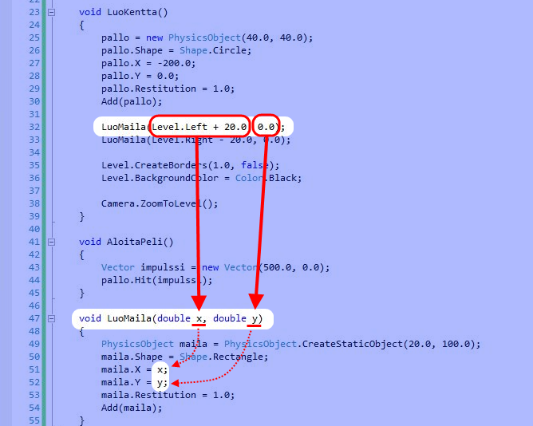

# Pong, vaihe 4: Kaksi mailaa

Tässä oppaassa teemme toisenkin mailan.


## 1. Miten tehdään peliin toinen maila?

Maila tehtiin edellisessä vaiheessa, aliohjelmassa `LuoKentta`, seuraavasti:

```csharp,ignore
PhysicsObject maila = PhysicsObject.CreateStaticObject(20.0, 100.0);
maila.Shape = Shape.Rectangle;
maila.X = Level.Left + 20.0;
maila.Y = 0.0;
maila.Restitution = 1.0;
Add(maila);
```

Toisen mailan voisimme tehdä tietysti samaan tapaan kuin ensimmäisenkin. Voisimme kopioida ensimmäisen mailan luovat rivit ja vaihtaa joka riville muuttujan `maila` tilalle `maila2` sekä muuttaa toisen mailan koordinaatit.

Jos myöhemmin peliin haluttaisiin vielä lisää mailoja, voisimme jälleen kopioida rivit, vaihtaa muuttujien nimet ja tarvittavat ominaisuudet...

Mutta kun mailat kerran tehdään ihan samaan tapaan, eikö tässä tehdä sama työ moneen kertaan?

Voitaisiinko mailan luominen ohjelmoida kerran niin, että ainoastaan mailan paikka kerrotaan kummallekin mailalle erikseen?

Kyllä voidaan! Mailan tekeminen voisi olla oma aliohjelma, jolle ainoastaan kerrotaan, mihin halutaan tehdä uusi maila. Näin samalla aliohjelmalla voitaisiin tehdä monta eri mailaa.

## 2. Mailoja luova aliohjelma ja parametrit

Tehdään aliohjelma, jota kutsumalla tietokone tekee aina uuden mailan ja lisää sen peliin haluamaamme paikkaan.

Koska eri mailoille tarvitaan eri koordinaatit, täytyy tämä pystyä jotenkin kertomaan aliohjelmalle. Annetaan koordinaatit aliohjelmalle **parametreina**.

- Aliohjelman parametrit luetellaan aliohjelman nimen jälkeen sulkujen sisällä.
- Ensin kerrotaan **parametrin tyyppi** ja sen jälkeen **parametrin nimi**.
- Useammat parametrit erotetaan pilkulla toisistaan.
- Kun aliohjelmaa kutsutaan, sille täytyy antaa juuri sellaiset parametrit, joita se haluaa.

**Lisää** siis seuraavanlainen aliohjelma:

```csharp,ignore
void LuoMaila(double x, double y)
{
    PhysicsObject maila = PhysicsObject.CreateStaticObject(20.0, 100.0);
    maila.Shape = Shape.Rectangle;
    maila.X = Level.Left + 20.0;
    maila.Y = 0.0;
    maila.Restitution = 1.0;
    Add(maila);
}
```

`LuoMaila`-aliohjelman parametrit `x` ja `y` ovat tyyppiä `double`. Tyyppiä `double` käytetään desimaalilukujen esittämiseen.

**Siirrä** punaisella merkityt mailan luomiseen liittyvät koodirivit `LuoMaila`-aliohjelmaan:

```csharp,ignore
    void LuoKentta()
    {
        pallo = new PhysicsObject(40.0, 40.0);
        pallo.Shape = Shape.Circle;
        pallo.X = -200.0;
        pallo.Y = 0.0;
        pallo.Restitution = 1.0;
        Add(pallo);

// HIGHLIGHT_RED_BEGIN
        PhysicsObject maila = PhysicsObject.CreateStaticObject(20.0, 100.0);
        maila.Shape = Shape.Rectangle;
        maila.X = Level.Left + 20.0;
        maila.Y = 0.0;
        maila.Restitution = 1.0;
        Add(maila);
// HIGHLIGHT_RED_END

        Level.CreateBorders(1.0, false);
        Level.Background.Color = Color.Black;

        Camera.ZoomToLevel();
    }
```

Otetaan vielä parametrit käyttöön. Sijoitetaan `LuoMaila`-aliohjelmassa parametrit `x` ja `y` mailan koordinaateiksi `maila.X` ja `maila.Y`.

Muutosten jälkeen `LuoMaila` näyttää tältä:

```csharp,ignore
void LuoMaila(double x, double y)
{
// HIGHLIGHT_GREEN_BEGIN
    PhysicsObject maila = PhysicsObject.CreateStaticObject(20.0, 100.0);
    maila.Shape = Shape.Rectangle;
    maila.X = x;
    maila.Y = y;
    maila.Restitution = 1.0;
    Add(maila);
// HIGHLIGHT_GREEN_END
}
```

Voit kokeilla ajaa pelin, mutta yhtään mailaa ei vielä näy. **Aliohjelmaa `LuoMaila` ei vielä kutsuta missään, eli sen koodirivejä ei koskaan suoriteta.**

> [!KOKEILE]

## 3. Mailoja luovan aliohjelman kutsuminen ja parametrien välittäminen

Aliohjelman avulla mailoja on helppo tehdä useampikin. Äsken siirrettyjen rivien tilalle kirjoitetaan kaksi aliohjelmakutsua:

```csharp,ignore
void LuoKentta()
{
    pallo = new PhysicsObject(40.0, 40.0);
    pallo.Shape = Shape.Circle;
    pallo.X = -200.0;
    pallo.Y = 0.0;
    pallo.Restitution = 1.0;
    Add(pallo);

// HIGHLIGHT_GREEN_BEGIN
    LuoMaila(Level.Left + 20.0, 0.0);
    LuoMaila(Level.Right - 20.0, 0.0);
// HIGHLIGHT_GREEN_END

    Level.CreateBorders(1.0, false);
    Level.Background.Color = Color.Black;

    Camera.ZoomToLevel();
}
```

Aliohjelman kutsussa aliohjelmalle annettavat **parametrit annetaan samassa järjestyksessä kuin ne aliohjelmassa otetaan vastaan**. Tässä tapauksessa siis ensin x-koordinaatti ja sitten y-koordinaatti.

Kutsussa **ei** luetella parametrien tyyppejä (kuten `double`).

Tämä kuva havainnollistaa sitä, miten parametrit välittyvät aliohjelmakutsusta mailan koordinaateiksi: 

Huomaa, että parametri voi olla myös yhteen- tai vähennyslaskun tulos. Esimerkiksi lasku `Level.Left + 20.0` suoritetaan ennen aliohjelman kutsua ja siitä saatava tulos annetaan aliohjelmalle parametriksi.

Nyt pelissä pitäisi näkyä kaksi mailaa!

> [!KOKEILE]

## 4. Lopputulos

Pong-peli kahdella mailalla näyttää nyt tältä:

```csharp,feature-jypeli
using System;
using System.Collections.Generic;
using System.Linq;
using System.Text;
using Jypeli;
using Jypeli.Assets;
using Jypeli.Controls;
using Jypeli.Effects;
using Jypeli.Widgets;

public class Pong : PhysicsGame
{
    PhysicsObject pallo;

    public override void Begin()
    {
        LuoKentta();
        AloitaPeli();

        Keyboard.Listen(Key.Escape, ButtonState.Pressed, ConfirmExit, "Lopeta peli");
    }

    void LuoKentta()
    {
        pallo = new PhysicsObject(40.0, 40.0);
        pallo.Shape = Shape.Circle;
        pallo.X = -200.0;
        pallo.Y = 0.0;
        pallo.Restitution = 1.0;
        Add(pallo);

        LuoMaila(Level.Left + 20.0, 0.0);
        LuoMaila(Level.Right - 20.0, 0.0);

        Level.CreateBorders(1.0, false);
        Level.BackgroundColor = Color.Black;

        Camera.ZoomToLevel();
    }

    void AloitaPeli()
    {
        Vector impulssi = new Vector(500.0, 0.0);
        pallo.Hit(impulssi * pallo.Mass);
    }

    void LuoMaila(double x, double y)
    {
        PhysicsObject maila = PhysicsObject.CreateStaticObject(20.0, 100.0);
        maila.Shape = Shape.Rectangle;
        maila.X = x;
        maila.Y = y;
        maila.Restitution = 1.0;
        Add(maila);
    }
}
```
