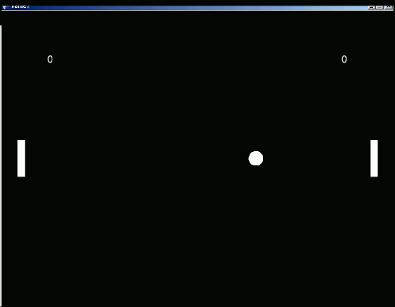

# Pong, vaihe 7: Pistelasku

Tässä vaiheessa lisäämme peliin pistelaskun. Pong-pelissä pelaaja saa pisteen, kun pallo ohittaa toisen pelaajan mailan.



## Aliohjelmakutsu laskureita varten

Pisteiden laskemiseksi tarvitsemme jonkinlaisen laskurin, joka pitää yllä pelaajan pisteitä. Laskureiden luominen olisi yksi kokonaisuus pelin alustamisessa, joten tehdään siitä oma aliohjelma.

**Lisää** aliohjelman `LisaaLaskurit` kutsu `Begin`iin:

```csharp,ignore
public override void Begin()
{
    LuoKentta();
    AsetaOhjaimet();
    LisaaLaskurit();
    AloitaPeli();
}
```

**Lisää** tässä vaiheessa "tyhjä" aliohjelma `LisaaLaskurit`, jotta koodi saadaan toimivaksi ja virheet pois:

```csharp,ignore
void LisaaLaskurit()
{
   // ...
}
```

## Laskurin luominen

Laskureita tulee peliin kaksi, yksi kummallekin pelaajalle.

Koska molemmat laskurit luodaan arvatenkin lähes samalla tavalla, kannattaa laskurin luomisesta tehdä aliohjelma.

**Kirjoita** uusi aliohjelma `LuoPisteLaskuri`:

```csharp,ignore
IntMeter LuoPisteLaskuri()
{
    IntMeter laskuri = new IntMeter(0);
    laskuri.MaxValue = 10;
    return laskuri;
}
```

Aliohjelman paluuarvon tyyppi on `IntMeter`, mikä tarkoittaa laskuria, joka laskee kokonaisluvuilla (kokonaisluvun tyyppi on `int`).

Laskurin konstruktorille (`new IntMeter...`) annetaan parametrina laskurin oletusarvo, joka pistelaskun ollessa kyseessä on luonnollisesti nolla.

Laskurille voi asettaa maksimiarvon (`MaxValue`), jonka jälkeen laskuri lopettaa pisteiden laskemisen. Se voi olla vaikkapa kymmenen.

Pisteiden laskemiseen riittäisi toki pelkkä kokonaisluku, mutta `IntMeter`-tyyppiä käyttämällä päästään helpommalla, kun pisteitä halutaan esittää ruudulla, kuten kohta nähdään.

## Pisteiden esittäminen

Pelkkä `IntMeter`-olio ei vielä näytä pisteitä, vaan ainoastaan säilyttää lukuarvon muistissa. Pisteiden esittämiseksi ruudulla tarvitaan vielä tekstikenttiä eli `Label`eita.

Tehdään pistelaskurin arvon näyttävä `Label` laskurin ohessa.

Koska pelaajien laskurit tulevat eri kohtaan ruutua, viedään jälleen koordinaatit parametrina aliohjelmalle.

**Muokkaa** `LuoPisteLaskuri`-aliohjelmaa:

```csharp,ignore
// HIGHLIGHT_GREEN_BEGIN
IntMeter LuoPisteLaskuri(double x, double y)
// HIGHLIGHT_GREEN_END
{
    IntMeter laskuri = new IntMeter(0);
    laskuri.MaxValue = 10;

// HIGHLIGHT_GREEN_BEGIN
    Label naytto = new Label();
    naytto.BindTo(laskuri);
    naytto.X = x;
    naytto.Y = y;
    naytto.TextColor = Color.White;
    naytto.BorderColor = Level.Background.Color;
    naytto.Color = Level.Background.Color;
    Add(naytto);
// HIGHLIGHT_GREEN_END

    return laskuri;
}
```

Tekstikenttä sidotaan näyttämään laskurin arvoa kutsulla `naytto.BindTo(laskuri)`. Näin ruudulle päivittyy automaattisesti laskurin arvo, vaikka sitä jossain kohtaa muutetaan.

Näytön väri asetetaan valkoiseksi, jotta se erottuu taustasta (`naytto.TextColor = Color.White`).

## Laskureiden lisääminen peliin

Koska laskureihin täytyy päästä käsiksi kohta, kun pisteitä lasketaan, tehdään niistä attribuutteja.

Pohdittavaa: Miksei näyttöjä tarvitse lisätä attribuuteiksi?

**Lisää** attribuutteihin `IntMeter`-tyyppiset muuttujat `pelaajan1Pisteet` ja `pelaajan2Pisteet`:

```csharp,ignore
public class Pong : PhysicsGame
{
    Vector nopeusYlos = new Vector(0, 200);
    Vector nopeusAlas = new Vector(0, -200);

    PhysicsObject pallo;
    PhysicsObject maila1;
    PhysicsObject maila2;

// HIGHLIGHT_GREEN_BEGIN
    IntMeter pelaajan1Pisteet;
    IntMeter pelaajan2Pisteet;
// HIGHLIGHT_GREEN_END

    public override void Begin()
    {
        LuoKentta();
        AsetaOhjaimet();
        LisaaLaskurit();
        AloitaPeli();
    }

    // ...
```

Meillä on jo tyhjä aliohjelma laskureiden luomiseksi.

**Lisää** aliohjelmaan `LisaaLaskurit` laskureita luovan aliohjelman kutsuminen ja luotujen laskureiden sijoittaminen muuttujiin:

```csharp,ignore
void LisaaLaskurit()
{
    pelaajan1Pisteet = LuoPisteLaskuri(Screen.Left + 100.0, Screen.Top - 100.0);
    pelaajan2Pisteet = LuoPisteLaskuri(Screen.Right - 100.0, Screen.Top - 100.0);
}
```

`LuoPisteLaskuri`-aliohjelmassa ensimmäinen parametri oli x-koordinaatti ja toinen y-koordinaatti. Näytölle lisättävien olioiden paikka ilmoitetaan ruudun, ei kentän, koordinaateissa.

Laskureiden x-koordinaatit on laskettu käyttäen hyväksi ruudun vasemman ja oikean reunan x-koordinaatteja (`Screen.Left` ja `Screen.Right`).

Y-koordinaatti lasketaan ruudun yläreunasta (`Screen.Top`) lukien.

> [!KOKEILE]

Kun nyt ajat ohjelman, pitäisi ruudun yläreunassa näkyä kaksi laskuria, jotka näyttävät arvoa 0.

## Törmäyksen käsittely

Jotta voisimme kasvattaa pisteitä, täytyisi tietää, milloin pallo ohittaa jommankumman mailan. Tämä onnistuu siten, että tarkkaillaan sitä, kun pallo osuu kentän vasempaan tai oikeaan reunaan.

Törmäyksiin reagoimista varten Jypeli-kirjastossa on aliohjelma nimeltä `AddCollisionHandler`.

`AddCollisionHandler` ottaa kaksi parametria:

- fysiikkaolio, jonka törmäyksiä kuunnellaan
- aliohjelma, jota kutsutaan, kun olio törmää johonkin

**Lisää** seuraavanlainen kutsu `LuoKentta`-aliohjelmaan, sen jälkeen kun pallo on luotu ja lisätty tasoon:

```csharp,ignore
AddCollisionHandler(pallo, KasittelePallonTormays);
```

> [!EI TOIMI VIELÄ]

Aliohjelman, jossa törmäys käsitellään, **täytyy olla** aina seuraavanlainen:

- Paluuarvo on `void` (eli ei palauteta mitään).
- Parametreina on kaksi `PhysicsObject`-luokan oliota.
    - Ensimmäinen parametri on se olio, jonka törmäyksiä kuunnellaan, eli törmääjä (meillä se on siis pallo).
    - Toinen parametri on törmäyksen kohde, jota ei vielä tunneta.

Aliohjelman voi toki nimetä vapaasti, kunhan sama nimi annetaan parametrina `AddCollisionHandler`-kutsussa.

**Lisää** siis seuraavanlainen aliohjelma:

```csharp,ignore
void KasittelePallonTormays(PhysicsObject pallo, PhysicsObject kohde)
{

}
```

Kun törmäyksen käsittelevään aliohjelmaan tullaan, tiedetään vasta, että pallo on törmännyt **johonkin**.

Jotta selviää, mihin se on törmännyt, täytyy tehdä hiukan vertailua.

Törmäys vasempaan reunaan selviää tarkastamalla, onko törmäyksen kohde ja vasen reuna yksi ja sama olio. Miten tämä onnistuisi?

Jotta vertailu olisi helppo suorittaa, meidän olisi hyvä saada kentän vasen reuna johonkin muuttujaan.

Muutetaan koodia niin, että luodaan kenttään reunat yksitellen eikä kaikkia kerralla.

**Pyyhi** `LuoKentta`-aliohjelmasta seuraava rivi:

```csharp,ignore
Level.CreateBorders(1.0, false);
```

**Tilalle kirjoita** ensin vasemman reunan luonti tähän tapaan:

```csharp,ignore
PhysicsObject vasenReuna = Level.CreateLeftBorder();
vasenReuna.Restitution = 1.0;
vasenReuna.IsVisible = false;
```

Reunan ominaisuudet täytyy nyt muuttaa halutuiksi jälkikäteen.

**Tee** vasemman reunan luonnin perään **samalla tavalla**

- oikea reuna (`CreateRightBorder`),
- alareuna (`CreateBottomBorder`) ja
- yläreuna (`CreateTopBorder`).

`KasittelePallonTormays`-aliohjelmassa voimme nyt tutkia, onko törmäyksen kohde sama olio kuin muuttuja `vasenReuna` tai `oikeaReuna`.

Kun vertaillaan onko kaksi asiaa samaa, käytetään `==`-merkintää.

Jos pallo osuu oikeaan reunaan, kasvatetaan pelaajan 1 pistelaskurin arvoa (`pelaajan1Pisteet.Value`). Laskureiden arvo on niiden `Value`-ominaisuudessa. Vastaavasti jos pallo osuu vasempaan reunaan, kasvatetaan pelaajan 2 pistelaskurin arvoa.

**Lisää** tarkistukset `KasittelePallonTormays`-aliohjelmaan:

```csharp,ignore
void KasittelePallonTormays(PhysicsObject pallo, PhysicsObject kohde)
{
    if (kohde == oikeaReuna)
    {
        pelaajan1Pisteet.Value += 1;
    }
    else if (kohde == vasenReuna)
    {
        pelaajan2Pisteet.Value += 1;
    }
}
```

Merkintä `+=` tarkoittaa, että merkinnän vasemmalla puolella olevaan arvoon lisätään se, mitä on merkinnän oikealla puolella.

Toisen `if`-lauseen edessä sana `else` (suom. muuten) tarkoittaa sitä, että `else`-sanan jälkeen tuleva `if`-lause suoritetaan vain, jos sitä edeltävän `if`-lauseen ehto oli epätosi.

Noista kahdesta `if`-lauseesta ei siis koskaan suoriteta molempia samalla kertaa. On myös hyvin mahdollista, että kumpaakaan niistä ei suoriteta, jos vaikkapa pallo osuu mailaan.

> [!EI TOIMI VIELÄ]

Jotta oikeaan ja vasempaan reunaan päästään käsiksi `KasittelePallonTormays`-aliohjelmassa, ne täytyy taas lisätä attribuuttien joukkoon, josta ne näkyvät kaikille aliohjelmille.

**Tee** vielä seuraavat muutokset:

```csharp,ignore
public class Pong : PhysicsGame
{
    Vector nopeusYlos = new Vector(0, 200);
    Vector nopeusAlas = new Vector(0, -200);

    PhysicsObject pallo;
    PhysicsObject maila1;
    PhysicsObject maila2;

    PhysicsObject vasenReuna;
    PhysicsObject oikeaReuna;

    IntMeter pelaajan1Pisteet;
    IntMeter pelaajan2Pisteet;

    // ...

    void LuoKentta()
    {
        pallo = new PhysicsObject(40.0, 40.0);
        pallo.Shape = Shape.Circle;
        pallo.X = -200.0;
        pallo.Y = 0.0;
        pallo.Restitution = 1.0;
        Add(pallo);
        AddCollisionHandler(pallo, KasittelePallonTormays);

        maila1 = LuoMaila(Level.Left + 20.0, 0.0);
        maila2 = LuoMaila(Level.Right - 20.0, 0.0);

// HIGHLIGHT_RED_BEGIN
        PhysicsObject vasenReuna = Level.CreateLeftBorder();
// HIGHLIGHT_RED_END
        vasenReuna.Restitution = 1.0;
        vasenReuna.IsVisible = false;

// HIGHLIGHT_RED_BEGIN
        PhysicsObject oikeaReuna = Level.CreateRightBorder();
// HIGHLIGHT_RED_END
        oikeaReuna.Restitution = 1.0;
        oikeaReuna.IsVisible = false;

        PhysicsObject ylaReuna = Level.CreateTopBorder();
        ylaReuna.Restitution = 1.0;
        ylaReuna.IsVisible = false;

        PhysicsObject alaReuna = Level.CreateBottomBorder();
        alaReuna.Restitution = 1.0;
        alaReuna.IsVisible = false;

        Level.Background.Color = Color.Black;

        Camera.ZoomToLevel();
    }
    // ...
```

> [!KOKEILE]

## Hienosäätöä

Pallo ei ehkä nyt käyttäydy aivan toivomallamme tavalla. Voit yrittää hienosäätää pelin pelattavuutta esimerkiksi pallon ominaisuuksia muuttamalla. Tutki, mitä tekevät sen `KineticFriction`- ja `CanRotate`-ominaisuudet ja kokeile muuttaa niitä. Vaikuttavatko ne pelikokemukseen? Jos pallo tuntuu joskus jäävän jumiin, kokeile esimerkiksi luoda resetointinäppäin, jota painamalla pallon sijainti asetetaan pelialueen keskelle, jonka jälkeen pallolle annetaan jokin nopeus.

## Lopputulos

Pong-pelin koodi kaikkine mailoineen ja pistelaskuineen näyttää nyt suunnilleen tältä:

```csharp,feature-jypeli
using System;
using System.Collections.Generic;
using System.Linq;
using System.Text;
using Jypeli;
using Jypeli.Assets;
using Jypeli.Controls;
using Jypeli.Effects;
using Jypeli.Widgets;

public class Pong : PhysicsGame
{
    Vector nopeusYlos = new Vector(0, 200);
    Vector nopeusAlas = new Vector(0, -200);

    PhysicsObject pallo;
    PhysicsObject maila1;
    PhysicsObject maila2;

    PhysicsObject vasenReuna;
    PhysicsObject oikeaReuna;

    IntMeter pelaajan1Pisteet;
    IntMeter pelaajan2Pisteet;

    public override void Begin()
    {
        LuoKentta();
        AsetaOhjaimet();
        LisaaLaskurit();
        AloitaPeli();
    }

    void LuoKentta()
    {
        pallo = new PhysicsObject(40.0, 40.0);
        pallo.Shape = Shape.Circle;
        pallo.X = -200.0;
        pallo.Y = 0.0;
        pallo.Restitution = 1.0;
        pallo.KineticFriction = 0.0;
        pallo.MomentOfInertia = Double.PositiveInfinity;
        Add(pallo);
        AddCollisionHandler(pallo, KasittelePallonTormays);

        maila1 = LuoMaila(Level.Left + 20.0, 0.0);
        maila2 = LuoMaila(Level.Right - 20.0, 0.0);

        vasenReuna = Level.CreateLeftBorder();
        vasenReuna.Restitution = 1.0;
        vasenReuna.KineticFriction = 0.0;
        vasenReuna.IsVisible = false;

        oikeaReuna = Level.CreateRightBorder();
        oikeaReuna.Restitution = 1.0;
        oikeaReuna.KineticFriction = 0.0;
        oikeaReuna.IsVisible = false;

        PhysicsObject ylaReuna = Level.CreateTopBorder();
        ylaReuna.Restitution = 1.0;
        ylaReuna.KineticFriction = 0.0;
        ylaReuna.IsVisible = false;

        PhysicsObject alaReuna = Level.CreateBottomBorder();
        alaReuna.Restitution = 1.0;
        alaReuna.IsVisible = false;
        alaReuna.KineticFriction = 0.0;

        Level.Background.Color = Color.Black;

        Camera.ZoomToLevel();
    }

    PhysicsObject LuoMaila(double x, double y)
    {
        PhysicsObject maila = PhysicsObject.CreateStaticObject(20.0, 100.0);
        maila.Shape = Shape.Rectangle;
        maila.X = x;
        maila.Y = y;
        maila.Restitution = 1.0;
        maila.KineticFriction = 0.0;
        Add(maila);
        return maila;
    }

    void LisaaLaskurit()
    {
        pelaajan1Pisteet = LuoPisteLaskuri(Screen.Left + 100.0, Screen.Top - 100.0);
        pelaajan2Pisteet = LuoPisteLaskuri(Screen.Right - 100.0, Screen.Top - 100.0);
    }

    IntMeter LuoPisteLaskuri(double x, double y)
    {
        IntMeter laskuri = new IntMeter(0);
        laskuri.MaxValue = 10;

        Label naytto = new Label();
        naytto.BindTo(laskuri);
        naytto.X = x;
        naytto.Y = y;
        naytto.TextColor = Color.White;
        naytto.BorderColor = Level.Background.Color;
        naytto.Color = Level.Background.Color;
        Add(naytto);

        return laskuri;
    }

    void KasittelePallonTormays(PhysicsObject pallo, PhysicsObject kohde)
    {
        if (kohde == oikeaReuna)
        {
            pelaajan1Pisteet.Value += 1;
        }
        else if (kohde == vasenReuna)
        {
            pelaajan2Pisteet.Value += 1;
        }
    }

    void AloitaPeli()
    {
        Vector impulssi = new Vector(500.0, 0.0);
        pallo.Hit(impulssi * pallo.Mass);
    }

    void AsetaOhjaimet()
    {
        Keyboard.Listen(Key.A, ButtonState.Down, AsetaNopeus, "Pelaaja 1: Liikuta mailaa ylös", maila1, nopeusYlos);
        Keyboard.Listen(Key.A, ButtonState.Released, AsetaNopeus, null, maila1, Vector.Zero);
        Keyboard.Listen(Key.Z, ButtonState.Down, AsetaNopeus, "Pelaaja 1: Liikuta mailaa alas", maila1, nopeusAlas);
        Keyboard.Listen(Key.Z, ButtonState.Released, AsetaNopeus, null, maila1, Vector.Zero);

        Keyboard.Listen(Key.Up, ButtonState.Down, AsetaNopeus, "Pelaaja 2: Liikuta mailaa ylös", maila2, nopeusYlos);
        Keyboard.Listen(Key.Up, ButtonState.Released, AsetaNopeus, null, maila2, Vector.Zero);
        Keyboard.Listen(Key.Down, ButtonState.Down, AsetaNopeus, "Pelaaja 2: Liikuta mailaa alas", maila2, nopeusAlas);
        Keyboard.Listen(Key.Down, ButtonState.Released, AsetaNopeus, null, maila2, Vector.Zero);

        Keyboard.Listen(Key.F1, ButtonState.Pressed, ShowControlHelp, "Näytä ohjeet");
        Keyboard.Listen(Key.Escape, ButtonState.Pressed, ConfirmExit, "Lopeta peli");

        ControllerOne.Listen(Button.DPadUp, ButtonState.Down, AsetaNopeus, "Liikuta mailaa ylös", maila1, nopeusYlos);
        ControllerOne.Listen(Button.DPadUp, ButtonState.Released, AsetaNopeus, null, maila1, Vector.Zero);
        ControllerOne.Listen(Button.DPadDown, ButtonState.Down, AsetaNopeus, "Liikuta mailaa alas", maila1, nopeusAlas);
        ControllerOne.Listen(Button.DPadDown, ButtonState.Released, AsetaNopeus, null, maila1, Vector.Zero);

        ControllerTwo.Listen(Button.DPadUp, ButtonState.Down, AsetaNopeus, "Liikuta mailaa ylös", maila2, nopeusYlos);
        ControllerTwo.Listen(Button.DPadUp, ButtonState.Released, AsetaNopeus, null, maila2, Vector.Zero);
        ControllerTwo.Listen(Button.DPadDown, ButtonState.Down, AsetaNopeus, "Liikuta mailaa alas", maila2, nopeusAlas);
        ControllerTwo.Listen(Button.DPadDown, ButtonState.Released, AsetaNopeus, null, maila2, Vector.Zero);

        ControllerOne.Listen(Button.Back, ButtonState.Pressed, ConfirmExit, "Lopeta peli");
        ControllerTwo.Listen(Button.Back, ButtonState.Pressed, ConfirmExit, "Lopeta peli");
    }

    void AsetaNopeus(PhysicsObject maila, Vector nopeus)
    {
        if ((nopeus.Y < 0) && (maila.Bottom < Level.Bottom))
        {
            maila.Velocity = Vector.Zero;
            return;
        }
        if ((nopeus.Y > 0) && (maila.Top > Level.Top))
        {
            maila.Velocity = Vector.Zero;
            return;
        }

        maila.Velocity = nopeus;
    }
}
```
